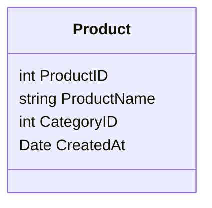

## Type 0 SCD - Retain Original

### Description

The Type 0 Slowly Changing Dimension (SCD) is a design pattern in which once data is initially inserted into a dimensional table, no changes are allowed thereafter. In this pattern, original values are retained without any mechanism for tracking historical changes. This approach is beneficial when certain dimensional attributes are immutable or when it is crucial to preserve the initial data state for auditing or compliance purposes.

### Architectural Approach

In the Type 0 SCD design pattern, attributes in a dimension table are strictly immutable after their creation. The insert operation is solely responsible for populating the tables with data. There are no updates or deletes executed on the data once it is stored, thus ensuring the integrity of the original data set over time.

### Paradigms

- **Immutability**: Emphasizes on maintaining original data without alterations.
- **Simplicity**: No complicated mechanisms for tracking data history.
- **Audit-based**: Suited for use cases that prioritize preserving the data's initial state.

### Best Practices

1. **Use for Static Data**: Implement Type 0 SCD for data attributes known to remain constant, such as unique identifiers, product codes, or creation timestamps.
2. **Operational Concerns**: Ensure business processes understand that changes in data will not be retroactively applied in this dimension.
3. **Documentation**: Maintain clear documentation of why certain fields are immutable, describing the business rationale.

### Example Code

#### SQL Example

Here's an example using SQL to define a `Product` table with static attributes that will employ the Type 0 SCD pattern:

```sql
CREATE TABLE Product (
    ProductID INT PRIMARY KEY,
    ProductName VARCHAR(255) NOT NULL,
    CategoryID INT NOT NULL,
    CreatedAt TIMESTAMP DEFAULT CURRENT_TIMESTAMP,
    UNIQUE(ProductID)
);
```

In this table definition, the `ProductID`, `ProductName`, and `CategoryID` are defined to remain historically consistent, as they should not change over time.

### UML Diagram



### Related Patterns

- **SCD Type 1**: Tracks only the latest changes, without historical versioning.
- **SCD Type 2**: Allows full historical tracking of changes by creating multiple records.
- **SCD Type 3**: Stores limited history with dedicated columns for old and new values.

### Additional Resources

- [Kimball Group: Slowly Changing Dimensions](https://www.kimballgroup.com/)
- [Data Warehousing Concepts](https://en.wikipedia.org/wiki/Dimensional_modeling)

### Summary

The Type 0 SCD – Retain Original pattern is a simple yet effective design choice for situations where dimensional data is immutable and needs to maintain its original state permanently. With Type 0 SCD, data integrity is locked in at the time of entry, making it an ideal choice for identifying specific static attributes within your data warehouse. This pattern simplifies the dimension table design by avoiding complex tracking and is the best-suited solution for compliance and audit-centered requirements.
