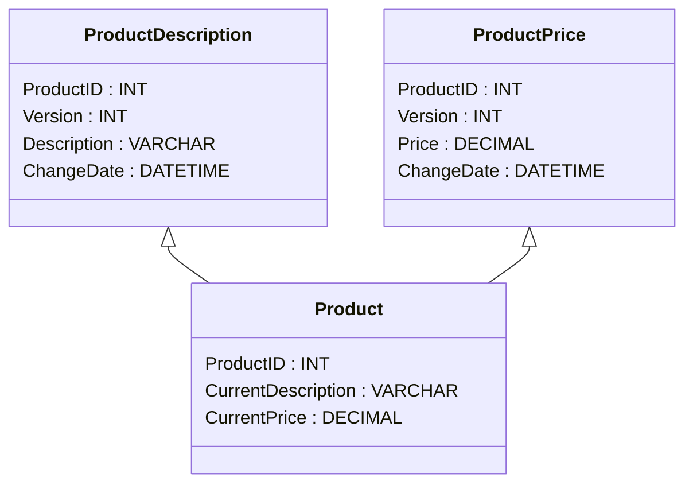

---

linkTitle: "Attribute Versioning"
title: "Attribute Versioning"
category: "Slowly Changing Dimensions (SCD)"
series: "Data Modeling Design Patterns"
description: "A design pattern for tracking changes in data at the attribute level, allowing specific attributes to be versioned independently, which enhances data management and decision-making capabilities."
categories:
- Data Modeling
- Data Warehousing
- Slowly Changing Dimensions
tags:
- Attribute Versioning
- Data Version Control
- Data Warehouse
- SCD
- Business Intelligence
date: 2024-07-07
type: docs

canonical: "https://softwarepatternslexicon.com/103/3/11"
license: "© 2024 Tokenizer Inc. CC BY-NC-SA 4.0"
---

## Attribute Versioning

### Introduction
In the realm of data warehousing and business intelligence, tracking changes to data over time is crucial. Attribute Versioning is a data modeling design pattern used within Slowly Changing Dimensions (SCD) that focuses on tracking changes at the individual attribute level, rather than at the entire record level. This methodology provides a more granular approach to data versioning, allowing specific attributes to be independently versioned and analyzed.

### Description
Attribute Versioning is designed to cater to business needs where changes in certain data attributes (e.g., price, description, or status) need to be studied independently of one another. For instance, in a retail scenario, a product's price and description might change independently. By implementing Attribute Versioning, businesses can accurately observe how variations in specific attributes affect overall performance.

### Architectural Approach

- **Data Structure**: Implement separate tables or partitions where changes to each attribute are tracked with timestamps and version numbers. Each row in the attribute history table might reference a primary key from the main entity table alongside metadata like version number, change date, and the new value of the attribute.

- **Efficient Data Retrieval**: Utilize indexing and partitioning strategies to quickly access the latest version or any historical version of an attribute. 

- **Separation of Concerns**: Keep the history of changes separate from the main data entities in order to maintain an organized and scalable data structure.

### Best Practices

1. **Attribute Tracking**: Only enable attribute versioning for attributes where historical tracking is necessary for business analytics.
2. **Granularity and Performance**: Be mindful of the performance implications of tracking multiple finely-grained changes, particularly with high-volume attributes.
3. **Data Quality**: Ensure rigorous validation processes to maintain data accuracy when changes occur across independent attributes.

### Example Code

In this scenario, using a SQL-based system, you might set up tables for attribute versioning as follows:

```sql
CREATE TABLE Products (
    ProductID INT PRIMARY KEY,
    CurrentDescription VARCHAR(255),
    CurrentPrice DECIMAL(10, 2)
);

CREATE TABLE ProductDescriptions (
    ProductID INT,
    Version INT,
    Description VARCHAR(255),
    ChangeDate DATETIME,
    PRIMARY KEY (ProductID, Version)
);

CREATE TABLE ProductPrices (
    ProductID INT,
    Version INT,
    Price DECIMAL(10, 2),
    ChangeDate DATETIME,
    PRIMARY KEY (ProductID, Version)
);
```

### Diagrams

Below is a UML Class Diagram demonstrating the relationships involving product attribute versioning, where product descriptions and prices are versioned independently.



### Related Patterns

- **Type 2 Slowly Changing Dimensions (SCD):** While SCD Type 2 tracks changes at the row level by creating new records, Attribute Versioning focuses more granularly on individual attribute changes.
- **Event Sourcing:** A design pattern retaining and reconstructing state changes, similar to capturing attribute changes over time.

### Additional Resources

- *The Data Warehouse Toolkit* by Ralph Kimball: A comprehensive guide to dimension modeling, including SCD.
- Online tutorials and courses focusing on data warehousing best practices and design patterns.

### Summary

Attribute Versioning empowers enterprises to track and analyze changes in specific data attributes with greater precision. By implementing this design pattern, businesses can gain a finer understanding of the effects that individual data changes have on their operations, facilitating more informed decision-making.

---
