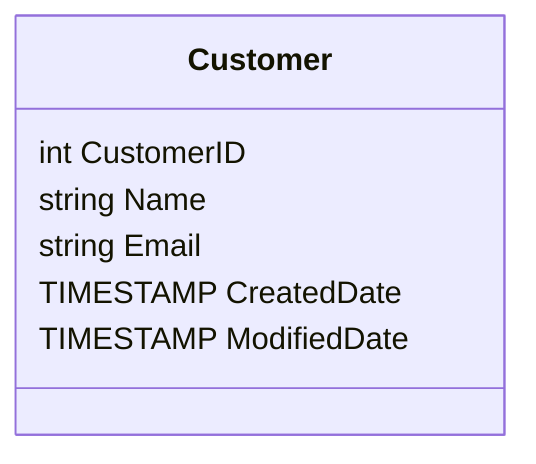

## Overview
Time-Stamping Records is a design pattern in data modeling that involves maintaining timestamps to track changes over time within a database. This pattern ensures that crucial information about the lifecycle of records—such as creation and modification times—are consistently recorded. In the context of Slowly Changing Dimensions (SCD), time-stamping is vital for maintaining historical accuracy and facilitating activities like auditing.

## Architectural Approach
The Time-Stamping Records pattern can be implemented by adding specific timestamp fields, such as `CreatedDate` and `ModifiedDate`, to each record in a database table. These columns are automatically updated by the system whenever a record is inserted or modified.

### Key Considerations
- **Consistency**: Ensure all tables requiring change history use the time-stamping pattern consistently.
- **Automatic Management**: Utilize database triggers or application logic to automatically set these fields, minimizing human error.
- **Time Zone Handling**: Address time zone requirements to maintain accuracy in global setups.

## Best Practices
1. **Standardize Field Names**: Use consistent naming conventions like `CreatedDate` and `ModifiedDate` across all tables.
2. **Use UTC**: Store timestamps in UTC to handle global interactions and ensure consistency.
3. **Database-Side Management**: Opt for database triggers to automatically set timestamps, removing the onus from application developers.
4. **Incorporate Versioning**: For critical applications, combine time-stamping with versioning attributes for even more granular tracking.
   
## Example Code
Here is how you might implement this pattern in a SQL database:

```sql
CREATE TABLE Customer (
    CustomerID INT PRIMARY KEY,
    Name VARCHAR(100),
    Email VARCHAR(100),
    CreatedDate TIMESTAMP DEFAULT CURRENT_TIMESTAMP,
    ModifiedDate TIMESTAMP DEFAULT CURRENT_TIMESTAMP ON UPDATE CURRENT_TIMESTAMP
);
```

In this example, `CreatedDate` is set to the current timestamp when the record is created, and `ModifiedDate` is updated automatically whenever the record is modified.

## Diagrams



## Related Patterns
- **Audit Trail**: Complements time-stamping by recording who made changes and what changes were made.
- **Historical Tracking**: Extends time-stamping by keeping detailed copies of records at each modification point.

## Additional Resources
- [Martin Fowler's Patterns of Enterprise Application Architecture](https://martinfowler.com/eaaCatalog/)
- [Slowly Changing Dimensions on Wikipedia](https://en.wikipedia.org/wiki/Slowly_changing_dimension)

## Summary
The Time-Stamping Records design pattern is a fundamental aspect of modern data modeling, providing essential auditing and tracking features in systems where data changes must be monitored accurately. By leveraging natural database functionalities like timestamps and combining them with best practices and related design patterns, developers can enhance the reliability and traceability of their data.
