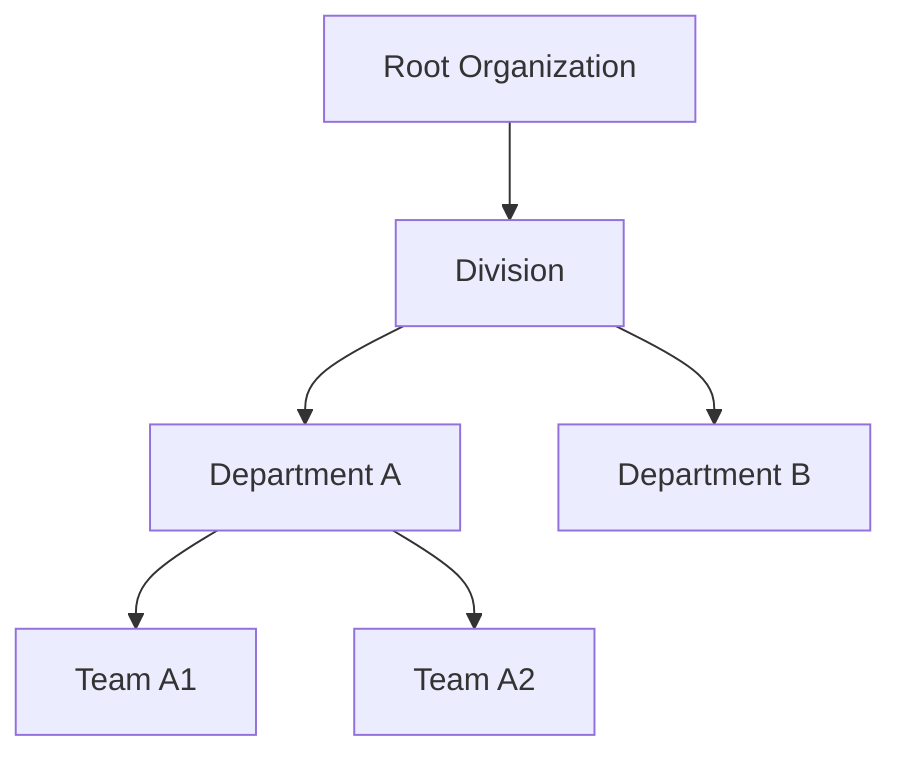

## Introduction

In data warehousing and analytics, a challenge is effectively handling Slowly Changing Dimensions (SCDs) that involve hierarchical structures. A typical use case might involve tracking historical and current changes in an organizational chart consisting of departments and sub-departments.

## Explanation of SCDs with Hierarchies

Hierarchical dimensions pose unique challenges due to their multi-level structure. Unlike flat dimensions, changes in one part of a hierarchy can impact numerous related entities. For example, a reorganization within a department can affect sub-departments, requiring sophisticated modeling strategies.
 
### Key Concepts:
- **Hierarchy Levels**: Defines different levels of the hierarchy (e.g., division, department, team).
- **Version History**: Maintains a historical record of changes to these hierarchical entities.
- **Lineage**: Tracks parent-child relationships over time.

## Design Strategies

1. **SCD Type 1**: Overwrite the existing values. Suitable when historical values aren't necessary for report generation.
   
2. **SCD Type 2**: Create new records for changes. Attributes historical data and maintains versions with `effective_date` and `expiry_date` columns.
   - **Implementation**: Each change in the hierarchy results in a new record for the entity that includes its level in the hierarchy.
   
3. **SCD Type 6 (Hybrid)**: A combination of Types 1, 2, and 3; preserving history, tracking changes, and surfacing the current situation.

### SCD Type 2 and 6 are particularly useful for hierarchical data as they facilitate historical analysis and accommodate structural changes over time.

## Example Use Case: Department Hierarchy

Given a scenario where an organization experiences frequent restructuring, you will:

1. **Identify Levels**: Define hierarchy levels (e.g., Organization, Division, Department, Team).
2. **Design Schema**:
   - Use composite keys that involve `department_id`, `version`, and `validity dates`.
   - Include `parent_department_id` to express hierarchical relationships.
3. **Implement Changes**: Each new restructure introduces an additional entry for each modified department.

Here is an illustrative SQL example for implementing SCD Type 2 with Hierarchical data:

```sql
CREATE TABLE department_scd (
    department_id INT,
    department_name VARCHAR(255),
    parent_department_id INT,
    effective_date DATE,
    expiry_date DATE,
    is_current BOOLEAN,
    PRIMARY KEY(department_id, effective_date)
);

-- Insertion of a new version due to changes
INSERT INTO department_scd (
    department_id, department_name, parent_department_id, 
    effective_date, expiry_date, is_current
) VALUES (
    5, 'Marketing', 1, '2024-01-01', '9999-12-31', TRUE
);

-- Updating previous version's expiry
UPDATE department_scd
SET expiry_date = '2024-01-01', is_current = FALSE
WHERE department_id = 5 AND is_current = TRUE;
```

## Diagrams



## Related Patterns

- **Parent-Child Hierarchies**: Deals with variable depth hierarchies using self-referencing tables.
- **Bridge Tables for Hierarchies**: Facilitates many-to-many relationships within hierarchical data.

## Additional Resources

1. Kimball Group’s guidelines on [Slowly Changing Dimensions](https://www.kimballgroup.com/).
2. Articles on managing SCD in big data contexts (Apache Hive, Delta Lake).

## Summary

SCD with Hierarchies is essential for capturing and analyzing changes in nested organizational structures across time. By employing this pattern, enterprises can maintain comprehensive historical insights, enabling more accurate data analysis and decision-making. Its implementation typically involves a combination of SCD Types 2 and 6, allowing both historical tracking and knowledge of current structure.
