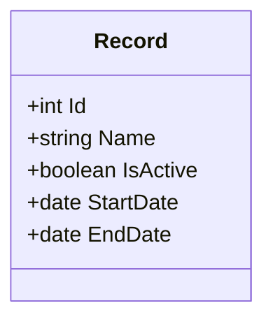
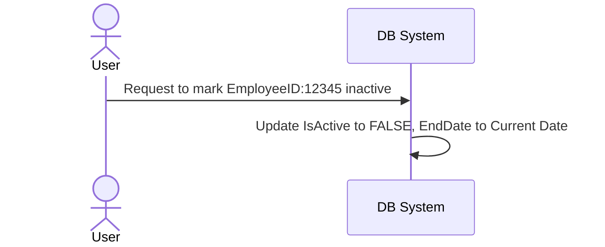

## Introduction
Soft Deletes is a data modeling pattern used extensively in enterprise data warehouses and databases to manage and maintain historical data without physically deleting records. This is particularly important in the context of Slowly Changing Dimensions (SCD), where historical accuracy and audit trails are mandatory.

## Detailed Explanation

### Design Pattern: Soft Deletes
Soft deletes involve marking a record as inactive instead of deleting it from the database. This strategy allows us to maintain historical records that can provide vital insights during audits or analyses. In the context of Slowly Changing Dimensions, this pattern is instrumental in dealing with changes in dimension attributes over time while preserving record history.

### Architectural Approach
The key to implementing soft deletes is the introduction of an additional field, often named `IsActive`, alongside other metadata fields such as `StartDate` and `EndDate`. 

1. **IsActive Field**: This boolean field indicates whether the record is currently active. If a record is active, `IsActive` is set to `TRUE`; otherwise, it is set to `FALSE`.

2. **StartDate and EndDate Fields**: These fields are used to specify the time frame during which the record was active. When a change occurs (e.g., an employee leaves the company), the `EndDate` is set to the date of the change, and `IsActive` is set to `FALSE`.

Thus, a soft delete helps simulate a deletion from the user's point of view while keeping the record in the database for historical context.

### Example: Employee Departure
Consider an employee records dimension in a data warehouse. Let's illustrate how an employee departure might be treated with a soft delete:

```sql
UPDATE Employee_Dimension
SET IsActive = FALSE,
    EndDate = CURRENT_TIMESTAMP
WHERE EmployeeID = 12345 AND IsActive = TRUE;
```

In this example, when an employee departs (typically a Slowly Changing Dimension Type 2 change), the record in the `Employee_Dimension` table remains, but it is marked inactive.

### Best Practices
- **Indexing**: Ensure that fields like `IsActive`, `StartDate`, and `EndDate` are indexed to improve query performance.
- **Auditing**: Use database triggers or similar mechanisms to automatically manage `EndDate` and `IsActive` upon status changes.
- **Data Purging**: When records become irrelevant (beyond a specific historical depth), consider implementing a data purging policy that archives or permanently deletes old records.

## Diagrams

### UML Class Diagram - Soft Deletes Concept



### Sequence Diagram - Soft Delete Process



## Related Patterns
- **Versioning**: Keeping multiple versions of records for audit trails and historical analysis.
- **State Transition**: A pattern capturing changes in object states over time, often complemented by soft deletes.
- **Audit Trail**: Recording changes, including who made them and when they were made.

## Additional Resources
- Martin Fowler's *Patterns of Enterprise Application Architecture* for more insights on object-relational mapping and change management strategies.
- Data Warehousing Toolkit by Ralph Kimball for Slowly Changing Dimensions methods and principles.

## Summary

Soft Deletes in Slowly Changing Dimensions offers a robust framework for dealing with changes in data while preserving historical records integrity. This allows for comprehensive data analysis, audit capabilities, and maintains a historical record in data models. It's a quintessential approach in enterprise data management, ensuring long-term data reliability.

Understanding and implementing this pattern effectively can significantly enhance data quality assurance processes within large-scale data management systems.
