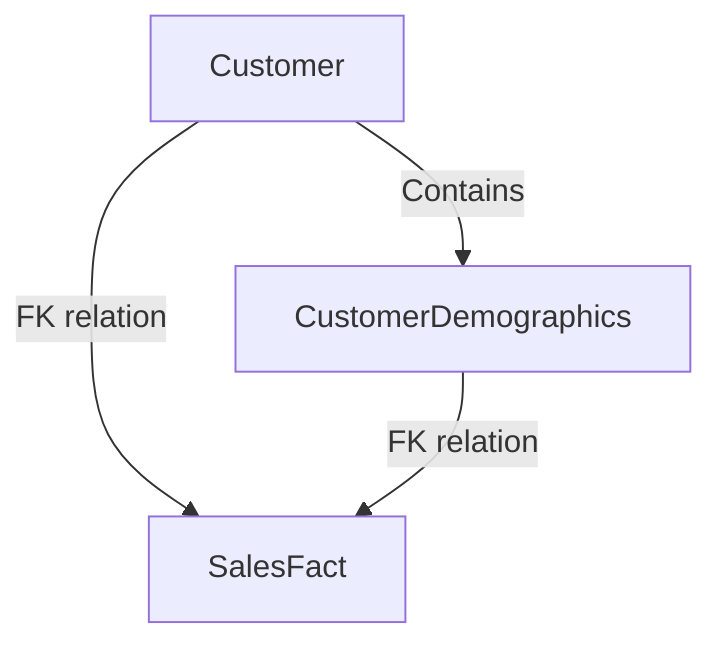

---

linkTitle: "Mini-Dimensions"
title: "Mini-Dimensions"
category: "Slowly Changing Dimensions (SCD)"
series: "Data Modeling Design Patterns"
description: "An in-depth look at Mini-Dimensions, a design pattern that involves splitting frequently changing attributes into separate dimensions to manage and optimize Slowly Changing Dimensions in data warehousing and data modeling."
categories:
- Slowly Changing Dimensions
- Data Modeling
- Data Warehousing
tags:
- Data Warehousing
- Dimensions
- Design Patterns
- Data Modeling
- SCD
date: 2024-07-07
type: docs

canonical: "https://softwarepatternslexicon.com/103/3/15"
license: "© 2024 Tokenizer Inc. CC BY-NC-SA 4.0"
---

## Introduction to Mini-Dimensions

In the realm of data modeling, particularly within data warehousing, managing changes in attribute data effectively is crucial for maintaining data accuracy and integrity. One of the challenges arises from frequently changing attributes in large dimensions, such as customer data. Mini-dimensions present a design pattern solution for efficiently handling these changing attributes by separating them into independent dimensions.

## Problem Statement

In traditional data warehousing, slowly changing dimensions (SCD) methods manage historical changes to dimensional data. However, handling frequently changing attributes in a large dimension, like a customer dimension, can lead to performance bottlenecks and excessive data volume. Constant updates and the need for historical tracking of frequently changing information can affect query performance and increase storage requirements.

## The Mini-Dimensions Approach

The Mini-Dimension pattern addresses this challenge by isolating the rapidly changing attributes from the main dimension into a smaller, more manageable dimension. By doing so, it reduces the churn in the primary dimension, thereby preserving its historical integrity and improving system performance.

### Key Advantages:

- **Improved Query Performance**: By normalizing frequently changing attributes into their own dimension, queries are streamlined.
- **Optimized Storage**: Reduces storage needs by minimizing the number of records affected by changes.
- **Simplified Maintenance**: Makes it easier to manage historical data without impacting the entire parent dimension.

## Implementation Example

Consider a scenario where a retail company has a `Customer` dimension with attributes like `Age Group`, `Membership Tier`, and `Marketing Segments`. These attributes change frequently as customers age, move between membership tiers, or switch marketing segments. Instead of capturing these changes directly in the `Customer` dimension, we create a `CustomerDemographics` mini-dimension.

### Schema Design:

- `Customer` Dimension:
  - CustomerID (PK)
  - Name
  - Email
  - Contact Number

- `CustomerDemographics` Dimension:
  - DemoID (PK)
  - Age Group
  - Membership Tier
  - Marketing Segment

- `Fact Table`:
  - TransactionID
  - CustomerID (FK)
  - DemoID (FK)
  - PurchaseAmount
  - TransactionDate

### Sample SQL Implementation

```sql
CREATE TABLE Customer (
    CustomerID INT PRIMARY KEY,
    Name VARCHAR(100),
    Email VARCHAR(100),
    ContactNumber VARCHAR(15)
);

CREATE TABLE CustomerDemographics (
    DemoID INT PRIMARY KEY,
    AgeGroup VARCHAR(50),
    MembershipTier VARCHAR(50),
    MarketingSegment VARCHAR(50)
);

CREATE TABLE SalesFact (
    TransactionID INT PRIMARY KEY,
    CustomerID INT,
    DemoID INT,
    PurchaseAmount DECIMAL(10, 2),
    TransactionDate DATE,
    FOREIGN KEY (CustomerID) REFERENCES Customer(CustomerID),
    FOREIGN KEY (DemoID) REFERENCES CustomerDemographics(DemoID)
);
```

## Architectural Diagram



## Related Patterns

- **Junk Dimensions**: Used to handle low cardinality flags and indicators in a single consolidated dimension.
- **Degenerate Dimensions**: Attributes stored within fact tables because they are not dimensionalized.
  
## Additional Resources

- [Kimball's Data Warehouse ETL Toolkit](https://www.kimballgroup.com/)
- [Data Warehousing Concepts](https://www.oracle.com/database/what-is-a-data-warehouse/)

## Conclusion

The Mini-Dimension design pattern is a powerful tool in the arsenal of data modelers and architects dealing with frequently changing attributes. By compartmentalizing these changes, not only do we achieve better performance and more scalable solutions, but we also maintain the integrity and cleanliness of the data warehouse. As with all design patterns, balance and careful implementation considerations are key.

---
