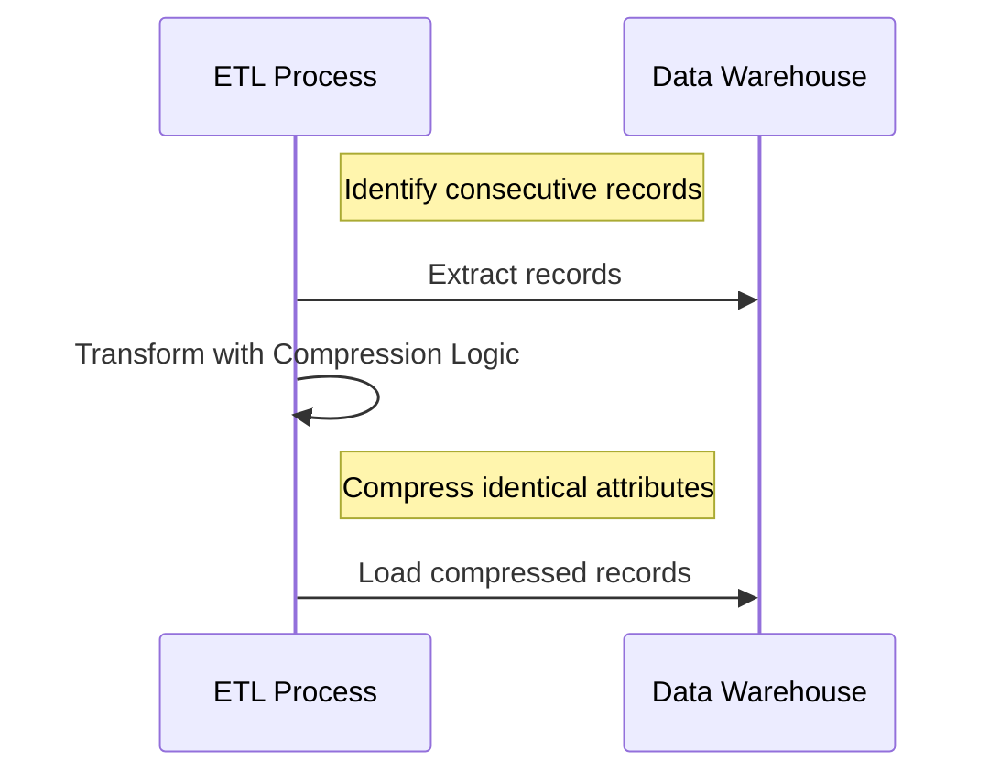

---

linkTitle: "Compressed SCD"
title: "Compressed SCD"
category: "Slowly Changing Dimensions (SCD)"
series: "Data Modeling Design Patterns"
description: "Summarizing history by merging records with identical attributes in data warehouse systems."
categories:
- Data Modeling
- Data Warehousing
- Design Patterns
tags:
- SCD
- Data Integration
- ETL
- Historical Data
- Data Warehouse
date: 2024-07-07
type: docs

canonical: "https://softwarepatternslexicon.com/103/3/16"
license: "© 2024 Tokenizer Inc. CC BY-NC-SA 4.0"
---

## Compressed Slowly Changing Dimensions (SCD)

A Compressed SCD is a data modeling design pattern used to optimize storage and query performance in data warehousing systems by compressing historical records that have identical attributes over a consecutive period. This pattern is particularly useful in scenarios where frequently changing dimensions are interleaved with periods of stability.

### Detailed Explanation

In data warehouses, tracking the history of dimensional data helps analyze changes over time. However, not all changes require granular tracking, especially when the attribute values remain constant for many consecutive records. The Compressed SCD pattern consolidates these unchanged records into a single summarized record.

#### Key Characteristics:

- **Data Consolidation**: Merges consecutive dimension records with identical attribute values into a single record, retaining only the earliest start date and latest end date.
- **Space Efficiency**: Reduces storage requirement by eliminating redundant records, leading to more efficient use of space and potentially improving query performance.
- **Query Optimization**: Querying compressed historical data can become faster due to reduced volume.

### Architectural Approach

#### Steps to Implement:

1. **Identify Stable History**: Determine which dimensions exhibit long periods of unchanged data.
2. **Configure ETL Processes**: Adjust the ETL (Extract, Transform, Load) processes to detect consecutive records with the same attribute values.
3. **Compression Logic**: Implement logic that consolidates consecutive records by extending their validity periods.
4. **Metadata Management**: Maintain metadata to track the original data points before and after compression for auditing and rollback capabilities.

### Example Code

Below is a pseudo-code example demonstrating the compression transformation in a typical ETL pipeline:

```java
function compressSCD(records):
    compressedRecords = []
    currentRecord = null

    foreach record in records:
        if currentRecord == null:
            currentRecord = record
            continue

        if currentRecord.attributes == record.attributes:
            currentRecord.endDate = record.endDate
        else:
            compressedRecords.append(currentRecord)
            currentRecord = record
            
    compressedRecords.append(currentRecord)
    return compressedRecords
```

### Diagrams



### Related Patterns

- **SCD Type 1**: Overwrites old data without keeping history.
- **SCD Type 2**: Keeps a complete historical record of changes.
- **SCD Type 3**: Captures current state plus historical change.

### Best Practices

- **Data Validation**: Ensure data consistency before applying compression to avoid losing critical change data.
- **Auditing**: Develop robust audit trails to track transformation and compression history.
- **Performance Tuning**: Test performance implications since compressed data can lead to both gains and additional complexity in querying.

### Additional Resources

- [Data Warehouse Design: Modeling and Implementation](https://www.example.com)
- [ETL Process Tuning and Optimization Techniques](https://www.example.com)

### Conclusion

The Compressed SCD pattern can greatly benefit data warehouse environments dealing with dimensions that have long periods of unchanged data. By optimizing storage and query performance while maintaining necessary historical context, it satisfies the dual needs of efficiency and analytical insights.


