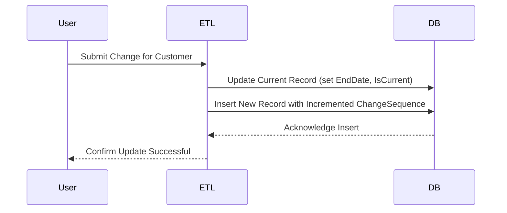

## Introduction

In the realm of data warehousing, tracking changes over time for dimension data is crucial for historical analysis. A Slowly Changing Dimension (SCD) is a concept used to manage these changes. The SCD with Effective Sequence Number pattern is a method to maintain the order of data changes efficiently and accurately. This approach introduces a `ChangeSequence` column that is incremented each time an update to a record occurs. This helps in ensuring a clear chronological order, which is critical for historical queries and reporting.

## Architectural Approach

The SCD with Effective Sequence Number pattern fits into the Type 2 SCD approach, which involves creating a new record for each change. This pattern specifically adds a `ChangeSequence` or equivalent column that acts as an ordering mechanism, independent of timestamps which might not always be precise due to concurrent updates or system clock issues.

### Components:
1. **ChangeSequence Column**: A mandatory field in the dimension table that gets incremented with each modification.
2. **Validity Columns**: Optional fields such as `StartDate` and `EndDate` indicating the active period for a particular version of the record.
3. **Current Flag**: An optional boolean field indicating if the record is the most recent version.

### Best Practices:
- Ensure the `ChangeSequence` is unique and consistent across records to act as a reliable sort order.
- Combine `ChangeSequence` with timestamps for additional integrity checks and easier debugging.

## Example Code

Below is a simplified implementation using SQL to demonstrate how this pattern can be instantiated:

```sql
CREATE TABLE Customer_Dimension (
    CustomerID INT,
    Name VARCHAR(100),
    Address VARCHAR(255),
    Status VARCHAR(20),
    ChangeSequence INT,
    StartDate DATE DEFAULT CURRENT_DATE,
    EndDate DATE,
    IsCurrent BOOLEAN DEFAULT TRUE,
    PRIMARY KEY (CustomerID, ChangeSequence)
);

-- SQL to process a change
UPDATE Customer_Dimension
SET EndDate = CURRENT_DATE, IsCurrent = FALSE
WHERE CustomerID = @CustomerID AND IsCurrent = TRUE;

INSERT INTO Customer_Dimension (CustomerID, Name, Address, Status, ChangeSequence)
VALUES (@CustomerID, @NewName, @NewAddress, @NewStatus,
        (SELECT MAX(ChangeSequence) + 1 FROM Customer_Dimension WHERE CustomerID = @CustomerID));
```

In practice, this SQL snippet would be part of an ETL process where changes are detected and managed accordingly.

## Diagram

Below is a Mermaid UML Sequence diagram illustrating the update sequence in the SCD with Effective Sequence Number pattern:



## Related Patterns

- **SCD Type 1**: Overwrite the existing data without maintaining history.
- **SCD Type 3**: Store only limited history by maintaining flags or few historical columns.
- **Temporal Table Pattern**: Maintain full table history, often supported natively in modern databases.

## Additional Resources

- [Kimball Group's Dimensional Modeling Techniques](https://www.kimballgroup.com/documentation/how-to-guides/)
- [AWS SCD Implementation Guide](https://docs.aws.amazon.com/redshift/latest/dg/r_Slowly_changing_dimension_changes.html)
- [Data Vault Modeling Techniques](https://danlinstedt.com/datavaultcat/data-vault-architecture/)

## Summary

The SCD with Effective Sequence Number pattern addresses the need for a reliable, chronological tracking method in data warehouses. By leveraging sequence numbers, this approach mitigates issues pertaining to timestamp precision and ensures a robust historical tracking mechanism. Such techniques are invaluable for organizations seeking detailed insight into the evolution of their data over time.
