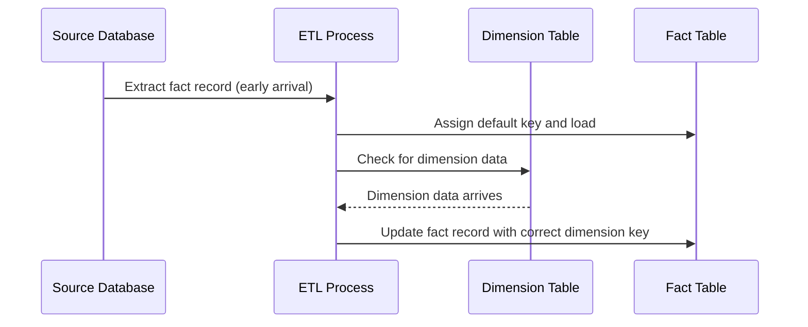

## Introduction

In data warehousing and ETL processes, it's not uncommon for fact records to arrive before their associated dimension data. This scenario poses a challenge as the integrity and accuracy of analytical insights depend on properly linked fact and dimension data. The "Early Arriving Facts" pattern provides a strategy to handle such situations gracefully.

## Problem

When fact records arrive before the associated dimension records during data ingestion, these fact records can end up orphaned in the fact table. Without a corresponding dimension record, it's impossible to establish correct relationships for accurate reporting and analysis.

## Solution

The "Early Arriving Facts" pattern provides a strategy for temporarily associating these fact records with a default placeholder dimension, known as a "Surrogate Key" or "Unknown Member Key," until the correct dimension data arrives. Once the dimension data becomes available, the placeholder can be updated with the accurate dimension key.

### Steps

1. **Assign a Default Surrogate Key**: 
   - Upon encountering an early arriving fact, assign it a default surrogate key pointing to a generic "Unknown" or "Temporary" dimension record.
   
2. **Load into Fact Table**: 
   - Load the fact record into the fact table using the assigned default surrogate key.

3. **Monitor for Dimension Data Arrival**: 
   - Implement a mechanism to check when the actual dimension data arrives.

4. **Update Fact Record**: 
   - Once the correct dimension record is available, update the corresponding fact records to replace the default surrogate key with the accurate one.

### Example Code

Here is a Pseudo-SQL example illustrating how you might handle early arriving facts within an ETL process:

```sql
-- Step 1: Assign Default Surrogate Key
INSERT INTO FactTable (product_key, sales_amount, sales_date)
  SELECT 
    COALESCE(dimension.product_key, -1), -- Default to -1 for unknown keys
    fact.sales_amount,
    fact.sales_date
  FROM FactStaging fact
  LEFT JOIN DimensionTable dimension
    ON fact.product_id = dimension.product_id;

-- Step 2: Periodically Update Fact Records
UPDATE FactTable
SET product_key = dimension.product_key
FROM DimensionTable dimension
WHERE FactTable.product_key = -1
  AND FactTable.product_id = dimension.product_id;
```

### Diagram

Here's a Mermaid UML diagram demonstrating the "Early Arriving Facts" process.



## Related Patterns

- **Slowly Changing Dimensions (SCD)**: Managing changes to dimension data over time.
- **Late Arriving Dimension**: Directly related when dimension data finally arrives after facts.

## Best Practices

- Utilize dedicated placeholder records with clear "unknown" identifiers.
- Implement tracking and alert systems to ensure early arriving facts are resolved timely.
- Ensure proper indexing on keys to enhance update performance in the fact table.

## Additional Resources

- Kimball Group: Data Warehouse Design Tips
- "The Data Warehouse Toolkit" by Ralph Kimball

## Summary

The "Early Arriving Facts" pattern provides an effective approach for handling scenarios where fact records precede their dimension data in ETL processes. By assigning a default surrogate key, this pattern ensures that data can still be processed and later corrected, maintaining the integrity and accuracy of data models while facilitating seamless analytical processes.
