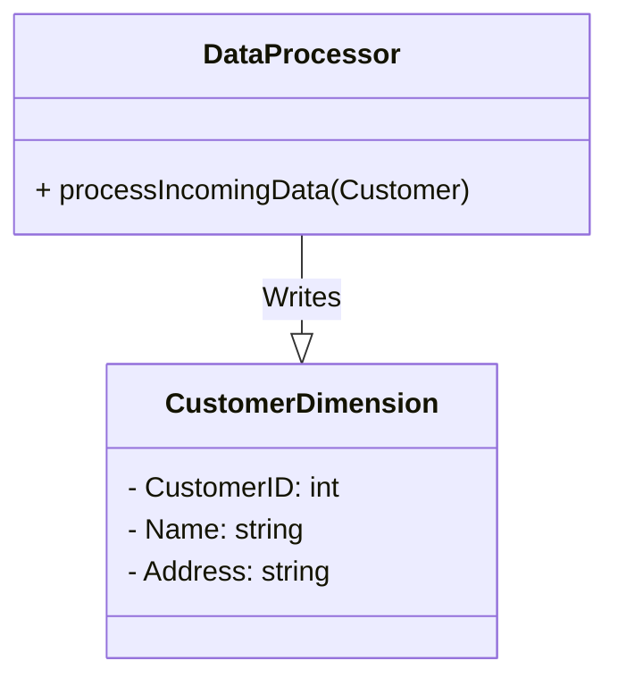

## Description

In the context of data warehousing and analytic modeling, Slowly Changing Dimensions (SCD) deal with managing changes in dimension tables while preserving historical accuracy and performance. The Type 1 SCD pattern addresses data changes by simply overwriting old records with new ones as they arrive, without maintaining any historical record of the data.

### Advantages

- **Simplicity**: By overwriting changes, the Type 1 approach is straightforward and easy to implement.
- **Performance**: Since there's no need to maintain historical data, queries are faster and storage requirements are lessened.
- **Clarity**: Analysis on the most current and relevant business data only, eliminating outdated or potentially confusing information.

### Disadvantages

- **Loss of History**: Overwrites obliterate previous data, making historical analysis impossible.
- **Misleading Analysis**: Overwritten data might mislead analyses where historical insights are necessary.

## Architectural Approach

### Implementation

The implementation involves simple `UPDATE` operations on the dimension table columns, reflecting new attribute values for existing records. This pattern is optimal for attributes or dimensions where historical data is irrelevant or unlikely to be used for future analysis.

#### Example SQL Query

Consider a customer dimension with fields for `CustomerID` and `Address`. When a customer address changes, you can overwrite the existing address with:

```sql
UPDATE CustomerDimension
SET Address = '123 New Avenue, New City, NC'
WHERE CustomerID = 456;
```

Here, the old address is lost and no longer retrievable post-update.

### Use Case Scenarios

- **Contact Information**: For applications where the latest contact information is paramount, such as customer care, Type 1 SCD is applicable.
- **Transactional Systems**: Systems primarily focused on current state operations rather than historical data analysis like inventory checks or order fulfillment.

## Design Pattern Diagrams

Here's a simple diagram illustrating the Type 1 SCD Process:



## Related Patterns

- **Type 2 SCD - Historical Tracking**: Retains all changes and allows historical querying through a versioning system.
- **Type 3 SCD - Limited History**: Retains a fixed-length history, typically for a specific attribute.
- **Snapshot Pattern**: Captures a point-in-time state for auditing or backtracking.

## Additional Resources

- [Kimball Dimensional Modeling Techniques](https://www.kimballgroup.com)
- [AWS Database Blog on SCD](https://aws.amazon.com/blogs/database/)
- [Apache Hive Guide on SCD](https://cwiki.apache.org/confluence/display/Hive/Home)

## Summary

Type 1 SCD - Overwrite stands as a basic data modeling pattern catering to scenarios where current data accuracy is prioritized over historical data tracking. Despite its limitation in historical data loss, its simplicity, operational efficiency, and performance make it valuable in scenarios with non-essential historical attributes.

When deciding on employing Type 1 SCD, consider balancing between data integrity needs and performance demands, complemented by a keen understanding of business priorities.
