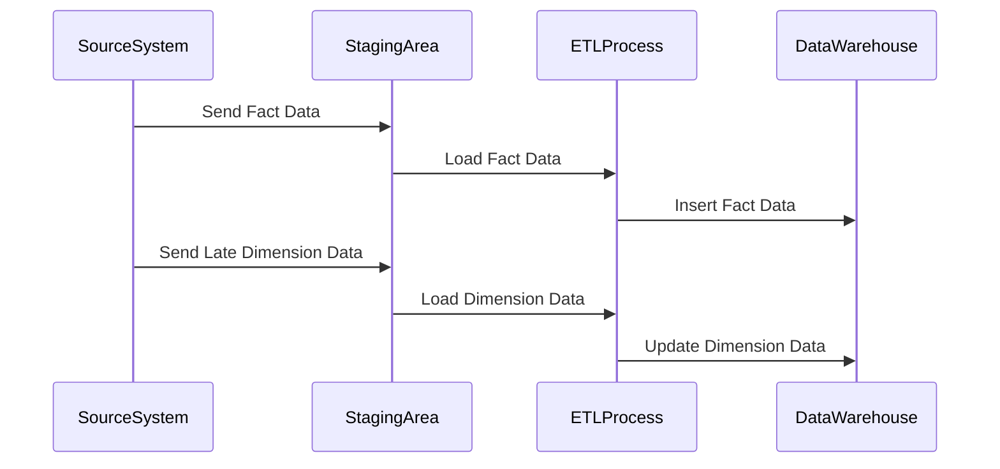

## Late Arriving Dimensions

### Description

Late Arriving Dimensions is a data modeling pattern used in data warehousing to address the scenario where dimension data arrives after related fact data has already been loaded. This situation can arise when information about entities such as products, customers, or other business descriptors is delayed or comes from different source systems that are out of sync with the data warehouse.

### Purpose

The primary purpose of this pattern is to ensure that the integrity and accuracy of analytical data are maintained by properly incorporating this late-arriving dimension data into the existing data model.

### Application Example

Consider a retail data warehouse where sales transactions (fact data) are loaded daily. If a new product is sold but its detailed attributes are added to the Product dimension table only after some delay, the data warehouse should have a strategy to handle this discrepancy to ensure the integrity of the analytical outputs.

### Architectural Approaches

1. **Surrogate Keys Handling**:
    - Utilize surrogate keys for dimension tables to ensure uniqueness and automatic handling of new entries.
    - Missing dimension rows can initially use a default placeholder or dummy row with a surrogate key.

2. **Staging Area & ETL Processes**:
    - Use a staging area in the ETL process to temporarily store incoming late data.
    - Design ETL jobs to update dimension tables with new data once the delayed information arrives.

3. **Data Reconciliation**:
    - Implement periodic data reconciliation processes to identify and update late-arriving dimension data.
    - Use incremental updates to minimize the impact on existing analytical reports.

### Best Practices

- **Default or Unknown Entry**: Define a default entry for missing dimensions to serve as a placeholder until the actual data arrives, ensuring that fact tables can reference existing keys without errors.
- **Tracking Changes**: Implement Slowly Changing Dimensions (SCD) techniques to track historical changes as late-arriving dimensions may also introduce historical data changes.
- **Auditing and Logging**: Maintain auditing logs to track the updates applied to dimension tables, providing traceability and helping with future debugging or data quality issues.

### Example Code

Suppose we have a `Product` table where new attributes for certain products arrive late:

```sql
-- Initial state of the Product table with a default unknown product
INSERT INTO Products (ProductKey, ProductID, ProductName, Category)
VALUES (0, 'Unknown', 'Unknown Product', 'Unknown Category');

-- Fact table with transactions linked to Product
INSERT INTO SalesFacts (SalesID, ProductKey, Quantity, Date)
VALUES (1, 0, 10, '2024-07-01');

-- Upon arrival of the late dimension
UPDATE Products
SET ProductName = 'New Product', Category = 'Gadgets'
WHERE ProductID = 'NewID';

-- Re-assign fact rows with the updated ProductKey
UPDATE SalesFacts
SET ProductKey = (SELECT ProductKey FROM Products WHERE ProductID = 'NewID')
WHERE ProductID = 'NewID';
```

### Diagrams

Here's a simple sequence diagram illustrating how late-arriving dimensions are updated:



### Related Patterns

- **Slowly Changing Dimensions (SCD)**: A pattern used to manage and track changes to dimension data over time.
- **Data Vault Modeling**: Supports agility and uses hubs, links, and satellites to handle business changes and late-arriving data flexibly.

### Additional Resources

- Kimball, R. (2013). The Data Warehouse Toolkit: The Definitive Guide to Dimensional Modeling. Wiley.
- Ralph Kimball's series on Data Warehousing and ETL.

### Summary

Late Arriving Dimensions is a crucial pattern for maintaining the integrity of a data warehouse when information arrives out of sync. Through appropriate handling, such as surrogate keys and ETL strategies, data consistency is preserved, and analytics remain accurate and meaningful.
