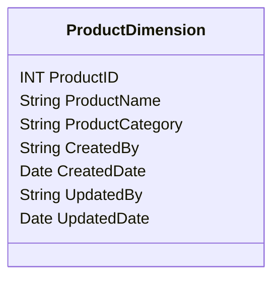

## Introduction

The SCD Metadata Columns design pattern focuses on incorporating metadata columns into dimension tables to maintain audit information, such as creation and update details, throughout the lifecycle of a record. This approach provides a robust framework for data governance, auditability, and historical tracking, which is essential in data warehousing and business intelligence systems.

## Detailed Explanation

### Key Concepts:

- **Slowly Changing Dimensions (SCD)**: Dimensions that change slowly over time within a data warehouse. Changes to these dimensions must be managed to ensure historical accuracy and consistency.
  
- **Metadata Columns**: Additional columns in a table specifically for recording data about data events, such as `CreatedBy`, `CreatedDate`, `UpdatedBy`, and `UpdatedDate`.

### Purpose:

Incorporating metadata columns allows organizations to track who created or modified records and when these actions took place. This promotes traceability, transparency, and accountability in data management practices.

### Benefits:

1. **Auditability**: Provides a clear audit trail of who modified which records and when, supporting data integrity and compliance requirements.
   
2. **Historical Tracking**: Enhances the ability to analyze changes over time to understand data evolution.

3. **Simplified Data Models**: Eliminates the need for complex joins with separate audit tables, ensuring easier querying and reporting.

### Architectural Approach

Implement metadata columns within each dimension table relevant to the SCD operation. For SCD types 1 and 2, the metadata attributes need careful integration to distinguish whether an update signifies an overwrite or historical preservation.

#### Example Columns:

- **`CreatedBy`**: Stores the identifier of the user or process that originally created the record.
- **`CreatedDate`**: Captures the timestamp when the record was initially created.
- **`UpdatedBy`**: Contains the identifier of the user or process that last updated the record.
- **`UpdatedDate`**: Records the timestamp of the latest update for the record.

### Example Code

Here's a simple SQL example to illustrate how these columns might be used in a dimension table:

```sql
CREATE TABLE ProductDimension (
    ProductID INT PRIMARY KEY,
    ProductName VARCHAR(100),
    ProductCategory VARCHAR(50),
    CreatedBy VARCHAR(50),
    CreatedDate DATETIME,
    UpdatedBy VARCHAR(50),
    UpdatedDate DATETIME
);

INSERT INTO ProductDimension (ProductID, ProductName, ProductCategory, CreatedBy, CreatedDate) 
VALUES (1, 'Smartphone', 'Electronics', 'data_entry_user', GETDATE());

-- Update Record
UPDATE ProductDimension
SET ProductName = 'Smartphone X',
    UpdatedBy = 'system_update_process',
    UpdatedDate = GETDATE()
WHERE ProductID = 1;
```

### Diagrams

Below is a simple Mermaid UML Class diagram representing an SCD table structure with metadata columns:



## Related Patterns

- **Type 2 Slowly Changing Dimension**: Maintains a full history of changes in the dimensions.
- **Audit Table**: A separate table to record changes, suitable for heavier auditing needs.
  
## Additional Resources

- [The Data Warehouse Toolkit](https://www.amazon.com/Data-Warehouse-Toolkit-Definitive-Dimensional/dp/1118530802): Comprehensive guide on dimensional modeling.
- [Building the Data Warehouse](https://www.amazon.com/Building-Data-Warehouse-Challenges-Solutions/dp/1634622384): Insights into constructing scalable and auditable data warehouse systems.

## Summary

The SCD Metadata Columns design pattern is a vital component in data governance, ensuring that dimension records in data warehouses are not only accurate but also auditable. By including metadata columns such as `CreatedBy`, `CreatedDate`, `UpdatedBy`, and `UpdatedDate`, organizations can streamline auditing processes, maintain historical data integrity, and support compliance policies effectively.
