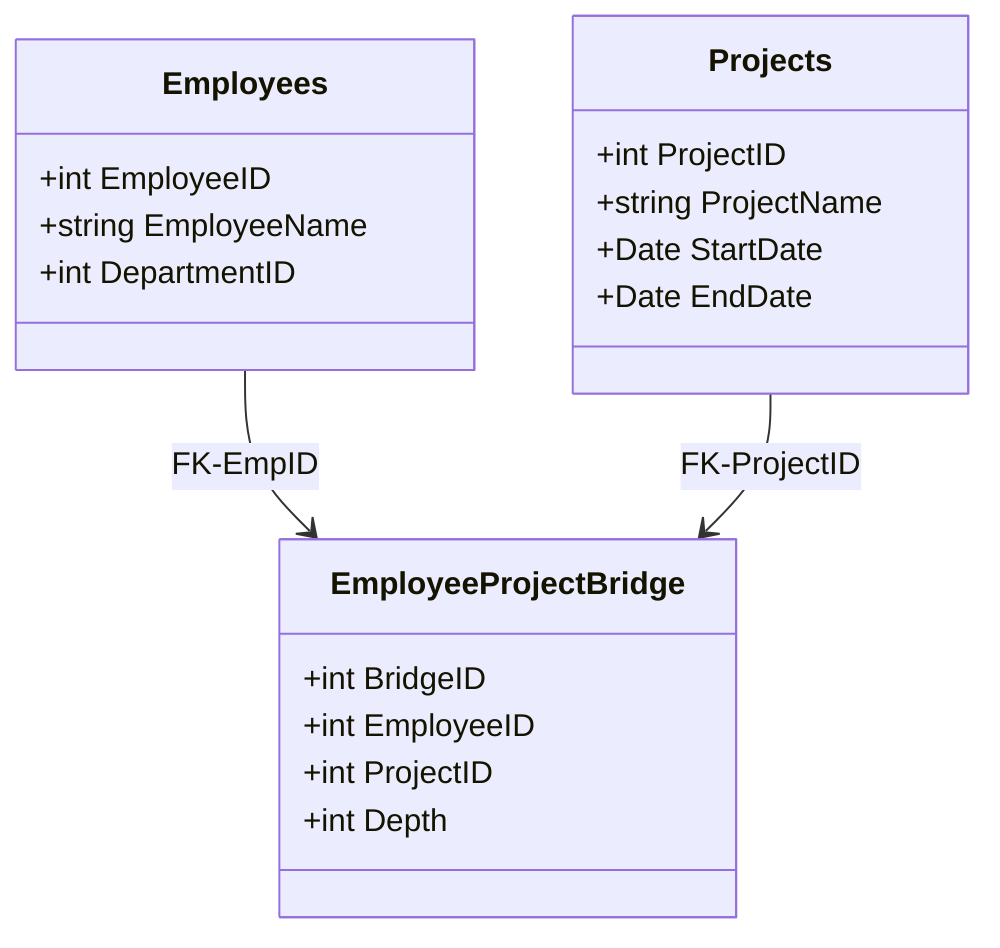

## Introduction

Hierarchy Bridge Tables are utilized in data modeling to effectively manage many-to-many hierarchical relationships. This pattern is particularly useful in environments dealing with complex hierarchies where multiple entities are associated, such as employees working on various projects, organizational structures, product categorizations, etc.

## Design Pattern Explanation

In environments involving intricate data hierarchies, simple fact tables might not adequately represent the relationship complexities. A Hierarchy Bridge Table allows the representation of these many-to-many relationships within hierarchies, enabling flexible data retrieval and association management.

### Structure

A typical hierarchy bridge table includes:
- **Surrogate Key**: A unique identifier for each row in the bridge table.
- **Parent Key**: The identifier for the parent entity in the hierarchy.
- **Child Key**: The identifier for the child entity within the same hierarchy.
- **Depth**: Indicates the depth of the child entity relative to its parent, helping to preserve hierarchical structure context during queries.

### Use Case Example

Consider a project management system where employees are often associated with multiple projects over time:
- **Employees Table**: Contains details about employees.
- **Projects Table**: Consists of various project details.
- **Hierarchy Bridge Table**: Links employees to projects considering the dynamic nature of work assignments and hierarchical reporting structures.

### Example Code

Below is a simplified SQL example demonstrating a hierarchy bridge table setup joining employees and projects:

```sql
CREATE TABLE Employees (
    EmployeeID INT PRIMARY KEY,
    EmployeeName VARCHAR(100),
    DepartmentID INT
);

CREATE TABLE Projects (
    ProjectID INT PRIMARY KEY,
    ProjectName VARCHAR(100),
    StartDate DATE,
    EndDate DATE
);

CREATE TABLE EmployeeProjectBridge (
    BridgeID INT PRIMARY KEY,
    EmployeeID INT,
    ProjectID INT,
    Depth INT,
    FOREIGN KEY (EmployeeID) REFERENCES Employees(EmployeeID),
    FOREIGN KEY (ProjectID) REFERENCES Projects(ProjectID)
);
```

### Diagrams

#### UML Class Diagram



## Related Patterns

- **Factless Fact Table**: Fact tables with no measures that enable capturing event metadata or bridge relationships in dimensional models.
- **Star Schema**: A foundational schema design used for building multi-dimensional data models with a central fact table.
- **Snowflake Schema**: A normalized form of star schema that extends hierarchy further to reduce redundancy.

## Best Practices

- Ensure that the bridge table uses surrogate keys for extensibility and performance.
- Utilize indices on key columns to improve query performance, especially in large datasets.
- Keep track of hierarchy levels with depth indicators to facilitate easier hierarchical queries or reports.
- Regularly validate the bridge table's data integrity to prevent orphan links or inconsistencies.

## Additional Resources

- [Kimball Group Reader: Relentlessly Practical Tools for Data Warehousing and Business Intelligence](https://www.kimballgroup.com)
- [Data Warehouse Toolkit by Ralph Kimball](https://www.amazon.com/Data-Warehouse-Toolkit-Definitive-Dimensional/dp/1118530802)

## Summary

Hierarchy Bridge Tables are vital components in modeling complex relationships in data warehousing scenarios that involve many-to-many interactions within hierarchies. By using this pattern, data architects can handle complex associative requirements efficiently, maintaining data integrity and facilitating dynamic query capabilities.
