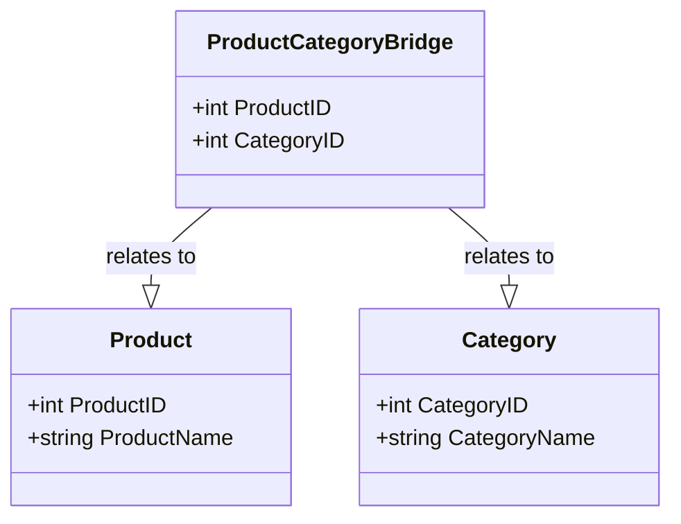

## Introduction

The **Multi-Valued Dimensions** design pattern addresses the challenge of modeling dimensions with attributes that can have multiple values at the same time. This is crucial in scenarios such as making a product classification more dynamic by associating it with multiple categories.

Multi-valued dimensions are prevalent in business scenarios where an entity can have different attributes or belong to various classifications. This pattern provides a structured approach to handle such complexity in data warehousing and dimensional modeling.

## Architectural Approach

When implementing a multi-valued dimension, several methods are typically considered:

1. **Bridge Table (Associative Table) Approach**:
   - **Implementation**: Use a separate bridge table to store associations between the fact table and the dimension table.
   - **Advantage**: Simplifies the fact table and allows many-to-many relationships without data duplication.
   - **Disadvantage**: Can increase complexity in querying due to additional table joins.

2. **Serialized Attribute Approach**:
   - **Implementation**: Store multiple values as serialized data in a single attribute column, such as JSON or XML format.
   - **Advantage**: Simplifies the database schema and minimizes joins.
   - **Disadvantage**: Can hinder querying performance and data integrity checks.

3. **Array/Table Column Extension**:
   - **Implementation**: Use database-specific features to store arrays or lists within columns.
   - **Advantage**: Can be more natural in NoSQL databases.
   - **Disadvantage**: Less support in traditional relational databases and may require schema updates for additional attributes.

## Example Code

Here's a simple example of a SQL schema using the bridge table approach:

```sql
CREATE TABLE Product (
    ProductID INT PRIMARY KEY,
    ProductName VARCHAR(255)
);

CREATE TABLE Category (
    CategoryID INT PRIMARY KEY,
    CategoryName VARCHAR(255)
);

CREATE TABLE ProductCategoryBridge (
    ProductID INT,
    CategoryID INT,
    PRIMARY KEY (ProductID, CategoryID),
    FOREIGN KEY (ProductID) REFERENCES Product(ProductID),
    FOREIGN KEY (CategoryID) REFERENCES Category(CategoryID)
);
```

In this setup:

- A `Product` can belong to multiple `Category` instances through the `ProductCategoryBridge` table.
- The `ProductCategoryBridge` table facilitates a many-to-many relationship.

## Diagrams

Below is a diagram representing the structure using Mermaid syntax:



## Best Practices

1. **Maintainability**:
   - Use descriptive naming conventions for tables and columns to enhance readability.
   
2. **Performance Optimization**:
   - Consider indexing strategy for bridge tables to improve query performance.

3. **Utility Functions**:
   - Provide database functions or views to simplify common queries involving multivalued dimensions.

4. **Regular Audit and Update**:
   - Ensure data integrity and consistency by implementing checks and triggers to handle changes across related tables.

## Related Patterns

- **Slowly Changing Dimension Type 2 (SCD Type 2)**:
  - Useful for capturing historical changes in dimension attributes.
- **Junction Table**:
  - A specific implementation pattern related to many-to-many relationships.

## Additional Resources

- Ralph Kimball's "The Data Warehouse Toolkit"
- Articles on database normalization and denormalization techniques
- Documentation on specific database features for handling arrays or JSON data types

## Summary

The Multi-Valued Dimensions pattern is a versatile solution in dimensional modeling which fulfills the need for complex analytics, allowing dimensions with multiple attributes to be integrated smoothly into data warehouses. The pattern is highly beneficial in retail and other industries where entities naturally fall into multiple categories, enhancing reporting flexibility and data integrity.
