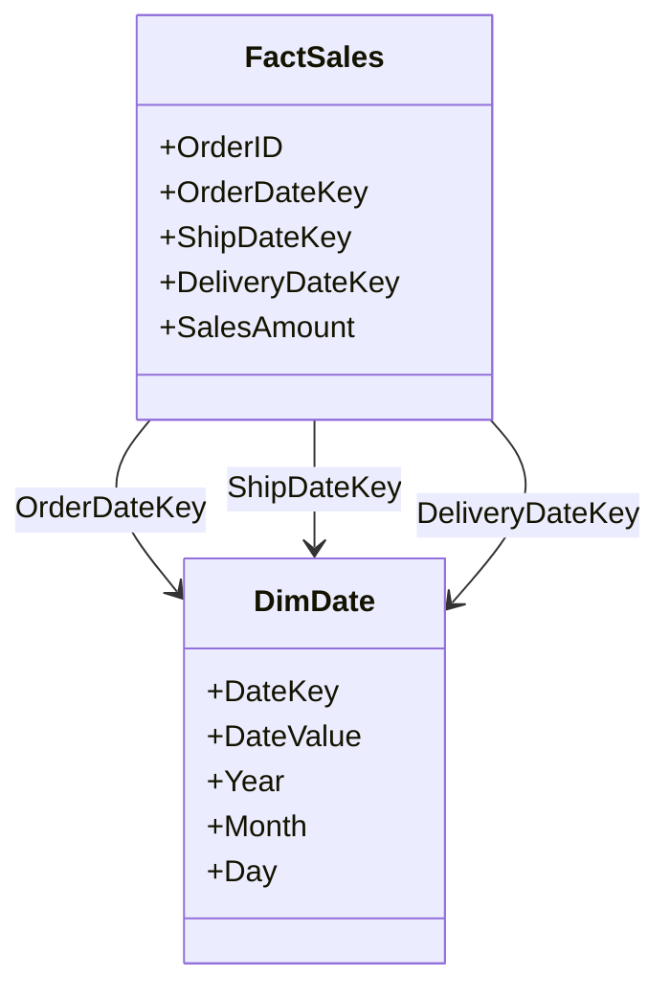

---

linkTitle: "SCD with Role-Playing Dimensions"
title: "SCD with Role-Playing Dimensions in Data Warehousing"
category: "Slowly Changing Dimensions (SCD)"
series: "Data Modeling Design Patterns"
description: "Role-Playing Dimensions in Slowly Changing Dimensions (SCD) and their application in data warehousing models. This pattern describes how to utilize the same dimension for multiple purposes in fact tables, enhancing analytical capabilities."
categories:
- Data Warehousing
- Data Modeling
- Business Intelligence
tags:
- SCD
- Role-Playing Dimension
- Data Warehousing
- Dimensional Modeling
- Data Architecture
date: 2024-07-07
type: docs

canonical: "https://softwarepatternslexicon.com/103/3/26"
license: "© 2024 Tokenizer Inc. CC BY-NC-SA 4.0"
---

In data warehousing, Slowly Changing Dimensions (SCD) are dimensions that capture slowly evolving data, such as customer or product information. A recurring challenge in dimensional modeling is dealing with role-playing dimensions. This pattern involves using the same dimension for multiple roles in a fact table, providing flexibility and reducing redundancy.

## What are Role-Playing Dimensions?

Role-playing dimensions refer to instances where the same dimension is utilized multiple times in a fact table with different contextual meanings. Consider the `Date` dimension, which might serve several roles such as `OrderDate`, `ShipDate`, and `DeliveryDate`. This enables diverse analytical measures across different timeframes without duplicating dimension tables.

## Architectural Approaches

* **Single Physical Table**: Use one physical dimension table but allow it to join multiple times to different foreign keys in the fact tables, each join reflecting a different role.
  
* **Aliases in SQL**: Use SQL queries with table aliasing to differentiate roles during data retrieval, where the aliases represent different contextual uses of the same dimension.

* **View Creation**: Create database views for each role to encapsulate common filtration and transformation logic related to that role.

## Best Practices

1. **Consistent Naming**: Clearly define and use distinct names for the roles in schema design to avoid confusion. e.g., `OrderDate`, `ShipDate`, `DeliveryDate`.
   
2. **Centralized Role Management**: Maintain a clear documentation of all possible roles a dimension can serve to ensure data governance practices are upheld.

3. **Efficient Indexing**: Index foreign keys to enhance query performance when joining large fact and dimension tables.

4. **Automated Role Identification**: Utilize ETL processes to automatically manage the assignment and identification of roles to ensure data accuracy.

## Example Code

Here’s a simple example demonstrating how SQL aliases can be used for role-playing dimensions:

```sql
SELECT
    f.OrderID,
    orderDate.DateValue AS OrderDate,
    shipDate.DateValue AS ShipDate,
    deliveryDate.DateValue AS DeliveryDate
FROM
    FactSales f
JOIN
    DimDate AS orderDate ON f.OrderDateKey = orderDate.DateKey
JOIN
    DimDate AS shipDate ON f.ShipDateKey = shipDate.DateKey
JOIN
    DimDate AS deliveryDate ON f.DeliveryDateKey = deliveryDate.DateKey;
```

This query illustrates how the same `DimDate` table is joined into a fact table multiple times, each time using different role names.

## Diagram

Below is a diagram modeled in Mermaid UML to visualize the concept:



## Related Patterns

- **SCD Type 2**: Useful for tracking historical changes across different roles within the same dimension.
- **Conformed Dimensions**: Ensures consistent metrics across different data marts/warehouses while sharing the same role-playing dimensions.
  
## Additional Resources

1. Ralph Kimball's "The Data Warehouse Toolkit"
2. "Agile Data Warehouse Design" by Lawrence Corr

## Summary

Role-playing dimensions in Slowly Changing Dimensions offer a robust framework for leveraging the same dimension across multiple contexts within a fact table. This design pattern optimizes the modeling process and deepens analytical insights by allowing diverse temporal analysis using the same dimensional data. Proper implementation and naming conventions are key to avoiding ambiguity and maintaining clarity across business intelligence and reporting applications.
