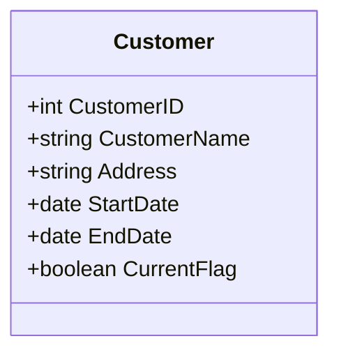

## Description

Type 2 Slowly Changing Dimension (SCD) is a data modeling design pattern used primarily in data warehousing. This approach involves preserving the complete history of data changes by inserting a new record in the dimensions table for every change, rather than updating the existing records. Each record in the table, therefore, captures the state of the dimensional entity for a specific period, including an effective date range when the record is valid.

This pattern is preferred when it is essential to track and report on how dimensional data changes over time, such as changes in a customer's address or status.

## Key Concepts

- **History Preservation**: Each change results in a new row, allowing you to maintain a detailed history of the object.
- **Surrogate Key**: A unique, artificial key is used to identify each version of a record.
- **Effective Dates**: Every row includes start and end dates that define the time interval during which the data was in effect.
  
## Example

Consider a `Customer` table where changes to a customer's address are tracked. Each change to any customer's attributes results in a new row being added.

### Table Structure

| CustomerID | CustomerName | Address      | StartDate   | EndDate     | CurrentFlag |
|------------|--------------|--------------|-------------|-------------|-------------|
| 1          | John Doe     | 123 Elm St   | 2023-01-01  | 2023-06-15  | N           |
| 1          | John Doe     | 456 Oak St   | 2023-06-16  | 9999-12-31  | Y           |

### SQL Example

Here's an example SQL snippet to add a new record when a customer address changes:

```sql
-- Close the existing active row for the customer
UPDATE Customer
SET EndDate = '2023-06-15', CurrentFlag = 'N'
WHERE CustomerID = 1 AND CurrentFlag = 'Y';

-- Insert the new row for the customer
INSERT INTO Customer (CustomerID, CustomerName, Address, StartDate, EndDate, CurrentFlag)
VALUES (1, 'John Doe', '456 Oak St', '2023-06-16', '9999-12-31', 'Y');
```

### Diagram



## Related Patterns

- **Type 1 SCD - Overwrite**: Overwrites the existing record, removing any history.
- **Type 3 SCD - Add New Field**: Adds a new field to track only the previous data state.
  
## Additional Resources

- [Slowly Changing Dimensions](https://en.wikipedia.org/wiki/Slowly_changing_dimension)
- [Data Warehousing Concepts: SCD Type 2](https://www.datainc.com/resources/blogs/scd-type-2-data-warehousing-concepts)

## Summary

The Type 2 SCD design pattern is essential in situations where historical data preservation and time-based data tracking are critical. By adding a new record for each change, this pattern provides a comprehensive method for maintaining historical accuracy in data warehouses, making it invaluable for analytical reporting and business intelligence activities.
