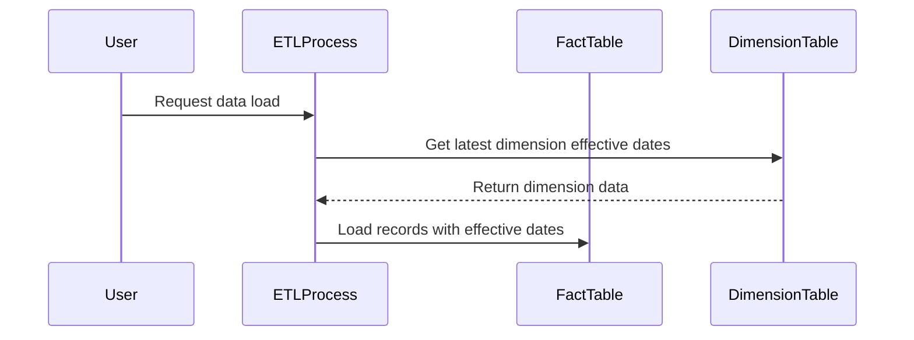

## Overview

Design patterns in data modeling often involve accounting for changes over time, particularly when dealing with slowly changing dimensions (SCD). This article explores the practice of using effective dates within fact tables to align transactions with the appropriate time-specific dimensions, ensuring that historical analysis is both accurate and consistent.

## Design Pattern Description

Incorporating effective dates in fact tables allows organizations to capture the temporal aspects of the data accurately. This technique is vital in situations where dimensions change over time and need to be linked accurately with transactions recorded in fact tables. By including effective dates, organizations can dynamically adjust the associations to the appropriate time-specific dimensions.

## Architectural Approaches

### Key Concepts

- **Effective Date Range**: For a transaction or record in a fact table, the effective date denotes the valid time period during which the dimension applies.
- **Versioned Dimensions**: Dimensions are stored with versioning or time validity, ensuring accurate historical linking.
- **Temporal Joins**: Using effective dates allows for efficient joining of facts with dimensions on a temporal basis.

### Implementation Strategies

1. **Schema Design**
   - Adding columns like `EffectiveStartDate` and `EffectiveEndDate` in fact tables.
   - Ensure dimensions are structured with corresponding effective date ranges.

2. **ETL Processes**
   - Utilize Extract, Transform, and Load (ETL) jobs to populate effective dates during data ingestion.
   - Update fact tables on dimension changes to reflect the accurate effective time span.

### Example Code

A sample SQL query to link a fact table `Sales` with a dimension `Price` using effective dates:

```sql
SELECT 
    s.OrderID,
    s.ProductID,
    s.SaleDate,
    p.Price
FROM 
    Sales s
JOIN 
    Price p ON s.ProductID = p.ProductID 
           AND s.SaleDate BETWEEN p.EffectiveStartDate AND p.EffectiveEndDate;
```

## Diagrams

Below is a Mermaid UML Sequence diagram illustrating the flow of data integration with effective date checks:



## Related Patterns

- **Slowly Changing Dimensions**: Managing changes in dimensions to ensure historical accuracy.
- **Temporal Tables**: Using tables designed to store data with historical states over time.
- **Type 2 SCD**: A specific method of dealing with changes, ensuring complete historical data accuracy by keeping previous data rows with their validity period intact.

## Additional Resources

- [Kimball Group's Data Mart Design](http://www.kimballgroup.com)
- [Temporal Databases and Information Systems, Springer](https://link.springer.com/book/10.1007/3-540-45655-3)
- [The Data Warehouse Toolkit, by Ralph Kimball](https://www.amazon.com/Data-Warehouse-Toolkit-Definitive-Dimensional/dp/1118530802)

## Summary

The use of effective dates in fact tables is a crucial design pattern in data warehousing to maintain accurate historical correlations between facts and dimensions. By embedding temporal logic directly into your data models, you ensure precise data representation, vital for decision-making and analytics across any time-bound dataset, while implementing sustainable practices for maintaining data accuracy over time.
