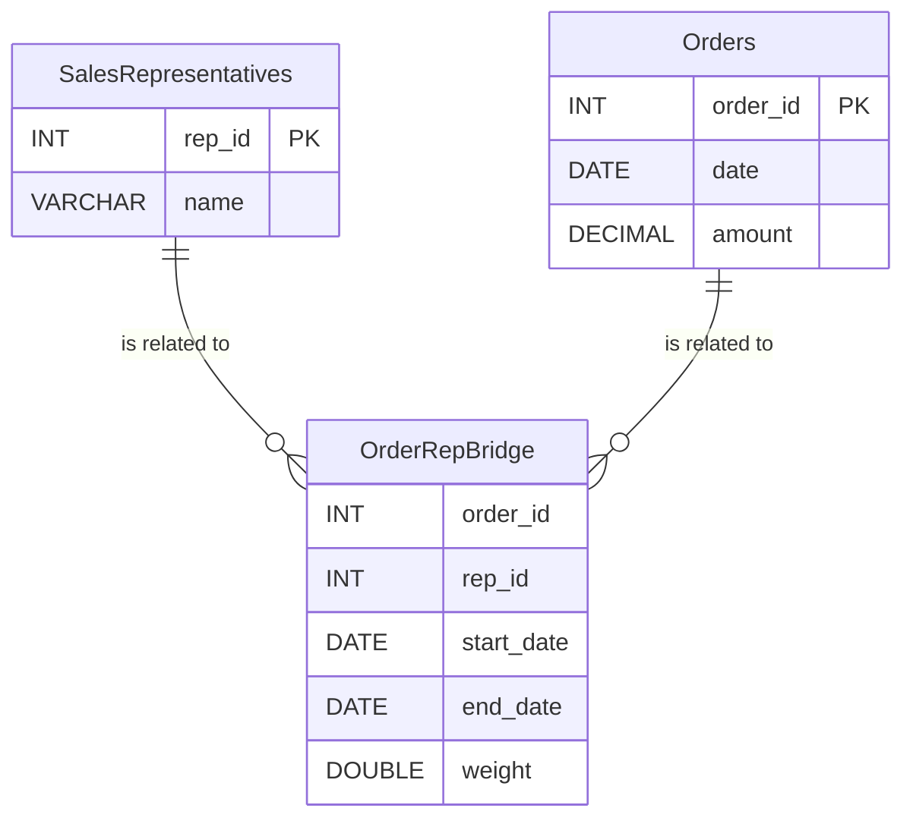

## Overview

In data warehousing, the concept of Slowly Changing Dimensions (SCDs) refers to the scenario where the dimensions change slowly over time, rather than changing on a regular schedule like time series data. The challenge lies in accurately and efficiently capturing these changes to retain both current and historical information. Bridge tables provide a robust solution to handle many-to-many relationships between fact and dimension tables which may alter over time.

## Design Pattern Details

Bridge tables are intermediary tables used to create complex relationships between dimension tables and fact tables in a star schema. They help manage many-to-many associations, such as associating multiple salespeople with a single sales transaction, which may fluctuate over time.

### Architectural Approach

1. **Identify the Association**: Establish areas in the data model where many-to-many relationships exist between dimensions and facts. For example, linking a customer to multiple addresses over time.

2. **Define the Bridge Table**: Create a bridge table that contains foreign keys from both tables involved in the many-to-many relationship and may include attributes such as validity dates, weights, or hierarchical levels, representing the relationships.

3. **Implement Slowly Changing Dimensions**: Use a type of SCD to manage changes in the dimension. Most commonly, a Type 2 SCD is used as it allows for the retention of historical data.

4. **Weight Management**: In scenarios where the relationships are not equally contributing or symmetrical, implement weight columns in bridge tables to capture the relative contribution or weightage of facts.

5. **Time-Variant Attributes**: Incorporate start and end dates showing the active periods of relationships to allow querying historical trends and current states effectively.

## Example Code

Consider a scenario with sales orders linked with multiple sales representatives:

```sql
-- Dimension Tables
CREATE TABLE SalesRepresentatives (
    rep_id INT PRIMARY KEY,
    name VARCHAR(100),
    ...

);

CREATE TABLE Orders (
    order_id INT PRIMARY KEY,
    date DATE,
    amount DECIMAL,
    ...

);

-- Bridge Table
CREATE TABLE OrderRepBridge (
    order_id INT,
    rep_id INT,
    start_date DATE,
    end_date DATE,
    weight DOUBLE, -- Optional
    PRIMARY KEY (order_id, rep_id, start_date)
    ...

);
```

## Diagram Representation



## Best Practices

- **Consistency**: Ensure dimension and bridge tables are consistently updated as source systems change.
- **Scalability**: Use indexing and partitioning effectively for large bridge tables to enhance performance.
- **Weight Balancing**: Properly calculate and adjust weights to accurately reflect contributions in your queries and reports.

## Related Patterns

- **Snowflake Schema**: Normalizes dimension tables to further simplify complex many-to-many relationships.
- **Star Schema**: A simplified data model typically consisting of the fact tables and dimension tables directly related.

## Additional Resources

- [Kimball's Data Warehouse Toolkit](https://www.kimballgroup.com/)
- [Data Warehousing Design Solutions](https://books.google.com/books/about/Data_Warehousing_Design_Solutions.html?id=2t6hR-Ta10UC)

## Summary

Bridge tables for Slowly Changing Dimensions are essential in data warehousing for capturing many-to-many relationships over time, allowing accurate historical and current analyses. Implementing such structures supports better scalability, flexibility, and accuracy in data warehouse design, significantly aiding strategic data-driven decisions.
