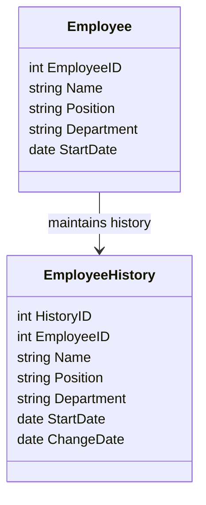

## Introduction 

The Type 4 Slowly Changing Dimension (SCD) pattern is a data modeling design pattern commonly used in data warehousing to handle the historical tracking of dimensional attributes when these attributes change over time. This pattern involves moving old records to a separate historical table so that the primary table only holds the current data.

## Architectural Approach

In Type 4 SCD, two tables are utilized: a current dimension table and a corresponding historical table. Whenever changes occur in any dimension attribute, instead of updating the existing data in place, the old records are moved to the historical table, while the main table is updated with newly changed values. This allows efficient querying for current records while still allowing historical data analysis when necessary.

### Implementation Strategy

1. **Current Table**: This table holds only the latest version of the records. It maintains an up-to-date view of the dimension, improving the efficiency of queries for current data.

2. **Historical Table**: This secondary table stores all previous state versions of the records. The architecture encourages the linking of records to their historical entries through primary or surrogate keys.

### Example Code

Below is an example implementation of Type 4 SCD in SQL:

```sql
-- Initial Current Table
CREATE TABLE Employee (
    EmployeeID INT PRIMARY KEY,
    Name VARCHAR(100),
    Position VARCHAR(100),
    Department VARCHAR(100),
    StartDate DATE
);

-- Historical Table to store older data
CREATE TABLE EmployeeHistory (
    HistoryID INT PRIMARY KEY AUTO_INCREMENT,
    EmployeeID INT,
    Name VARCHAR(100),
    Position VARCHAR(100),
    Department VARCHAR(100),
    StartDate DATE,
    ChangeDate DATE,
    FOREIGN KEY (EmployeeID) REFERENCES Employee(EmployeeID)
);

-- Insert example for update
BEGIN TRANSACTION;

-- Move old data to history table
INSERT INTO EmployeeHistory
SELECT EmployeeID, Name, Position, Department, StartDate, NOW()
FROM Employee
WHERE EmployeeID = 1;

-- Update current table with new data
UPDATE Employee
SET Name = 'New Name', Position = 'New Position', Department = 'New Department'
WHERE EmployeeID = 1;

COMMIT;
```

### Mermaid UML Diagram



## Best Practices

- Utilize a scheduled ETL process to periodically check and transition data to the historical table.
- Ensure indexing on EmployeeID in both current and historical tables to maintain query performance.
- Consider using a surrogate key for ease in historical tracking.
- Automate consistency checks to validate data integrity between the historical and current tables.

## Related Patterns

- **Type 1 SCD - Overwriting**: Directly updates records without maintaining history.
- **Type 2 SCD - Versioning**: Tracks changes by creating a versioned record in the same table.
- **Type 6 SCD - Hybrid**: Combines approaches to benefit various scenarios.

## Additional Resources

- *The Data Warehouse Toolkit* by Ralph Kimball - Detailed exploration of dimensional modeling and SCDs.
- Online articles and industry whitepapers providing insights into advanced uses of SCDs.

## Summary

The Type 4 SCD pattern effectively separates current and historical records using distinct tables, offering clarity and query optimization by isolating up-to-date data from its historical counterparts. This pattern simplifies data management in enterprises with a high frequency of data updates and a critical need to analyze historical trends. As with any data strategy, thorough testing and validation are critical to implement Type 4 SCD effectively, ensuring data accuracy and consistency are maintained.
