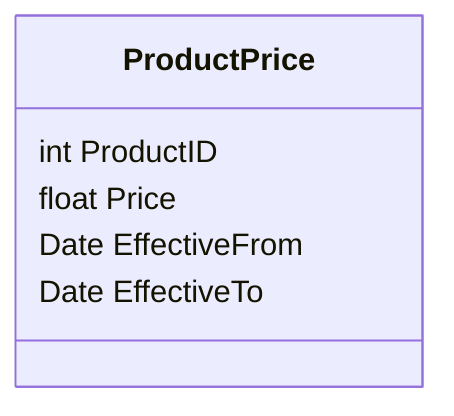

## Overview

The Effective Dating design pattern is a crucial concept in data warehousing and dynamic datasets, particularly when dealing with Slowly Changing Dimensions (SCD). It leverages `EffectiveFrom` and `EffectiveTo` date fields to track changes and the timeframe during which a particular version of a record is valid. This method is essential for maintaining historical accuracy and enabling precise auditing functions in large datasets.

## Detailed Explanation

### Purpose

The primary goal of the Effective Dating pattern is to capture and store data in a way that reflects changes over time. It enables systems to answer questions like "What value was applicable at a certain point in time?" and "How has this data changed over the past months or years?" This design pattern is vital for businesses and applications that need to maintain a history of data variations, such as pricing, employment status, or product attributes.

### How It Works

In the Effective Dating approach, each record in a table is timestamped with two specific dates:

- **EffectiveFrom**: This date indicates when the record becomes active.
- **EffectiveTo**: This date specifies when the record is no longer active.

When a record is first created, its `EffectiveTo` date is usually set to a placeholder such as a far-future date to indicate that it is currently active. Each update to the record results in a new entry with adjusted `EffectiveFrom` and `EffectiveTo` dates, providing a chronological history of the data.

### Example Code

Here's how you might implement the Effective Dating pattern in an SQL database for a `ProductPrice` table:

```sql
CREATE TABLE ProductPrice (
    ProductID INT,
    Price DECIMAL(10, 2),
    EffectiveFrom DATE,
    EffectiveTo DATE
);

-- Insert a new price record
INSERT INTO ProductPrice (ProductID, Price, EffectiveFrom, EffectiveTo)
VALUES (1, 100.00, '2023-01-01', '9999-12-31');

-- Update the price and close the current record
UPDATE ProductPrice
SET EffectiveTo = '2023-06-30'
WHERE ProductID = 1 AND EffectiveTo = '9999-12-31';

-- Insert the updated price record
INSERT INTO ProductPrice (ProductID, Price, EffectiveFrom, EffectiveTo)
VALUES (1, 120.00, '2023-07-01', '9999-12-31');
```

### Related Patterns

1. **Type 2 Slowly Changing Dimension (SCD 2)**: Effective Dating is a characteristic feature of the SCD 2 pattern where complete historical track of data changes is maintained.
2. **Temporal Tables**: SQL has built-in support for temporal tables which bear similarity to this pattern by automatically managing effective dates.

### Best Practices

- Always set an open-ended date for `EffectiveTo` when initiating a new record version, commonly using '9999-12-31'.
- Ensure consistency and accuracy by meticulously managing your update and insert logic to appropriately close records and initiate new ones.

## Example Diagram



## Additional Resources

- *Data Warehouse Toolkit* by Ralph Kimball: Essential reads for understanding Slowly Changing Dimensions and temporal data patterns.
- *Temporal Data & the Relational Model* by C.J. Date: Delves into the modeling of temporal data using databases.

## Summary

The Effective Dating pattern is a powerful approach to track historical changes in datasets over time. Leveraging `EffectiveFrom` and `EffectiveTo` dates enables intricate auditing and historical analysis, critical for data warehousing environments. Consistent implementation of this pattern ensures the preservation of data integrity across complex and evolving datasets.

This design pattern forms the backbone of robust data archiving strategies, providing a reliable framework for temporal data management and extending the analytic capability of business intelligence solutions.
