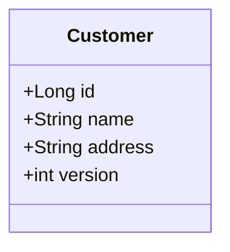
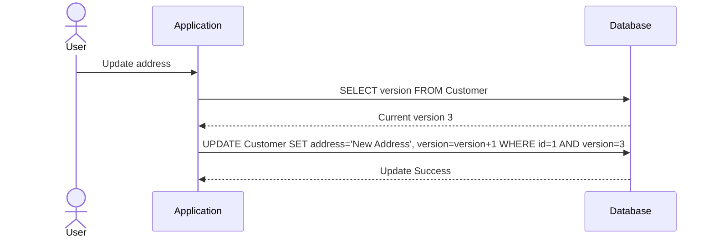

## Description

Record versioning is a fundamental design pattern used to manage and track changes in records over time, ensuring data integrity and consistency across systems. It involves assigning a version number to each record within a data store. Whenever a record is modified, its version number is incremented. This technique is particularly beneficial in systems where records undergo frequent updates and a historical audit trail is necessary.

## Architectural Approach

The architectural approach to implementing record versioning typically involves:

1. **Adding a Version Field:** Every table or document is equipped with a version field, often implemented as an integer or a timestamp.
2. **Incrementing the Version:** Each update operation should increment the version field, ensuring that changes are easily traceable.
3. **Optimistic Locking:** Utilize the version field for data integrity by implementing optimistic locking. This means that updates check the current version before committing changes, preventing conflicts.
4. **Auditing and History:** Store historical versions of records for auditability by keeping previous states available for review or rollback.

## Best Practices

- **Atomic Updates:** For relational databases, use atomic operations to ensure that both the data and the version field are updated in a single transaction.
- **Conflict Resolution:** Implement strategies to handle version conflicts, especially in distributed systems where data might be replicated across nodes.
- **Data Archiving:** Periodically archive historical records to optimize performance while maintaining a record of changes.
- **Integration with Audit Logs:** Sync versioning with audit logs to provide a comprehensive overview of all changes within the system.

## Example Code

### Java JPA Example

```java
@Entity
public class Customer {

    @Id
    @GeneratedValue(strategy = GenerationType.IDENTITY)
    private Long id;

    private String name;
    private String address;

    @Version
    private int version;

    // getters and setters
}
```

### SQL Example

```sql
CREATE TABLE Customer (
    ID serial PRIMARY KEY,
    Name VARCHAR(100),
    Address VARCHAR(255),
    Version INT NOT NULL DEFAULT 1
);
```

## Diagrams

### UML Class Diagram



### Sequence Diagram



## Related Patterns

- **Optimistic Locking:** A pattern that uses record versioning to manage concurrent data access.
- **Event Sourcing:** Instead of storing the current state only, each state-changing event is recorded in sequence, enabling full audit trail and versioning by events.

## Additional Resources

- [Event Sourcing Pattern - Cloud Design Patterns](https://example.com/event-sourcing)
- [Concurrency Patterns for Distribution](https://example.com/concurrency-patterns)
- [Data Archiving Strategies](https://example.com/data-archiving)

## Summary

Record versioning is an essential pattern in data management that aids in maintaining data integrity and providing a robust audit trail of all changes. By implementing record versioning, systems ensure safe concurrent updates, facilitate conflict resolution in distributed environments, and offer historical insights into data evolution.
