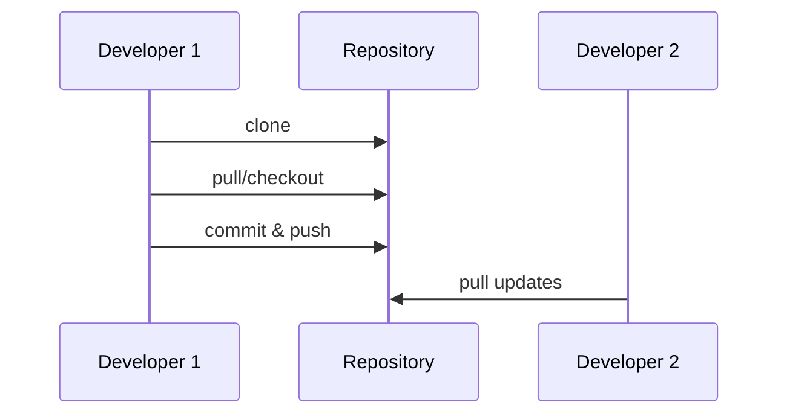

---

linkTitle: "Version Control Systems"
title: "Version Control Systems"
category: "Versioning Patterns"
series: "Data Modeling Design Patterns"
description: "An overview of Version Control Systems, which are essential for tracking changes over time in data or code, facilitating collaboration, and maintaining historical records."
categories:
- Versioning
- Collaboration
- Data Management
tags:
- Git
- Source Code Management
- Distributed Systems
- Collaboration Tools
- Software Development
date: 2024-07-07
type: docs
canonical: "https://softwarepatternslexicon.com/103/4/10"
license: "© 2024 Tokenizer Inc. CC BY-NC-SA 4.0"
---

## Introduction

Version Control Systems (VCSs) are vital tools in software development and many other fields where tracking the progress and changes of digital files is essential. By maintaining a detailed history of modifications, VCSs enable multiple users to work collaboratively on the same project without conflict, support rollback to previous versions, and ensure that all changes are adequately tracked and explained.

## Core Concepts

- **Repositories**: The central storage location for all files and their version history. Repositories can be hosted locally or on remote servers.
- **Commits**: These are snapshots of the project at a specific point in time. Each commit typically includes a message describing what changes were made and why.
- **Branches**: Separate lines of development that allow users to work on different features or fixes independently before merging changes back into the main codebase.
- **Merging**: Combining changes from different branches into one unified version. This can sometimes lead to conflicts if two branches have incompatible changes.

## Architectural Approaches

- **Centralized VCS (CVCS)**: A single server holds all the versioned files, and clients check out files from this central place. Examples include Subversion and CVS. This model is simpler but creates a single point of failure.
- **Distributed VCS (DVCS)**: Each client has their complete repository mirror with full history. Git and Mercurial are popular examples. This approach enhances redundancy and allows offline work capabilities.

## Best Practices

1. **Commit Frequently**: Regular commits make tracking progress easier and reduce the pain of merging.
2. **Write Meaningful Commit Messages**: Messages should convey why changes were made to help in future reviews.
3. **Use Branches for Features**: Keeping feature development, bug fixes, or experimental ideas on separate branches helps avoid conflicts and keeps the mainline stable.
4. **Regularly Merge Back**: Integrate changes frequently to prevent diverging too far from the main development line.
5. **Review Code Changes**: Peer reviews of code before merging can catch issues early and promote collective code ownership.

## Example Code with Git

```shell
git init my-repo
cd my-repo

echo "Hello, World!" > hello.txt
git add hello.txt
git commit -m "Add hello.txt with sample greeting"

git checkout -b feature/greeting-update

echo "Hello, Universe!" > hello.txt
git commit -am "Update greeting to universe"

git checkout main
git merge feature/greeting-update

git remote add origin <remote-repository-URL>
git push -u origin main
```

## Related Patterns

- **Continuous Integration**: Ensures that code changes are automatically tested and integrated into the mainline regularly using version control systems as the backbone for tracking code changes.
- **Build Automation**: Involves scripting or tools that automatically compile and package code, often leveraging VCSs to trigger build processes based on new commits.

## Diagrams

### Basic Git Workflow



## Additional Resources

- [Git Documentation](https://git-scm.com/docs)
- [Mercurial: The Definitive Guide](https://www.mercurial-scm.org/wiki/Documentation)
- [Understanding Version Control Systems](https://www.atlassian.com/git/tutorials/what-is-version-control)
- [GitHub Learning Lab](https://lab.github.com/)

## Summary

Version Control Systems are indispensable in modern software development, enabling teams to work collaboratively on large codebases. By providing a robust mechanism for tracking versions, facilitating collaboration, and ensuring code integrity, VCSs lay the foundation for effective software lifecycle management. Embracing best practices in version control not only boosts productivity but also aids in fostering a culture of accountability and rigorous quality assurance.
