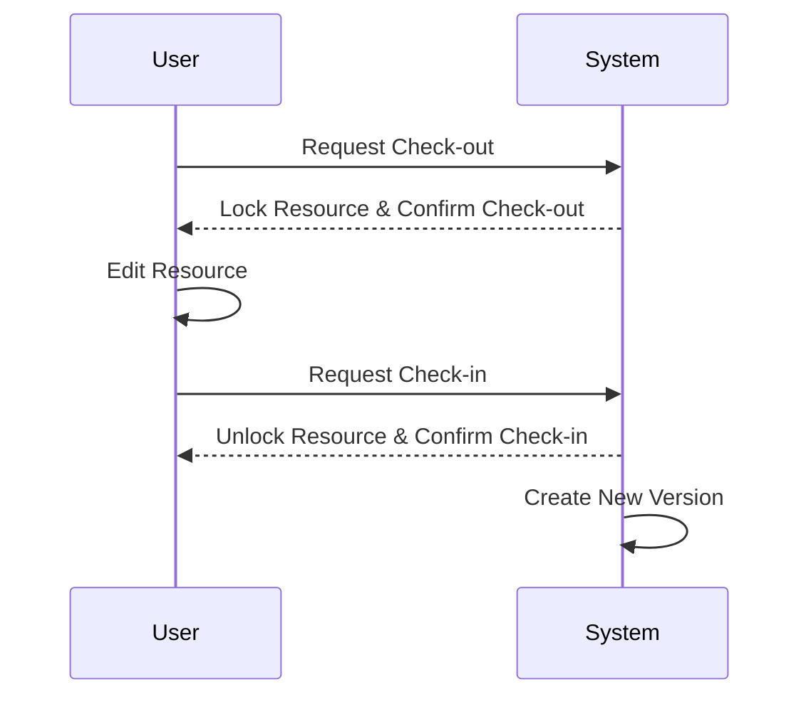

## Overview

The Check-in/Check-out Pattern is utilized to ensure that only one user can modify a resource at a time, thereby maintaining version integrity and preventing conflicting changes. This pattern is particularly beneficial in collaborative environments where data consistency and version management are crucial.

## Intent

The primary goal of this pattern is to enable controlled modifications by locking resources during active editing. Once changes are complete, a new version is created upon checking the resource back in, thus allowing other users to access the latest version.

## Applicability

- **Document Management Systems**: Ensures a consistent and conflict-free editing process.
- **Version Control Systems**: Facilitates safe alterations in source code repositories.
- **Database Management**: Useful for systems requiring strict change control mechanisms.

## Benefits

- Prevents simultaneous conflicting updates.
- Maintains a clear version history.
- Ensures data consistency and integrity.
- Facilitates rollback in case of erroneous changes.

## Structure

The Check-in/Check-out Pattern can be visualized using the Mermaid UML Sequence Diagram below:



## Implementation

Here's a simplified example using Java to demonstrate the Check-in/Check-out Pattern:

```java
public class Document {
    private String content;
    private boolean isLocked = false;
    private String userCheckedOut;

    public synchronized boolean checkOut(String user) {
        if (!isLocked) {
            isLocked = true;
            userCheckedOut = user;
            return true;
        }
        return false;
    }

    public synchronized boolean checkIn(String user, String newContent) {
        if (isLocked && userCheckedOut.equals(user)) {
            content = newContent;
            isLocked = false;
            createNewVersion();
            return true;
        }
        return false;
    }

    private void createNewVersion() {
        // Code to save the current content as a new version in version history
    }
}
```

## Related Patterns

- **Optimistic Concurrency Control**: Unlike Check-in/Check-out, this allows concurrent access and resolves conflicts by merging changes.
- **Pessimistic Locking**: Similar in limiting access but often locks at a database level.
- **Snapshot Isolation**: Maintains consistency by taking snapshots of the data state.

## Best Practices

- Clearly communicate locking status to all potential editors.
- Implement notification systems for users waiting to edit a locked resource.
- Allow for emergency unlock procedures to avoid deadlocks.

## Additional Resources

- [Version Control Systems in Software Engineering](https://en.wikipedia.org/wiki/Version_control)
- [Concurrency Control in Database Systems](https://en.wikipedia.org/wiki/Concurrency_control)

## Summary

The Check-in/Check-out Pattern is essential in scenarios where data integrity and version management are critical. By enabling exclusive editing and maintaining a comprehensive version history, this pattern prevents data conflicts and ensures orderly updates, fostering an environment of reliable collaboration.
