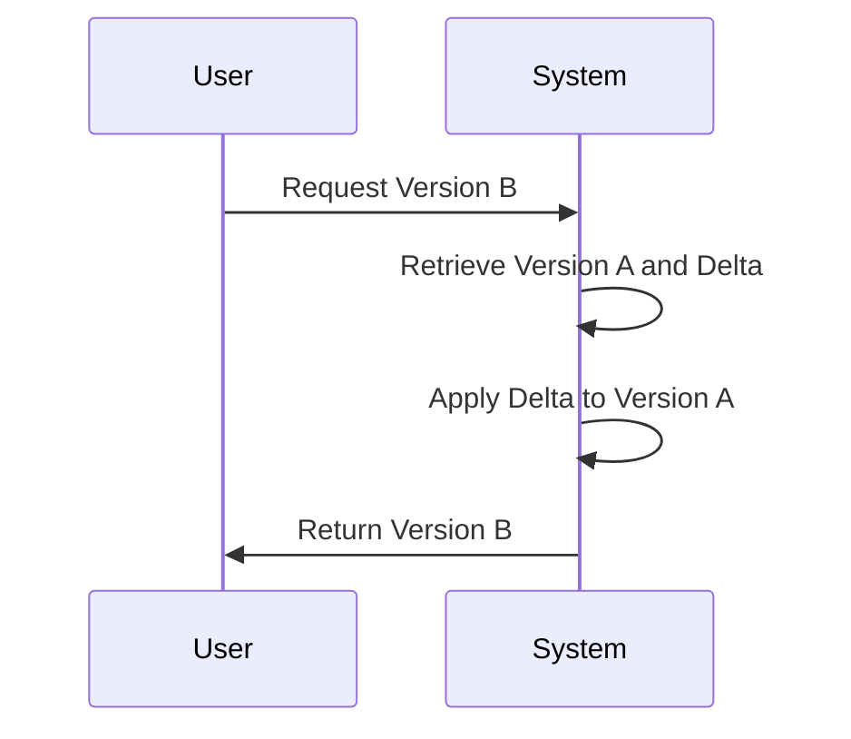

## Delta Encoding

### Description

Delta Encoding is a technique used to store data as the difference between successive versions rather than storing each version in its entirety. This approach optimizes storage space by only recording changes or increments (known as deltas) between a new version and its predecessor. The most common application of delta encoding can be observed in version control systems, data backup solutions, and data synchronization services where efficient data storage and transfer are paramount.

### Key Concepts and Architecture

1. **Delta Representation**:
   - Deltas are computed by taking the difference between two successive versions of data.
   - Deltas can be stored as binary patches, textual diffs, or operational transformations.

2. **Storage and Retrieval**:
   - The original data and a series of delta files allow reconstruction of any stored version.
   - Retrieval can involve sequentially applying deltas to reconstruct the desired version from the base data.

3. **Compression Benefits**:
   - delta encoding reduces redundant information, improving the efficiency of data storage.
   - It is particularly effective for datasets where changes between versions are minor compared to their total size.

### Example Code

Here's a simple example in Python to illustrate delta encoding using textual data:

```python
from difflib import ndiff

def compute_delta(old_version, new_version):
    diff_result = ndiff(old_version.splitlines(), new_version.splitlines())
    return "\n".join(diff_result)

def apply_delta(base_version, delta):
    patches = delta.splitlines()
    patched_result = []
    
    for patch in patches:
        if patch.startswith("  "):
            patched_result.append(patch[2:])
        elif patch.startswith("+ "):
            patched_result.append(patch[2:])
            
    return "\n".join(patched_result)

old_version = "The quick brown fox jumps over the lazy dog."
new_version = "The quick brown fox jumped over the very lazy dog."

delta = compute_delta(old_version, new_version)
applied_version = apply_delta(old_version, delta)

print("Delta:\n", delta)
print("Reconstructed Version:\n", applied_version)
```

### Diagrams

#### Delta Encoding Sequence Diagram



### Related Patterns

- **Snapshot Pattern**: While delta encoding focuses on storing changes, the snapshot pattern periodically stores a complete copy of the data. The combination of delta encoding with periodic snapshots can mitigate the complexity of reconstructing versions.
- **Event Sourcing**: Similar to recording the entire state, event sourcing saves events (or deltas) that lead to state changes, offering insights into the history and audit trails of data.

### Best Practices

- **Balance Storage and Computation Costs**: While delta encoding can save storage space, repeatedly applying deltas can be computationally costly. Utilizing periodic snapshots helps strike a balance.
- **Optimize Delta Computation**: Use efficient algorithms tailored to the data type, such as rsync for binary data or algorithms like Meyer's diff for text comparision.
- **Concurrent Versioning Handling**: Implement mechanisms to handle concurrent modifications, especially in collaboration and synchronization scenarios.

### Additional Resources

1. [The rsync Algorithm](https://rsync.samba.org/tech_report/)
2. [Version Control with Git](https://git-scm.com/book/en/v2)

### Summary

Delta Encoding is a time-tested, efficient strategy for data versioning and storage optimization. It enables systems to maintain historical versions with minimal storage overhead, advantageous in resources-constrained environments or large-scale systems with frequent minor data updates. Coupled with other design patterns like Snapshots or Event Sourcing, its application can ensure that storage systems are both scalable and robust against data drifts and changes. Understanding and implementing delta encoding can greatly benefit any architecture that requires efficient version management.
