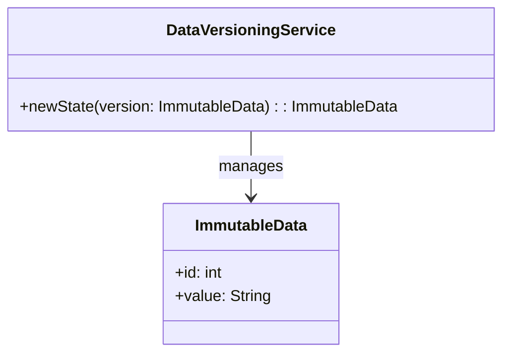
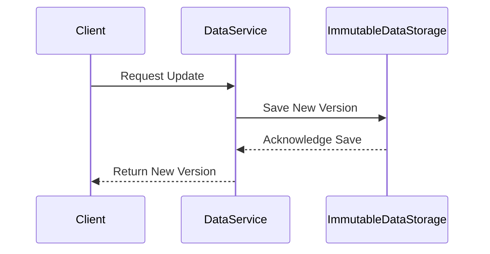

## Description

Immutable data structures are an innovative approach in data management and software design that treat data as read-only. In these structures, any modification to the data results in the creation of a new data entity, while the existing data remains intact and unchanged. This characteristic is particularly beneficial in scenarios requiring data versioning and historical record maintenance, such as bitemporal databases. The principle of immutability guards against unintended side effects, enables reliable state management, and facilitates fault tolerance in distributed systems.

## Architectural Approach

The architectural approach of using immutable data structures often involves implementing concepts from functional programming. These include:

- **Persistence**: Every update creates a new version of the data state, allowing systems to retrieve historical data for audits and analytics.
- **Concurrency and Synchronization**: Since immutable objects can be shared across multiple threads without the need for synchronization, this leads to more straightforward and efficient multi-threaded code.
- **Distributed Systems**: Data replication across distributed nodes is simplified, as immutable data requires no locking mechanisms for coherence.

### Implementation Strategies

1. **Functional Programming Languages**: Languages like Scala, Clojure, and Haskell natively support immutable constructs.
2. **Immutable Collections in Java and JavaScript**:
   - **Java**: Use classes from the `Java Collections Framework` that are designed to produce immutable instances.
   - **JavaScript**: Libraries such as [Immutable.js](https://immutable-js.github.io/immutable-js/) allow for immutable stack and queue implementations.
3. **Database Systems**: Implement bitemporal tables where each record contains valid and transaction times, ensuring historical accuracy and lineage tracking.

## Example Code

Below is an example in JavaScript using Immutable.js:

```javascript
const { Map } = require('immutable');

let map1 = Map({a:1, b:2, c:3});
let map2 = map1.set('b', 50);

console.log(map1.get('b')); // 2
console.log(map2.get('b')); // 50
```

In this example, `map1` remains unchanged even after executing the `set` operation, showcasing the immutability principle.

## Diagrams

### UML Class Diagram

Here is a basic representation of immutable data handling.



### Sequence Diagram

A potential flow of operations in a version-controlled system.



## Best Practices

- **Design for Immutability**: Design your systems from the ground up to embrace immutability, especially in concurrent environments.
- **Use Appropriate Libraries**: Leverage existing libraries that handle immutability efficiently to reduce performance overheads.
- **Efficient State Management**: Utilize patterns like event sourcing to capture state changes effectively within immutable systems.

## Related Patterns

1. **Event Sourcing**: Captures all changes to an application state as a sequence of events.
2. **Command Query Responsibility Segregation (CQRS)**: Separates reading and writing processes leading to efficient immutable state handling.
3. **Snapshotting**: Occasionally stores the entire state of a system to provide rapid loading and recovery capabilities.

## Additional Resources

- [Persistent Data Structures (Wikipedia)](https://en.wikipedia.org/wiki/Persistent_data_structure)
- [Why Immutability Matters](https://mikehogan.github.io/2016/10/18/why-immutability-matters.html)
- [The Value of Immutability](https://codeburst.io/the-value-of-immutability-72704a0b7f28)

## Summary

Immutable data structures foster robust, concurrent, and version-controlled systems allowing data to be easily tracked over time without the risk of inadvertent data corruption. By leveraging immutability, especially in cloud computing and distributed environments, one can create performant, safe, and scalable applications that align with modern architectural principles. Embracing and building upon these foundations empower developers to construct enduring systems while enhancing data integrity and consistency.
