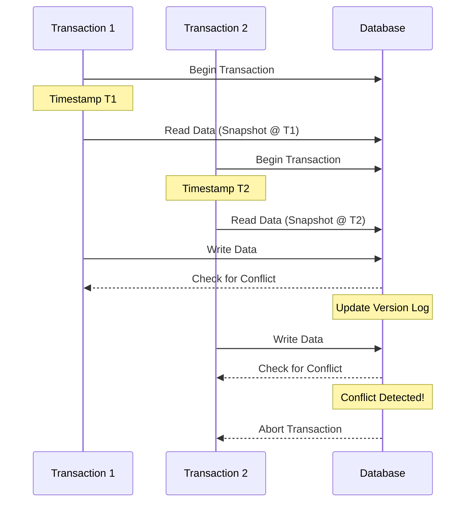

## Snapshot Isolation

### Description

Snapshot Isolation (SI) is a concurrency control mechanism used in database systems to provide consistency and isolation for transactions. Under this model, each transaction operates on a consistent snapshot of the database taken at the time the transaction begins. This ensures that transactions are isolated from each other, avoiding interference and conflicts that could cause data integrity issues.

Transactions under Snapshot Isolation do not block each other to read data, which results in higher concurrency compared to other isolation levels like Serializable. However, while read operations are non-blocking, write operations may still cause conflicts if they affect the same data as another concurrent transaction. These conflicts lead to write skew or violation of foreign key constraints if not handled properly by the database engine.

### Architectural Approach

Snapshot Isolation is typically implemented using multi-version concurrency control (MVCC). In MVCC, the database maintains multiple versions of a data item. Each version has a timestamp, and transactions read the latest version that was committed before the transaction began. This provides a consistent view as of the specific snapshot time.

1. **Transaction Timestamping**: Each transaction is given a unique timestamp when it begins. The transaction will see all the changes made by transactions that completed before its own timestamp but not those after.

2. **Version Management**: Each data item in the database keeps a version list. The list maintains multiple versions, each associated with a timestamp corresponding to the transaction that created it.

3. **Visibility**: Read operations retrieve the version of the data that is visible according to the transaction's start timestamp.

4. **Conflict Resolution**: Write operations are checked at commit time to ensure no conflicts. If two transactions attempt to update the same data concurrently, the system resolves conflicts by using the timestamps to determine which transaction should proceed, often aborting the later one.

### Example Code

Here's an abstract representation of how Snapshot Isolation might be facilitated in a Python-based application using an MVCC approach:

```python
class VersionedData:
    def __init__(self):
        self.versions = []  # List of tuples (timestamp, value)

    def read(self, transaction_timestamp):
        for timestamp, value in reversed(self.versions):
            if timestamp <= transaction_timestamp:
                return value
        return None

    def write(self, transaction_timestamp, value):
        self.versions.append((transaction_timestamp, value))


class Transaction:
    def __init__(self, database):
        self.timestamp = self.generate_timestamp()
        self.db = database

    def generate_timestamp(self):
        # Imagine a logical or physical timestamp generator
        return time.time()

    def read(self, key):
        return self.db[key].read(self.timestamp)

    def write(self, key, value):
        self.db[key].write(self.timestamp, value)

db = {'data1': VersionedData()}
txn1 = Transaction(db)
txn1.write('data1', 'Value A')
print(txn1.read('data1')) # Outputs 'Value A'
```

### Diagram

Below is a Mermaid sequence diagram illustrating a basic snapshot isolation scenario where two transactions interact with the database.



### Related Patterns

- **Multi-Version Concurrency Control (MVCC)**: Underpins Snapshot Isolation by maintaining multiple versions of data items to provide concurrent transactional access.
- **Optimistic Concurrency Control**: Snapshot Isolation is considered optimistic as it allows transactions to complete with the hope that conflicts are rare.
- **Serializable Isolation**: Provides a stricter isolation level compared to snapshot isolation, ensuring complete isolation between transactions at the potential cost of reduced concurrency.

### Additional Resources

- [Concurrency Control in Database Systems](https://en.wikipedia.org/wiki/Concurrency_control)
- [Granularity of Locks and Degrees of Isolation](https://dl.acm.org/doi/10.1145/602259.602261)
- [Read Consistency in Modern Database Systems](https://www.usenix.org/system/files/conference/atc18/atc18-goodman.pdf)

### Summary

Snapshot Isolation is a valuable concurrency control mechanism offering transaction isolation without requiring locks on read operations, thus boosting performance in high-concurrency environments. By employing MVCC, it ensures each transaction executes against a consistent view of the database state as of its initiation. While it enhances concurrency, careful handling is required to manage write conflicts and potential anomalies like write skew. Understanding and applying Snapshot Isolation helps design robust, high-performance database systems.
