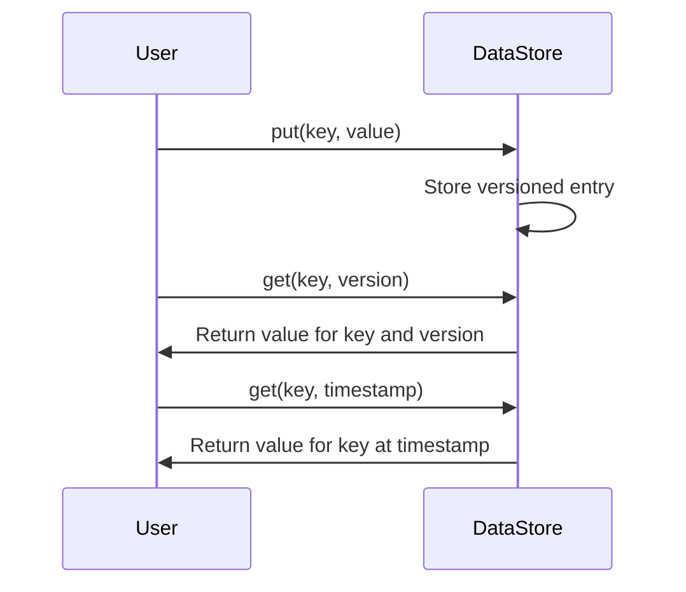

## Description

The Versioned Data Store pattern is a database design pattern specifically structured to manage and store multiple versions of data over time. This approach allows systems to track changes, maintain historical context, and facilitate rollback or review of previous states. It's especially valuable in domains where auditability, traceability, and undo capabilities are essential, such as financial systems, scientific research, or collaborative editing platforms.

## Architectural Approach

### Key Characteristics

1. **Data Versioning**: Each entry in the database is associated with a unique version identifier or timestamp, enabling precise data retrieval for a specific point in time.
2. **Immutable Records**: Typically, previous data states are immutable, preserving integrity and consistency.
3. **Temporal Queries**: Support for querying the data state at any point in time.
4. **Version Control Mechanisms**: Allows branching, merging, and diff comparison, similar to version control systems used in software development.

### Implementation Approaches

1. **Temporal Database Techniques**: 
   - Implemented using temporal tables which handle historical data.
   - Ensures timestamp attributes are accurately managed to reflect valid time and transaction time.

2. **Snapshot-based Systems**: 
   - Capture the entire state of the database at a given point in time.
   - Useful for maintaining consistent data views and replicas.
   
3. **Event Sourcing**:
   - Stores a history of events that explicitly reconstruct all state changes over time rather than storing the state itself.

## Best Practices

- Design for immutability to enhance data reliability and consistency.
- Use adequate indexing strategies to optimize query performance for historical data retrieval.
- Manage storage costs wisely, considering data growth and retention policies.
- Ensure effective branching and merging strategies if utilizing version control concepts.
  
## Example Code

Here's an example using a simplified versioned key-value implementation in Scala:

```scala
case class VersionedEntry[T](version: Int, timestamp: Long, value: T)

class VersionedDataStore[T] {
  private var store: Map[String, List[VersionedEntry[T]]] = Map()

  def put(key: String, value: T): Unit = {
    val version = store.get(key).map(_.maxBy(_.version).version + 1).getOrElse(1)
    val timestamp = System.currentTimeMillis()
    val entry = VersionedEntry(version, timestamp, value)
    store += key -> (store.getOrElse(key, List()) :+ entry)
  }

  def get(key: String, version: Option[Int] = None, timestamp: Option[Long] = None): Option[T] = {
    store.get(key).flatMap { entries =>
      (version, timestamp) match {
        case (Some(v), _) => entries.find(_.version == v).map(_.value)
        case (_, Some(ts)) => entries.reverse.find(_.timestamp <= ts).map(_.value)
        case _ => entries.lastOption.map(_.value)
      }
    }
  }
}
```

## Diagrams

### Mermaid UML Sequence Diagram



## Related Patterns

- **Event Sourcing**: Logging every data change as a sequence of events to recreate any past state.
- **Audit Trail**: Maintaining a detailed history of changes for regulatory and recovery purposes.
- **Snapshotting**: Periodic full captures of system state to enable rollback and disaster recovery.

## Additional Resources

- Martin Fowler's [Event Sourcing Description](https://martinfowler.com/eaaDev/EventSourcing.html)
- Temporal Tables in [SQL Standard](https://en.wikipedia.org/wiki/SQL:2011#Temporal_tables)
- Best Practices for [Data Versioning in Databases](https://example.com)

## Summary

The Versioned Data Store pattern provides robust mechanisms for managing the historical context and lineage of any dataset. By integrating effective versioning and time-travel capabilities, it allows developers to design sophisticated data management solutions that meet a variety of business needs related to compliance, audit, and recovery while adhering to best practices in data consistency and accessibility. This pattern lays a solid foundation for systems requiring historical data analysis or needing to provide user-driven revert functionality.
