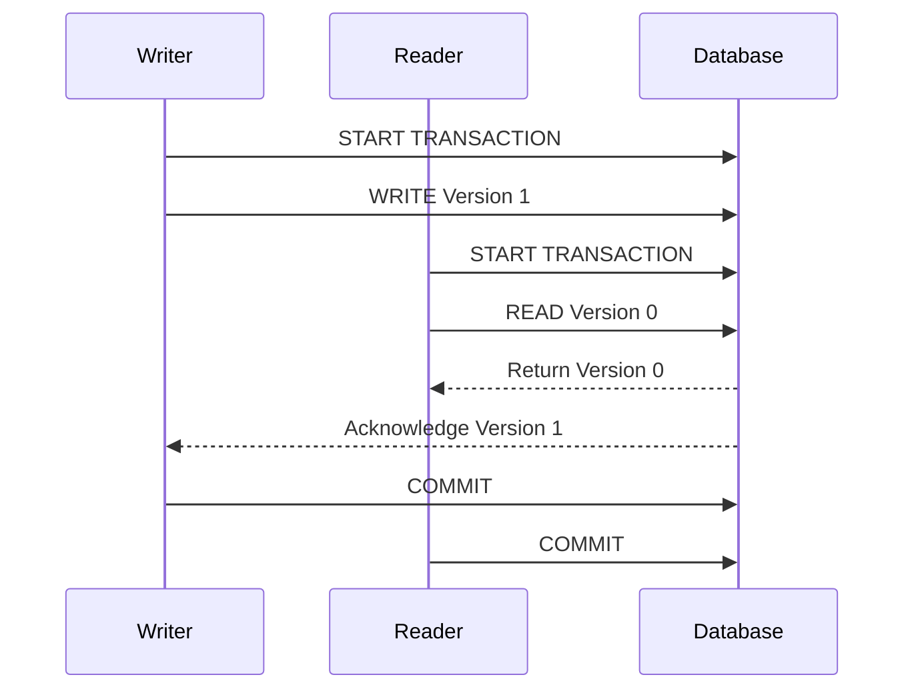

## Multi-Version Concurrency Control (MVCC)

### Description

Multi-Version Concurrency Control (MVCC) is a sophisticated database concurrency control mechanism designed to enhance data retrieval and manipulation by maintaining multiple versions of each piece of data. MVCC contributes to improving read performance and minimizes lock contention, providing an effective solution for handling concurrent transactions in database systems.

The central concept of MVCC is maintaining different versions of a data item at different points in time, which enables read transactions to access a snapshot of the database as it appeared at the start of the transaction. This facilitates non-blocking reads, enhances system performance, and ensures data consistency without interfering with write transactions.

### Key Concepts

- **Snapshot Isolation**: Readers access a consistent snapshot of the data, isolated from changes made by concurrent write operations.
- **Version Chains**: Each data item maintains a version chain that tracks changes over time. Typically, version chains are implemented using timestamps or version numbers.
- **Garbage Collection**: Stale versions need to be periodically cleaned up to reclaim storage space. This cleanup process is known as garbage collection.
- **Non-Blocking Reads**: Reads do not block writes—allowing high concurrency and enabling a smoother user experience.

### Implementation in Databases

#### Example: PostgreSQL

PostgreSQL, a widely-used open-source relational database, employs MVCC to support concurrent transactions and maintain data consistency. PostgreSQL uniquely uses transaction IDs to manage versioning. In PostgreSQL:

1. **Transaction ID**: Each transaction is assigned a unique identifier.
2. **Visibility Check**: Each tuple/version has associated metadata (including creation and expiration transaction IDs) to check its visibility to a transaction.
3. **Index-Only Scans**: With MVCC, PostgreSQL can perform index-only scans, greatly improving efficiency by avoiding unnecessary data page fetches.

### Diagram

Below is a simple sequence diagram illustrating how MVCC handles concurrent read and write transactions:

### Related Patterns

- **Optimistic Concurrency Control**: Another concurrency approach that assumes no conflict will occur and validates prior to commit.
- **Timestamp Ordering Protocols**: Ensures serializability of transactions using timestamps.
- **Lock-Based Protocols**: MVCC reduces contention caused by exclusive locks by maintaining multiple versions.

### Best Practices

- **Tune Garbage Collection**: Regularly run garbage collection processes to free space and prevent database bloat.
- **Manage Version Chain Length**: Correctly configure transaction settings to manage the length of version chains to optimize performance.
- **Monitor System Performance**: Keep an eye on system performance metrics to balance between read and write latencies effectively.

### Additional Resources

- [PostgreSQL MVCC Documentation](https://www.postgresql.org/docs/current/mvcc-intro.html)
- [ACID Transactions in MVCC](https://dev.mysql.com/doc/refman/8.0/en/innodb-multi-versioning.html)
- [Concurrency Control](https://medium.com/geekculture/concurrency-control-database-and-implementation-e937b44e734e)

### Summary

Multi-Version Concurrency Control (MVCC) is pivotal for systems requiring robust solutions for concurrent data access without sacrificing performance or consistency. By maintaining multiple versions of data, MVCC enables high concurrency, non-blocking reads, and minimizes lock contention while ensuring data correctness. Its differentiation lies in snapshot isolation, version chains, and protocols for managing concurrent access, making it integral in modern database systems such as PostgreSQL and beyond.
