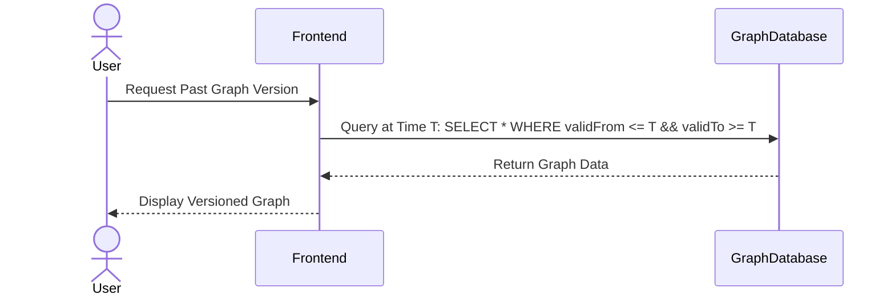

## Introduction

The Versioned Graphs design pattern is a data modeling technique used to dynamically manage and represent the evolution of relationships within a graph over time. By maintaining versions of graph data structures, systems can efficiently track changes, allowing historical queries and providing insights into how the nature of the interconnected entities changes. This pattern is particularly valuable in scenarios where understanding the temporal progression of relationships is as crucial as understanding their current state.

## Example Use Case

In a social network, relationships between users, such as friendships or follows, can change frequently. Capturing these changes as versions of the social graph allows users or analysts to query not only the current state of the network but also its past configurations. This can reveal insights into user behaviors, social trends, and influence patterns over time.

## Detailed Explanation

### Design Pattern Architecture

Versioned Graphs rely on effectively managing time-based transitions within nodes and edges of a graph. Typically, this involves:

- **Node Versions**: Nodes in a graph represent entities, and their properties might change with time. Each version of a node could capture its state at a particular timestamp.
  
- **Edge Versions**: Similar to nodes, edges represent relationships that can form or dissolve over time. Each version of an edge depicts its connectivity and properties during specific temporal intervals.

### Strategies for Implementing Versioned Graphs

#### 1. Snapshot-Based Versioning
This approach periodically captures the entire graph's state at particular intervals, creating snapshots. Queries can access these snapshots to analyze historical states.

#### 2. Delta-Based Versioning
Rather than storing entire snapshots, delta changes are recorded. Each delta captures differences from the previous state, and the graph's state at any point can be reconstructed by applying these deltas cumulatively.

#### 3. Temporal Property Graphs
Propagating temporal attributes into node and edge properties allows annotations with valid time intervals, ensuring all state changes are represented within the graph structure naturally.

### Example Code

Below is a simplified pseudo-code representation of implementing a Versioned Graph using temporal properties:

```scala
case class Node(id: String, validFrom: Long, validTo: Long, properties: Map[String, Any])
case class Edge(fromId: String, toId: String, validFrom: Long, validTo: Long, properties: Map[String, Any])

class VersionedGraph {
  private val nodes: MutableList[Node] = MutableList()
  private val edges: MutableList[Edge] = MutableList()

  def addNode(node: Node): Unit = nodes += node
  def addEdge(edge: Edge): Unit = edges += edge
  
  def queryNodesAtTime(time: Long): List[Node] =
    nodes.filter(node => node.validFrom <= time && node.validTo >= time)
  
  def queryEdgesAtTime(time: Long): List[Edge] =
    edges.filter(edge => edge.validFrom <= time && edge.validTo >= time)
}
```

### Diagrams

Here is an example of a simple UML sequence diagram illustrating how a versioned query might interact with a graph database:



## Related Patterns

- **Event Sourcing**: Capturing state changes as a sequence of events, allowing the replay of events to construct current and historical states.
  
- **Temporal Databases**: Special database architectures aimed at managing time-sensitive data changes and queries.

## Additional Resources

- "Graph Databases: New Opportunities for Connected Data" by Ian Robinson, Jim Webber, and Emil Eifrem.
- "The Art of Temporal Data Modeling" – Research publications on handling temporal datasets in modern applications.

## Summary

The Versioned Graphs pattern enables efficient management and querying of graph data structures as they evolve over time. By leveraging strategies like snapshot-based, delta-based, and temporal property graphs, systems can provide comprehensive insights into their historical and current states. As data grows more connected and dynamic, implementing robust graph versioning techniques becomes essential for capturing a complete picture of evolving relationships.
