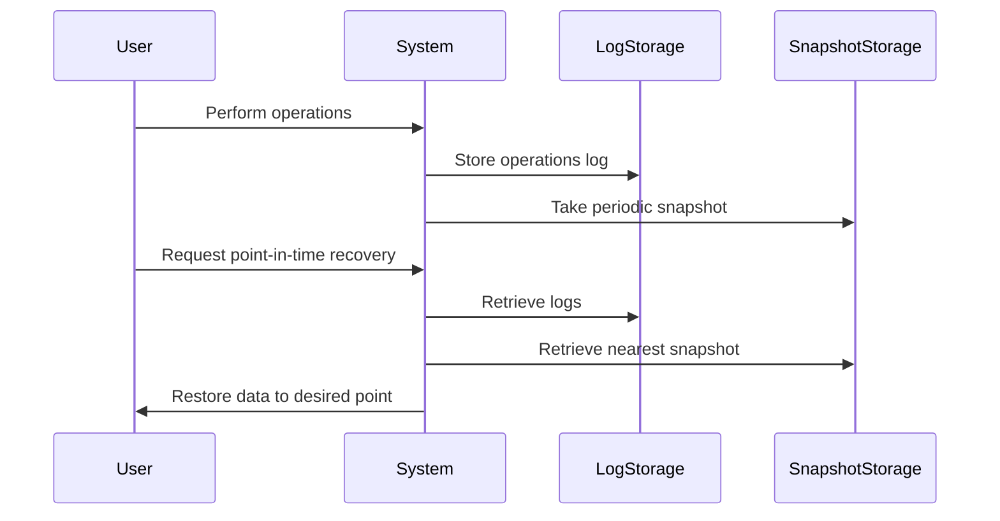

## Introduction

Point-in-Time Recovery (PITR) is a design pattern that enables the restoration of data to a particular state at a specific moment in the past. This technique is invaluable for rectifying data-loss events, such as accidental deletions or erroneous updates, thereby ensuring business continuity and data integrity. PITR is primarily used in databases and data storage systems in cloud environments.

## Detailed Explanation

### Design Patterns and Architectural Approaches

- **Transaction Logging**: Capture all transactions in a log so the sequence of changes can be replayed or reversed. This requires handling logs in parallel with data writes to ensure consistency after a failure.
  
- **Snapshotting**: Periodically capture a complete copy or representation of the dataset. Snapshots can act as baseline data points useful for restoration.
  
- **Continuous Replication**: Implement technologies such as change data capture that replicates ongoing changes to a secondary system or log for potential replay.
  
- **Time-based Restore Points**: Regularly mark system states with time-based restore metadata to facilitate operations like database rollbacks.

### Best Practices

- **Granularity and Frequency**: Determine the granularity and frequency of backups based on the application's criticality and data change frequency.
  
- **Decoupled Storage for Logs**: Store transaction logs separate from main data stores to prevent loss due to hardware or software failures.
  
- **Consistent Time Mechanism**: Use consistent timekeeping services like Network Time Protocol (NTP) to ensure precise restore points.
  
- **Automate**: Use automation for regular snapshots and log backups to mitigate human error and ensure consistent operation.
  
- **Security and Compliance**: Ensure logs and snapshots are securely stored and encrypted to adhere to regulatory compliance standards.

### Example Code

For illustration, let's consider database operations implemented using Golang and how we might snapshot and log changes within a program:

```go
package main

import (
	"log"
	"time"
)

type Transaction struct {
	ID        int
	Timestamp time.Time
	Data      string
}

var transactionLog []Transaction

func recordTransaction(id int, data string) {
	transaction := Transaction{
		ID:        id,
		Timestamp: time.Now(),
		Data:      data,
	}
	transactionLog = append(transactionLog, transaction)
	log.Printf("Recorded Transaction: %+v\n", transaction)
}

func main() {
	// Simulate recording transactions
	recordTransaction(1, "Initial data")
	time.Sleep(2 * time.Second)
	recordTransaction(2, "Updated data")
	// Implement snapshot and more logging mechanisms as necessary
}
```

### Diagrams

Below is a simple sequence diagram using Mermaid showing a PITR process:



## Related Patterns

- **Backup and Restore**: Involves maintaining copies of data and bringing data back from backups after a loss.
- **Change Data Capture**: Facilitates tracking changes in data, allowing PITR through change replay.
- **Redundancy and Replication**: Uses data copies for availability ensuring data can be recovered or continued elsewhere intact.

## Additional Resources

- [AWS Point-In-Time Recovery (PITR) for DynamoDB](https://aws.amazon.com/dynamodb/point-in-time-recovery/)
- [GCP SQL Instance Backups and PITR](https://cloud.google.com/sql/docs/mysql/backup-recovery/backup-process)
- [Disaster Recovery Solutions for Databases](https://azure.microsoft.com/en-us/solutions/backup-and-disaster-recovery/)

## Summary

Point-in-Time Recovery is a crucial pattern in maintaining the resilience and reliability of data systems. By employing transaction logging, snapshot taking, and consistent replication, organizations can shield themselves against data loss, ensuring their systems can bounce back effectively from errors and disasters.
