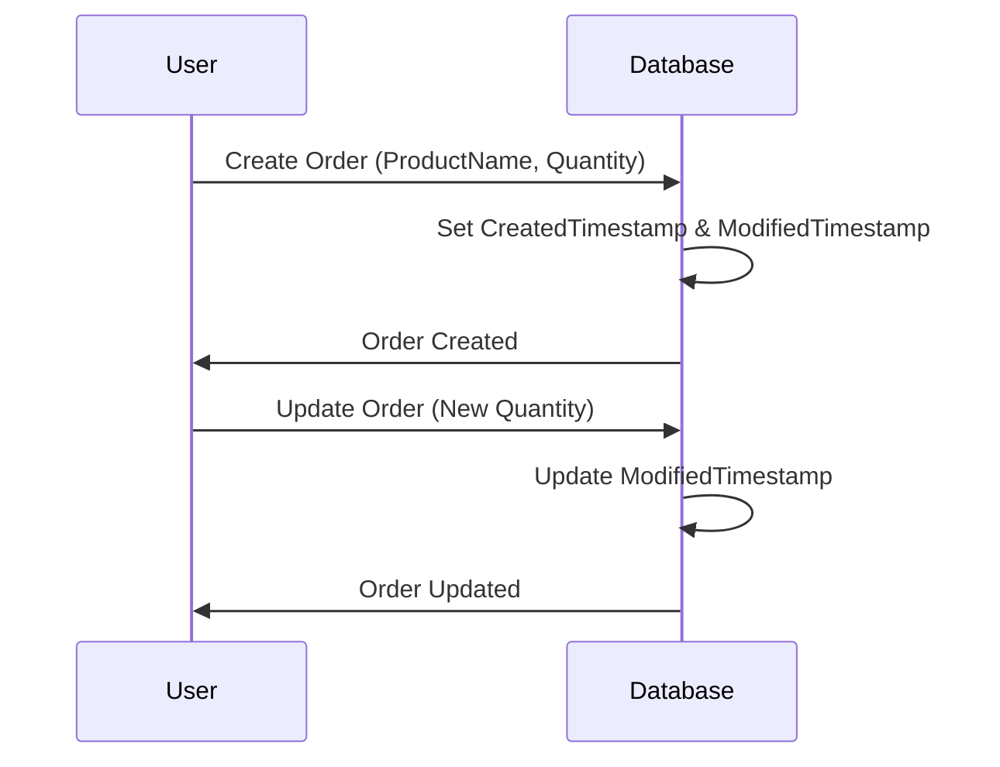

### Timestamp Versioning

**Timestamp Versioning** is a common pattern in data management systems, utilizing timestamps to represent the precise creation or modification time of a record. This approach facilitates accurate version tracking and plays a critical role in maintaining data integrity, especially in distributed systems, where concurrent modifications may occur.

#### Detailed Explanation

In Timestamp Versioning, every record in a database typically comes with two additional fields:

- **CreatedTimestamp**: This indicates the exact moment when the record was initially created.
- **ModifiedTimestamp**: This marks the most recent time the record was updated.

By leveraging these timestamp fields, systems can ensure consistency and resolve conflicts, especially in scenarios involving concurrent updates.

#### Architectural Approaches

1. **Time-Based Conflict Resolution**: When detecting conflicts in distributed systems, earlier versions can be preserved while relying on modified timestamps to determine the latest valid record.
2. **Historical Data Retrieval**: Timestamps can facilitate the retrieval of record states as of a specified time, supporting functionalities like time-based queries and historical audits.
3. **Time-Series Data Management**: Effective management of time-series data requires accurate timestamps to construct an evolving dataset that captures changes over time.

#### Best Practices

- **Synchronization of Clocks**: Ensure all systems have synchronized clocks to maintain accuracy and consistency across different nodes within a distributed system.
- **Time Zone Handling**: Use UTC timestamps to account for differences in local time zones, ensuring uniformity in record timestamps.
- **Granularity Considerations**: Choose the appropriate precision (milliseconds, microseconds) based on the application’s requirements for tracking changes.

#### Example Code

Consider a simple SQL table implementation that uses timestamps for version tracking:

```sql
CREATE TABLE Orders (
    OrderID INT PRIMARY KEY,
    ProductName VARCHAR(255),
    Quantity INT,
    CreatedTimestamp TIMESTAMP DEFAULT CURRENT_TIMESTAMP,
    ModifiedTimestamp TIMESTAMP DEFAULT CURRENT_TIMESTAMP ON UPDATE CURRENT_TIMESTAMP
);
```

In this example, each record in the `Orders` table automatically logs its creation and modification times, facilitating easy tracking of its history.

#### Diagrams

Below is a UML sequence diagram depicting a scenario where a record is updated, leveraging timestamps for versioning:



#### Related Patterns

- **Event Sourcing**: Captures all changes as a sequence of events, each with corresponding timestamps for historical rebuilding of application state.
- **Optimistic Locking**: Uses timestamps as part of a locking mechanism to handle concurrent updates without conflicts.
- **Temporal Versioning**: Extends timestamp versioning to include support for operations over multiple periods and states.

#### Additional Resources

- [Wikipedia on Timestamps](https://en.wikipedia.org/wiki/Timestamp)
- [Time Synchronization in Distributed Systems](https://example.com/time-sync)

#### Summary

Timestamp Versioning is a vital pattern in data management, providing precise tracking of record versions through timestamps. It enables effective conflict resolution, historical data analysis, and reliable management of time-sensitive data across various systems, especially in a distributed environment. Following best practices ensures its efficacy and aids in maintaining data integrity.
