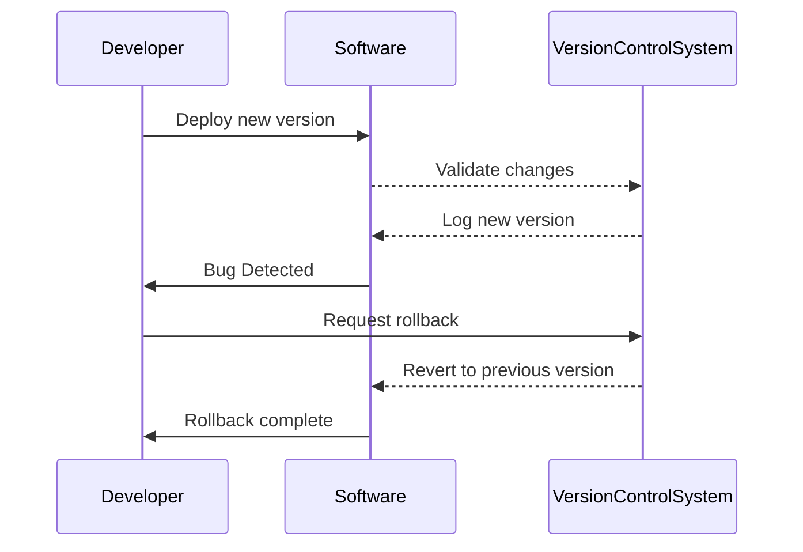

## Introduction

The Rolling Back pattern addresses how to revert data or a system state to a previous version when undesired changes or errors occur. This versioning pattern is particularly important in environments where frequent updates and modifications happen, such as software development, database management, and cloud-based applications.

## Detailed Explanation

### Concept

In software and data management, rolling back means returning the system to a previous known stable state. This is typically done to fix errors introduced by recent changes or updates. Rollbacks are commonly used with transactional systems, where they act as a fail-safe.

### Use Cases

- **Software Deployments**: Reverting to a previous version of software if the latest deployment contains critical bugs.
- **Database Management**: Restoring database tables to an earlier state to correct data corruption or incorrect entries.
- **Configuration Changes**: Undoing configurations that led to system instability.

### Architectural Approach

1. **Snapshotting**: Regular snapshots of system states or databases can be taken, allowing rollbacks to revert to these saved states.
2. **Versioning**: With version control systems (VCS), codebases can be rolled back to previous commits, ensuring any problematic code can be reverted easily.
3. **Undo Logs**: Applications maintain logs of changes, making it possible to revert the changes in reverse order.

### Best Practices

- Keep regular snapshots or backups and test their recoverability.
- Implement robust unit and integration tests to catch errors early and minimize the need for rollbacks.
- Automate rollback procedures to reduce recovery time.
- Maintain comprehensive documentation of each change to understand the ramifications of a rollback.

## Example Code

Here is a basic example using a version control system for code rollbacks:

```bash
# Revert commits to undo changes

git log

git revert <commit_hash>
```

Or for databases, using transaction logs in SQL:

```sql
-- Assuming the use of PostgreSQL for rolling back a transaction
BEGIN TRANSACTION;

-- Execute the faulty change
UPDATE accounts SET balance = balance - 100 WHERE account_id = 1;

-- Something went wrong? Rollback
ROLLBACK;
```

## Related Patterns

- **Snapshot Pattern**: Taking regular "snapshots" or backups of a system for restoration.
- **Transaction Pattern**: Ensuring atomic operations to allow safe rollbacks.
- **Blue-Green Deployment**: This pattern allows switching between two environments without downtime, facilitating easier rollback if necessary.

## Diagrams



## Additional Resources

- [Git Documentation: Reverting Commits](https://git-scm.com/docs/git-revert)
- [PostgreSQL Transaction Management](https://www.postgresql.org/docs/current/tutorial-transactions.html)
- [AWS Backups and Restore Solutions](https://aws.amazon.com/backup/)

## Summary

The Rolling Back design pattern is an essential strategy for error recovery and maintaining system stability across various domains. By preparing for failures and using systematic approaches like snapshotting and logging, organizations can swiftly correct issues without compromising on data integrity or system availability.
