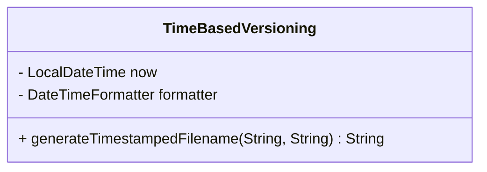

---

linkTitle: "Time-Based Versioning"
title: "Time-Based Versioning"
category: "Versioning Patterns"
series: "Data Modeling Design Patterns"
description: "Using timestamps as version identifiers, allowing precise tracking and access to different versions of data or configurations by associating them with their creation or modification times."
categories:
- Versioning
- Data Modeling
- Time Management
tags:
- Time-based
- Version Control
- Data Management
- Timestamps
- Backup Strategies
date: 2024-07-07
type: docs

canonical: "https://softwarepatternslexicon.com/103/4/21"
license: "© 2024 Tokenizer Inc. CC BY-NC-SA 4.0"
---

## Time-Based Versioning

### Description

Time-Based Versioning is a strategy for managing different versions of entities, such as files, data, or configurations, by appending or associating them with timestamps. This method is particularly useful in scenarios where changes over time need to be managed and possibly rolled back. It provides an intuitive, chronological version control mechanism ensuring that versions are both uniquely identifiable and easily accessible based on time.

### Benefits

- **Ease of Use**: Human-readable timestamps make it easy to understand the sequence of versions without requiring additional tools or complex tags.
- **Temporal Integrity**: Guarantees that the chronological order of changes is maintained, aiding debugging and historical analysis.
- **Simplified Rollback**: Allows for straightforward identification and retrieval of past versions to reverse to a previous state if necessary.

### Example Use Cases

1. **Backup Systems**: Backup files are named with timestamps, such as `database_backup_2023-09-15_2300.sql`, clearly indicating when each backup was taken.
2. **Configuration Management**: System configurations saved with names like `config_2023-05-20_1800.json` help track changes and deploy appropriate settings at the desired times.
3. **Data Lakes**: Large datasets append timestamps to partition keys, facilitating time-based queries and historical data management.

### Implementation Strategy

- Use consistent timestamp formats across all systems to ensure compatibility (`yyyy-MM-dd_HHmm`).
- Store metadata along with versions to provide context about the changes.
- Utilize server UTC formatting to avoid timezone issues across distributed systems.

### Example Code

Here is a simple implementation in Java that demonstrates naming files with time-based versioning using Java's `java.time` package:

```java
import java.time.LocalDateTime;
import java.time.format.DateTimeFormatter;

public class TimeBasedVersioning {
    private static final DateTimeFormatter formatter = DateTimeFormatter.ofPattern("yyyy-MM-dd_HHmm");

    public static String generateTimestampedFilename(String prefix, String extension) {
        LocalDateTime now = LocalDateTime.now();
        return prefix + "_" + now.format(formatter) + extension;
    }

    public static void main(String[] args) {
        String filename = generateTimestampedFilename("backup", ".sql");
        System.out.println("Generated Filename: " + filename);
    }
}
```

### Diagrams

#### Mermaid UML Diagram



### Related Patterns

- **Semantic Versioning**: Utilizes major, minor, and patch numbers to describe different versions, ideal for tracking software changes.
- **Event Sourcing**: Captures state changes as a sequence of events timestamped in chronological order.

### Additional Resources

- [ISO 8601 Date and Time Format](https://www.iso.org/iso-8601-date-and-time-format.html)
- [Java Time API](https://docs.oracle.com/javase/8/docs/api/java/time/package-summary.html)
- [Best Practices for Implementing Version Control Systems](https://git-scm.com/book/en/v2)

### Summary

Time-Based Versioning is a strategic approach you can employ to manage version histories with clarity and simplicity by utilizing timestamps. Its application spans various domains, ensuring data reliability and enhancing historical data analysis capabilities. It complements other versioning strategies and proves indispensable in modern software systems where tracking change history robustly is crucial.
