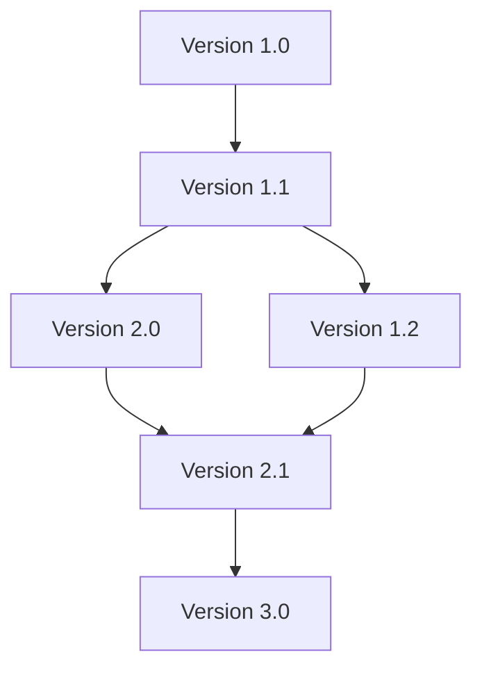

## Introduction to Version Trees

Version Trees are a design pattern used in version control systems to manage different iterations or versions of a dataset or codebase. Unlike simple linear version control, version trees allow for branching and merging, which are critical for collaborative development and complex data management scenarios.

## Architectural Overview

In a Version Tree, each node in the tree represents a distinct version of the data or code. Edges between nodes signify the evolution of versions, often through branching (creating a new path) or merging (reuniting divergent paths). This tree-like structure enables parallel developments, supporting workflows commonly found in modern software and data projects.

### Branching

Branching is the process of diverging from an existing version to develop an independent line of changes. It allows teams to work on different features simultaneously without interfering with the mainline version.

### Merging

Merging is the process of integrating changes from one branch back into another. This requires reconciling differences and ensuring that the main line of development integrates changes correctly.

## Example Code and Diagrams

Consider a simple implementation in JavaScript to represent version trees:

```javascript
class VersionNode {
    constructor(version, parent = null) {
        this.version = version;
        this.children = [];
        this.parent = parent;
    }
    
    addChild(version) {
        const childNode = new VersionNode(version, this);
        this.children.push(childNode);
        return childNode;
    }
    
    merge(otherNode) {
        // Logic for merging nodes would depend on application-specific rules
        console.log(`Merging version ${otherNode.version} into ${this.version}`);
    }
}
```

### Mermaid Diagram: Version Tree



## Related Patterns

- **Event Sourcing**: Complementary to version trees, this pattern records state changes as a sequence of events, thus capturing a complete history of operations.
  
- **Command Query Responsibility Segregation (CQRS)**: Often used together with version trees to isolate read and write operations, facilitating concurrent work and scaling in distributed systems.

## Additional Resources

- [Git Documentation](https://git-scm.com/doc): In-depth resource on implementing and using version control with trees.
- [EDA with Event Sourcing](https://martinfowler.com/eaaDev/EventSourcing.html): A thorough exploration of event sourcing as a procedure for managing state.

## Summary

The Version Tree pattern is crucial for managing complex version histories where branching and merging are frequent. This pattern supports both collaborative environments and distributed systems by providing a clear structure for versioning. Mastery of version trees is essential for software engineers dealing with dynamic, concurrent, and large-scale projects.
