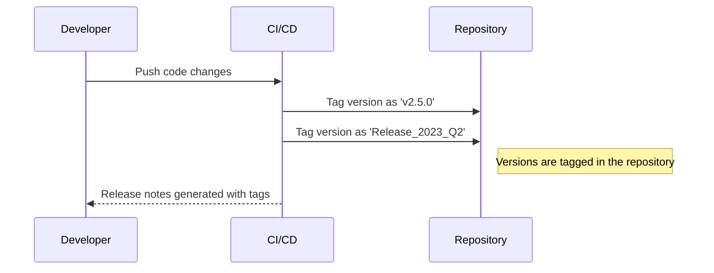

## Introduction

In software development and data management, versioning is a critical practice for tracking changes, managing releases, and maintaining continuity in evolving systems. One useful pattern that complements numeric versioning is the use of **Version Tags**. A version tag is a human-readable label associated with a specific version of software, file, data schema, or any changeable entity. By adding semantic meaning to version identifiers, version tags enable easier identification, referencing, and communication of changes across teams.

## Design Pattern Elements

### Problem

Numeric version numbers alone can be insufficient for easy identification and reference. They typically follow a standard format like MAJOR.MINOR.PATCH (e.g., 2.4.1), which provides a snapshot of changes but lacks semantic clarity for end-users or stakeholders who may need to quickly understand the state or significance of a version.

### Solution

Implement version tags alongside numeric versions as a means to convey additional information, such as:

- Release cycle indicators (e.g., `Release_2023_Q1`).
- Significant milestones (e.g., `Beta`, `Stable`, `LTS` for Long-Term Support).
- Specific operational contexts (e.g., `Demo`, `Production`).

These tags make it easier for teams and systems to reference specific versions without diving into details.

### Implementation

Version tags can be managed through:

- **Source Control Systems** like Git, which provide tagging mechanisms. For example:
  ```bash
  git tag -a v1.0.0 -m "Stable Release: Q3 2023"
  git tag -a demo_v1.0 -m "Demo Version for Client X"
  ```

- **Continuous Integration/Continuous Deployment (CI/CD) Pipelines** that automate the assignment of tags during build and release stages.

- **Documentation and Release Notes** including both numeric and human-readable tags, providing context and insight into the content and purpose of releases.

### Example

Consider a scenario in which a software team releases new features quarterly. Using version tags makes milestone identification clear and manageable:

- `v2.0.0`: Major release with new features based on customer feedback.
- `Release_2023_Q1`: Human-friendly tag identifying the release cycle.
- `Beta_2023`: Indicates beta testing stage to stakeholders.

These tags are attached via the version control system, embedded in release documentation, and highlighted in user materials.

### Diagram

Below is a sequence diagram illustrating the process of tagging versions during a CI/CD pipeline:



## Related Patterns

- **Semantic Versioning**: Provides a standard for version numbers, which can be complemented by version tags.
- **Branch by Abstraction**: Uses branches in source control which can include tagged checkpoints.
- **Canary Release**: Where version tags can denote experimental deployments for testing.

## Best Practices

- **Consistency**: Maintain a consistent tagging convention within the organization for ease of use and reference.
- **Relevance**: Tags should be meaningful and relevant to the functions or purpose they denote.
- **Automation**: Incorporate automatic tagging in the CI/CD process to minimize manual errors.

## Additional Resources

- [Semantic Versioning Official Site](https://semver.org/)
- [Managing Releases with Git Tags](https://git-scm.com/book/en/v2/Git-Basics-Tagging)
- [CI/CD Automation Strategies](https://www.atlassian.com/continuous-delivery/principles/automation)

## Summary

Version Tags enhance numeric versioning with human-readable labels, providing clarity and improving communication within development workflows. This pattern integrates seamlessly into modern CI/CD practices, facilitating better management and tracking of software versions across lifecycle stages. By following best practices and leveraging existing tools, organizations can significantly enhance their versioning system.
