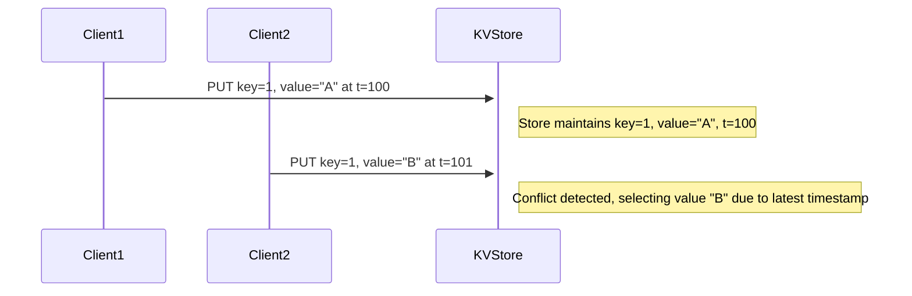

## Conflict Resolution

### Description

Conflict resolution is a critical concept in distributed systems, particularly in scenarios involving data synchronization, versioning, and collaborative editing. When multiple versions or branches of data are maintained concurrently, conflicts can arise during the merge process. Understanding and implementing effective conflict resolution strategies is essential for ensuring data integrity, consistency, and user satisfaction.

In distributed databases and collaborative applications, conflicts frequently emerge when concurrent updates occur. To address these conflicts, systems utilize various strategies and rules, with "last-write-wins" being one of the most common methods. However, depending on the use case, more sophisticated conflict resolution methods may be necessary to achieve the desired level of consistency and precision.

### Architectural Approaches

1. **Last-Write-Wins (LWW)**
   - A simplistic approach where the most recent update is retained. Suitable for applications where overwriting data with the latest version is acceptable.

2. **Operational Transformation**
   - Widely used in collaborative real-time editors, this approach transforms the operations in such a way to resolve conflicts while preserving the intent of all operations.

3. **Three-Way Merge**
   - Utilizes a base version to reconcile differences between two diverged copies. Commonly used in version control systems like Git.

4. **Vector Clocks and Causal Trees**
   - Provide more elaborate mechanisms for ordering events and resolving conflicts based on the causality and concurrency of operations.

5. **Custom Rule-Based Strategies**
   - In domains where domain-specific rules or business logic dictate resolution, custom strategies can be implemented to enforce specific requirements.

### Best Practices

- **Understand Business Requirements**: Choose a conflict resolution strategy that aligns with the expectations for data consistency and integrity specific to the business domain.
- **Test Conflict Scenarios**: Thoroughly test how the system handles a wide range of conflict scenarios to ensure reliability and predictability.
- **Educate Users**: Offer guidance and documentation to help users understand how conflicts are resolved, especially in collaborative environments.
- **Iterative Improvement**: Constantly evaluate and improve conflict resolution approaches based on user feedback and changes in system requirements.

### Example Code

Here's a basic outline demonstrating a last-write-wins approach in a distributed key-value store:

```java
import java.util.concurrent.ConcurrentHashMap;

public class DistributedKVStore {

    private ConcurrentHashMap<String, VersionedValue> store = new ConcurrentHashMap<>();

    public void put(String key, String value, long timestamp) {
        store.merge(key, new VersionedValue(value, timestamp), 
            (existing, newVersion) -> existing.timestamp >= newVersion.timestamp ? existing : newVersion);
    }

    public String get(String key) {
        var versionedValue = store.get(key);
        return versionedValue == null ? null : versionedValue.value;
    }

    private static class VersionedValue {
        String value;
        long timestamp;

        VersionedValue(String value, long timestamp) {
            this.value = value;
            this.timestamp = timestamp;
        }
    }
}
```

### Diagrams

#### Sequence Diagram for Conflict Resolution



### Related Patterns

- **Eventual Consistency**: Often a driving factor behind conflict resolution strategies in distributed systems.
- **Optimistic Concurrency Control**: A technique in which conflict resolution strategies become critical to ensure data integrity post-login.
- **Merge Patterns**: General strategies for merging disparate data streams or versions.

### Additional Resources

- [Wikipedia: Conflict-free Replicated Data Types (CRDTs)](https://en.wikipedia.org/wiki/Conflict-free_replicated_data_type)
- [ACM Article: Operational Transformation in Real-time Group Editors](https://dl.acm.org/)
- [Git Documentation: Merge Strategies](https://git-scm.com/docs/merge)

### Summary

Conflict resolution in distributed systems requires thoughtful consideration of business logic, data integrity, and system requirements. While simple approaches like last-write-wins might suffice for some applications, more complex systems may demand sophisticated resolution strategies to manage operational divergence effectively. By understanding various patterns and practices, engineers can design systems that maintain consistency and meet organizational data requirements.
