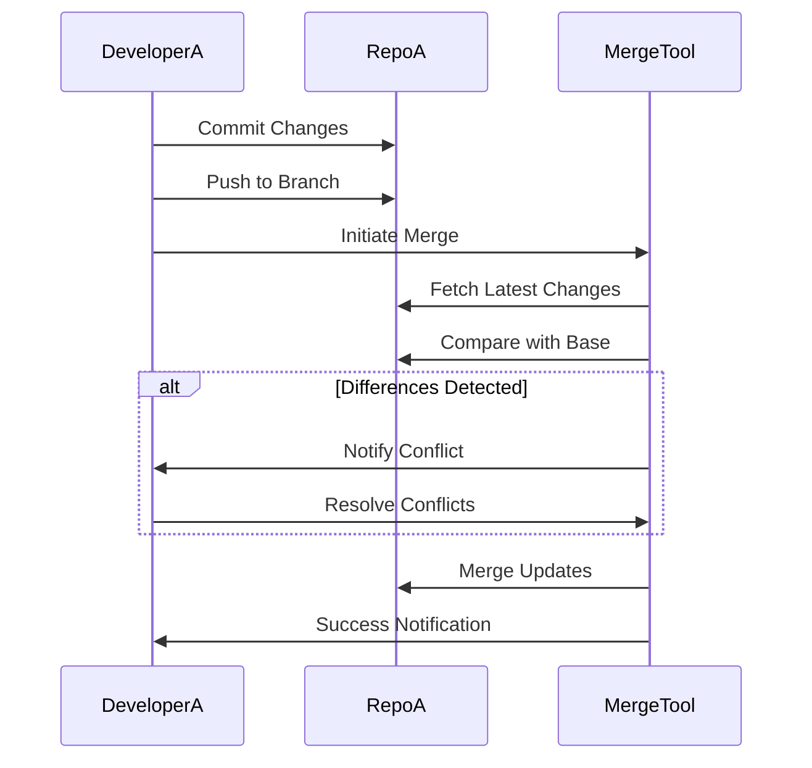

## Overview

In complex systems, managing data changes across multiple versions or branches is crucial. Merge Strategies provide structured methods for resolving conflicts and integrating changes efficiently. This pattern is essential in version control systems, database management, and distributed applications.

## Common Types of Merge Strategies

1. **Three-Way Merge**: A prevalent strategy that involves merging two versions of a set using a common ancestor. Conflicts are resolved through manual intervention or automated rules.
   
   **Example Implementation:**
   ```java
   public class ThreeWayMerge {
       public static String merge(String base, String versionA, String versionB) {
           // Difflib or similar library could be used here for demonstration
           // Logic to compare base with versionA and versionB and merge differences
           // Placeholder logic:
           String mergedResult = base; // assume base is reconciled with changes
           return mergedResult;
       }
   }
   ```

2. **Rebase**: This strategy sequentially applies from one branch onto another, effectively rewriting project history. This is often used to maintain a linear project history.

3. **Recursive Merge**: Utilized by Git, it diverges on the merge strategy by creating a temporary merge base with multiple internal merges, effectively handling complex branching.

## Best Practices

- Always maintain a clean and well-defined branch strategy aligned with team workflows.
- Regularly perform merges to keep branches up to date and reduce conflict potential.
- Establish clear rules and guidelines for conflict resolution to streamline the merging process.
- Use version control systems with support for complex merge strategies like Git.
 
## Architectural Approaches

- **Divide and Conquer**: Break down the scope of changes or code into smaller, manageable branches before merging them back.
- **Automated Conflict Resolution**: Implement tools that automatically detect and resolve conflicts according to predefined rules or machine learning models that learn from past resolutions.

## Example Sequence Diagram

Here's a sample sequence diagram depicting a basic three-way merge strategy in a distributed version control system:



## Related Patterns

- **Feature Branching**: Managing new features in branches to enhance isolation and integration at optimal times.
- **Continuous Integration**: Coupling merge operations with tests ensures that merged code doesn't introduce errors.

## Additional Resources

- [Git Branching](https://git-scm.com/book/en/v2/Git-Branching-Branching-Workflows)
- [Advanced Merging](https://git-scm.com/docs/git-merge)
- [Version Control Best Practices](https://martinfowler.com/articles/branching-patterns.html)

## Summary

Merge Strategies are vital for ensuring data consistency and integrity across different branches in version-controlled environments. Whether using a three-way merge, rebasing, or recursive merging, the goal is always to reduce conflicts and integrate changes smoothly. By employing best practices and leveraging sophisticated tools, organizations can maintain high efficiency in their versioning strategies.
