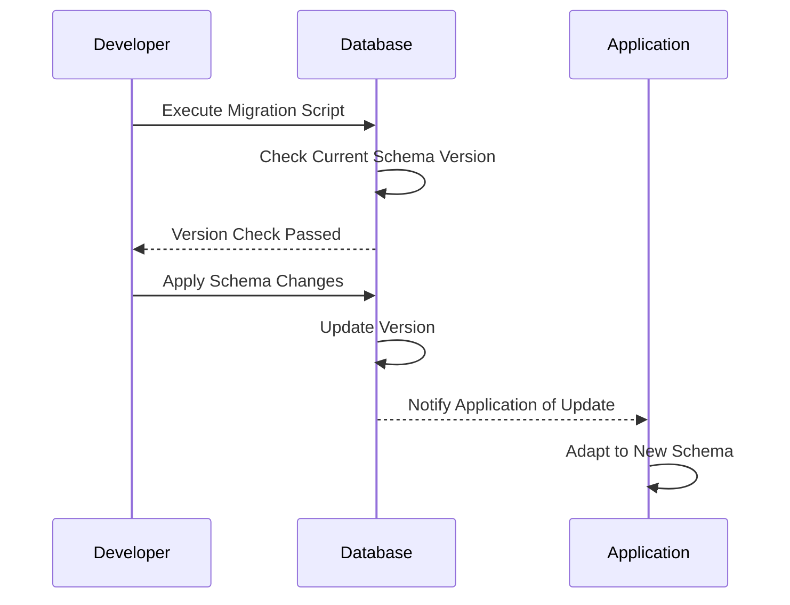

**Versioned Schema Evolution**

Schema evolution is a critical aspect of database design and management, especially when dealing with applications that demand high availability. The Versioned Schema Evolution pattern allows for seamless transitions and updates to your database schema, ensuring backward compatibility and minimal disruption to running applications. 

### Detailed Explanation

The Versioned Schema Evolution pattern is focused on introducing changes to your database schema in a controlled manner. This approach ensures that applications continue to function correctly by maintaining compatibility between multiple schema versions. The process largely revolves around:

1. **Schema Versioning**: Assigning unique versions to your schemas that help in managing changes over time. This versioning is useful for both tracking changes and implementing compatibility checks.

2. **Migration Scripts**: Developing and applying scripts that incrementally upgrade the database schema. These scripts handle transformations such as adding new tables, modifying columns, or removing deprecated attributes.

3. **Compatibility Handling**: Ensuring the application logic can handle both the old and new versions of the schema, often involving data access layers or services that abstract the underlying database changes.

4. **Testing and Rollback**: Implementing comprehensive testing strategies for migration scripts to identify any issues before deploying in production environments, along with rollback mechanisms to reverse changes if necessary.

### Example Code

Consider a situation where we want to add a new column `email` to a `users` table. The existing version is `v1`, and the new version post-migration would be `v2`.

```sql
-- Migration script for version v2
BEGIN;

-- Check the current version of the schema before applying the migration
DO 
BEGIN
    IF NOT EXISTS (SELECT 1 FROM schema_versions WHERE version = 'v1') THEN
            RAISE EXCEPTION 'Unexpected schema version: migration cannot proceed';
    END IF;
END ;

-- Apply schema change
ALTER TABLE users ADD COLUMN email VARCHAR(255);

-- Update the schema version table
INSERT INTO schema_versions(version, applied_at) VALUES ('v2', NOW());

COMMIT;
```

### Diagrams

Below is a sequence diagram explaining the flow of applying a schema migration:



### Related Patterns

- **Backward Compatibility**: Ensure that systems using an older version of the schema remain functional after updates.
- **Schema Version Control**: Utilize version control systems to manage schema migration scripts and changes.
- **Feature Toggles**: Temporarily enable or disable features to transition gradually towards a new schema.

### Additional Resources

- [Martin Fowler's Database Migrations](https://martinfowler.com/articles/evodb.html)
- [Flyway Database Migrations Tool](https://flywaydb.org)
- [Liquibase Open Source Library](https://www.liquibase.org)

### Summary

The Versioned Schema Evolution pattern is vital in the modern data-driven environment, where software applications must sustain agility and robustness despite frequent changes. This pattern streamlines the process of updating database schemas, safeguarding data consistency, and ensuring that applications remain operable across different schema versions. Adopting such a pattern within your architectural design not only enhances the robustness of your application's data layer but also contributes significantly to overall seamless user experiences during upgrades.
