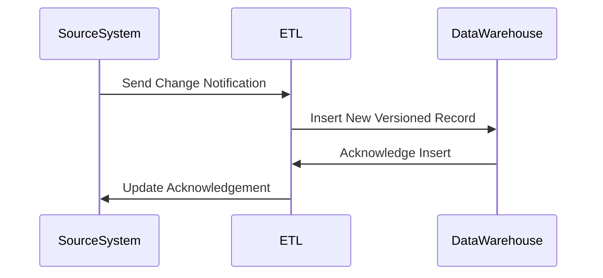

## Overview

Versioned Data Warehouses are a design pattern that manages data versions in data warehouses to facilitate time-based analysis and historical reporting. By maintaining data versions, organizations enhance their ability to track changes over time, analyze historical trends, and ensure data accuracy across different periods.

## Architectural Approach

The concept of Versioned Data Warehouses involves augmenting the warehouse architecture to support versioning of dimensions and facts. This pattern often integrates:

- **Slowly Changing Dimensions (SCD):** Techniques like SCD Type 2 are commonly used for maintaining historical versions of dimension data.
- **Temporal Tables:** Utilizing database features that natively support time dimensions and point-in-time querying.
- **Audit Logs:** Implementation of audit trails for change tracking.
- **ETL Processes:** Efficient Extract, Transform, Load processes to capture and maintain versions.

## Design Patterns and Paradigms

### Slowly Changing Dimensions (SCD)

The SCD Type 2 method is widely adopted to manage versioned data, creating new records with version indicators (e.g., StartDate and EndDate columns) every time a change occurs.

### Temporal Versioning

Temporal versioning in databases maintains versions at a schema level, providing inherent support for time-specific queries.

### Event Sourcing

An event sourcing approach can also be adopted, where each change in data is treated as an immutable event, ensuring each state transition is recorded.

## Best Practices

- **Identify Versioned Entities:** Determine which dimensions and facts require versioning.
- **Use Composite Keys:** For SCD Type 2 dimensions, use composite keys comprising surrogate keys and timestamps.
- **Optimize Queries:** Invest in query optimization and indexing strategies to maintain performance as data versions grow.
- **Data Governance:** Establish governance protocols for managing versions, ensuring data validity and compliance.

## Example Code

Here's a basic SQL implementation for maintaining versioned data using SCD Type 2:

```sql
-- Creating a versioned dimension table
CREATE TABLE customer_dim (
    customer_id INT,
    customer_name VARCHAR(100),
    start_date DATE,
    end_date DATE,
    current_flag CHAR(1) DEFAULT 'Y'
);

-- Inserting a new version of a customer dimension
INSERT INTO customer_dim (customer_id, customer_name, start_date, end_date, current_flag)
VALUES (1, 'John Doe', '2024-01-01', NULL, 'Y');
```

## Diagram

Below is a simple UML Sequence Diagram depicting an incoming update to a versioned data warehouse dimension:



## Related Patterns

- **Temporal Pattern:** Concepts for handling and querying time-based data.
- **Anderson's Architectural Pattern:** Structures related for maintaining historical data.
- **Incremental ETL Pattern:** Efficient data load strategies to handle large volumes of historical data.

## Additional Resources

- [Kimball Group's Data Warehouse Toolkit](https://www.kimballgroup.com)
- [Temporal Table Support in Modern Databases](https://www.microsoft.com/en-us/sql-server/sql-server-2017)
- [Event Sourcing Concepts](https://martinfowler.com/eaaDev/EventSourcing.html)

## Summary

Versioned Data Warehouses play a critical role in organizations requiring reliable, time-based, and historical data analysis. By following a structured versioning approach, one can ensure data integrity and enhance the utility of the data warehouse for decision-making. This pattern is integral to any business looking to gain insights from historical trends and maintain a consistent data audit trail.
