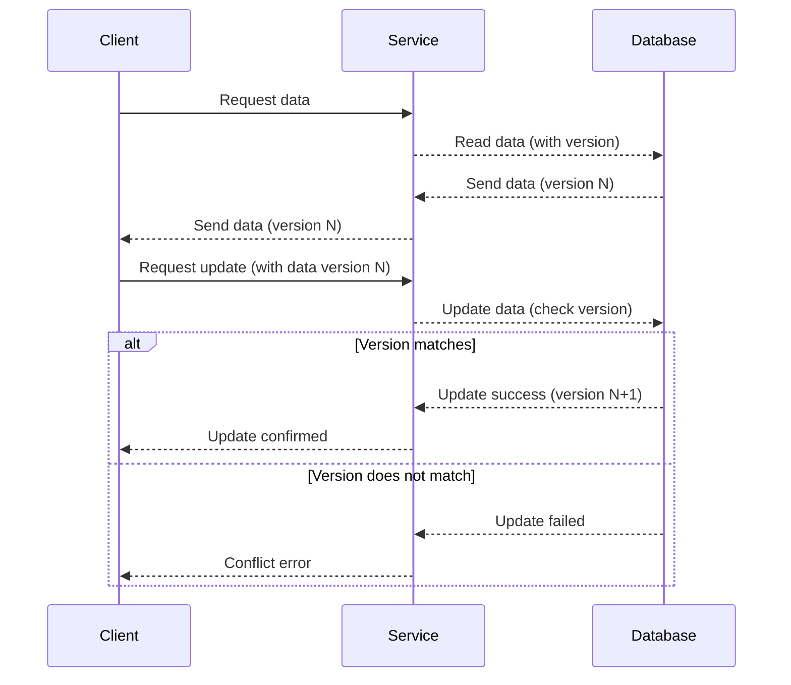

## Description

Optimistic Locking is a concurrency control pattern used to ensure data integrity without locking resources for the entire transaction duration. Instead of assuming conflicts will occur, this method assumes multiple transactions can proceed without interference. It verifies this assumption only when committing changes. This pattern improves performance in scenarios where conflicts are rare.

### Key Concepts:

1. **Version Control**: Each record in the database includes a version number. Every transaction that reads this record also takes note of the version number.
2. **Detection of Conflicts**: Before committing a transaction, the system checks if the version number of the data to be updated has changed.
3. **Handling Conflicts**: If the data has been modified by another transaction (indicated by a version number miss-match), the committing transaction aborts, and can either retry or notify a conflict.

## Best Practices

- **Granular Versioning**: Use version numbers at the record-level or finer, such as fields within the record, to reduce the likelihood of conflicts.
- **Retry Logic**: Implement a strategy for retries after detecting conflicts to allow the system to resolve transient contention.
- **User Feedback**: Provide meaningful feedback in user interfaces for conflict resolution when manual intervention is feasible.
- **Conflict Resolution**: Use domain-specific strategies to resolve conflicts automatically, when possible.

## Example Code

Below is a simple Java example demonstrating the Optimistic Locking pattern using a `Product` entity with a version field.

```java
import javax.persistence.*;

@Entity
public class Product {
    @Id
    @GeneratedValue(strategy = GenerationType.IDENTITY)
    private Long id;
    
    private String name;
    
    private double price;
    
    @Version
    private int version;

    // getters and setters for fields
}

public interface ProductRepository extends JpaRepository<Product, Long> {}

@Service
public class ProductService {

    @Autowired
    private ProductRepository productRepository;

    @Transactional
    public void updateProductPrice(Long productId, double newPrice) {
        Product product = productRepository.findById(productId).orElseThrow(() -> new EntityNotFoundException("Product not found"));
        product.setPrice(newPrice); // If a conflicting update takes place, an OptimisticLockingFailureException is thrown.
        productRepository.save(product);
    }
}
```

## Diagram

Below is a Mermaid UML sequence diagram illustrating the workflow of optimistic locking in a data update scenario:



## Related Patterns

- **Pessimistic Locking**: Unlike Optimistic Locking, Pessimistic Locking locks data at the beginning of a transaction, assuming conflicts will occur and thus minimizing the chance of concurrent modifications.
- **Eventual Consistency**: This is relevant in distributed systems where immediate consistency is not guaranteed, and retries or compensating transactions may be used upon conflicts.

## Additional Resources

- **JPA Documentation on Versioning**
- **Patterns of Enterprise Application Architecture** by Martin Fowler
- **Best Practices for Optimistic Locking** from the Hibernate Community

## Summary

Optimistic Locking is a vital pattern in ensuring data consistency and integrity within high-concurrency environments where write conflicts are uncommon. By leveraging versioning and conflict resolution strategies, systems can achieve efficient resource utilization and improve performance without the drawbacks associated with extensive locking. Suitable implementation can optimize throughput and enhance user experiences in scalable distributed systems.
