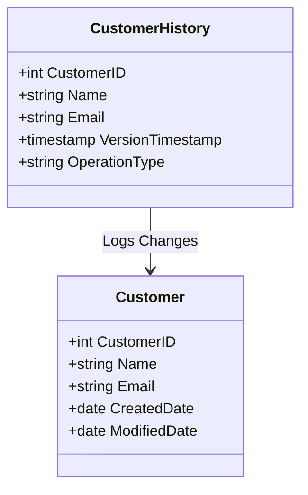

## Versioned Data Views

### Overview

Versioned Data Views is a design pattern that involves creating database views representing data as it existed at a specific point in time or version. This pattern is crucial in scenarios where historical data preservation and comparison are necessary, such as audit trails, data lineage, or rollback capabilities in software systems.

### Architectural Approaches

There are several approaches to implementing Versioned Data Views in database systems:

- **Copy-On-Write**: Create a new copy of the data whenever a version change occurs. This approach is simple but can lead to high storage usage due to data duplication.
- **Delta Storage**: Store only the differences (deltas) between different versions rather than full data copies. This method optimizes storage while still enabling reconstruction of various data versions.
- **Temporal Tables**: Some databases provide built-in support for versioned views through temporal tables, which manage changes over time with minimal overhead.
- **Data Snapshots**: Periodically capture and store complete snapshots that represent data states at particular points in time.

Here's a simple example to illustrate creating a versioned view using SQL:

```sql
CREATE VIEW Customer_Versioned AS
SELECT
    CustomerID,
    Name,
    Email,
    VersionTimestamp
FROM
    CustomerHistory
WHERE
    VersionTimestamp = '2023-01-01';
```

In this example, the `Customer_Versioned` view represents customer data as it was on January 1, 2023, leveraging an underlying history table that logs changes over time.

### Best Practices

- **Optimize Storage**: Choose data storage strategies (e.g., delta storage vs. full copies) based on operation costs, performance, and storage capacity.
- **Indexing**: Efficient indexing strategies are essential for quick retrieval of specific data versions.
- **Consistency Guarantees**: Ensure that versioning methods maintain data consistency across different views and data states.
- **Access Control**: Implement strict access controls for versioned views, particularly when they contain sensitive historical data.

### Example Code and Diagrams

#### UML Diagram



The above UML diagram demonstrates a simple customer table and a related history table that logs changes, forming the basis for versioned views.

### Related Patterns

- **Audit Log**: Complements Versioned Data Views by maintaining a detailed log of changes for auditing purposes.
- **Temporal Data Management**: Uses temporal aspects to manage data evolution over time.
- **Snapshot Isolation**: Provides isolation for transactions by maintaining consistent snapshots of data.

### Additional Resources

- [Temporal Table Design](https://docs.microsoft.com/en-us/sql/relational-databases/tables/temporal-tables)
- [Database Versioning Patterns](https://martinfowler.com/eaaDev/EvolutionaryDatabaseDesign.html)
- [Delta Storage Techniques](https://en.wikipedia.org/wiki/Delta_encoding)

### Summary

Versioned Data Views are a powerful pattern for managing and accessing historical data over time. By adopting strategies like copy-on-write, delta storage, or temporal tables, organizations can maintain robust data lineage and enable precise comparisons between different datasets. Following best practices and leveraging efficient querying and storage techniques ensures optimal implementation of this pattern in various database systems.
