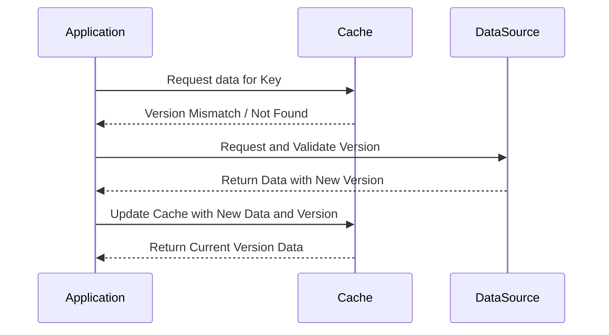

## Version-Aware Caching

### Overview

Version-aware caching is a design pattern that incorporates data versioning into the caching mechanism. It ensures that cached data is consistent with the latest version of the underlying data source, preventing stale or inconsistent data scenarios. This pattern is critical in distributed systems and applications where data is frequently updated and accessed by multiple consumers.

### Detailed Explanation

In traditional caching mechanisms, data may become stale if the underlying data changes and the cache is not invalidated timely. Version-aware caching introduces a versioning scheme, where each cache entry is tagged with a version identifier, matching the current version of the data. This makes it straightforward to determine if a cache entry is still valid or needs to be refreshed:

1. **Version Tagging**: Each data entity is associated with a version number or version tag, which increments upon data modification.
2. **Cache Entries**: Include version information in the cache entries. The cache management system uses this to compare against the current data version.
3. **Validation and Invalidation**: When a read request is received, the cache system checks if the stored version matches the current data version:
   - If it matches, the data is served from the cache.
   - If it doesn't match, the cache is invalidated and populated with the fresh data and its new version.

### Architectural Approaches

- **Version Number Synchronization**: One strategy is synchronizing version numbers between the cache and the primary data source. Implement database-triggered cache invalidation or updates based on data changes.
- **Centralized Version Control**: Use a centralized version control system that all instances can query to validate the freshness of their cached data.
- **Distributed Version Control**: Implementing a distributed version scheme can help scale systems where a centralized approach is not feasible.

### Best Practices

- **Choose Appropriate Versioning Strategy**: Use version numbers, timestamps, or hash checksums based on your application's needs.
- **Efficient Cache Invalidation**: Design the invalidation logic to minimize the load on both the data store and cache store.
- **Fallback Strategies**: Ensure consistent data access by implementing strategies for cache reads miss situations.

### Example Code

Here's an example using Java with a hypothetical cache:

```java
public class VersionAwareCache<K, V> {
    private final Map<K, CachedEntry<V>> cache = new ConcurrentHashMap<>();
    private final DataSource<K, V> dataSource; // hypothetical external data source

    public VersionAwareCache(DataSource<K, V> dataSource) {
        this.dataSource = dataSource;
    }

    public V get(K key) {
        CachedEntry<V> cachedEntry = cache.get(key);
        long currentVersion = dataSource.getVersion(key);

        if (cachedEntry == null || cachedEntry.version != currentVersion) {
            // Cache miss or stale cache, fetch and update
            V data = dataSource.getData(key);
            cache.put(key, new CachedEntry<>(data, currentVersion));
            return data;
        }

        return cachedEntry.data;
    }
}

class CachedEntry<V> {
    final V data;
    final long version;

    CachedEntry(V data, long version) {
        this.data = data;
        this.version = version;
    }
}
```

### Diagrams

#### Cache Retrieval and Invalidation Sequence Diagram



### Related Patterns

- **Cache-Aside (Lazy Loading)**: Caches data on demand.
- **Write-Through Cache**: Updates cache and data sources synchronously.
- **Event Sourcing**: Manages application state as a sequence of events, contributing to an effective versioning mechanism.

### Additional Resources

- **High-Performance Caching Best Practices** from AWS Caching Resources
- **Consistency Models in Distributed Systems** - Understand consistency guarantees
- **Database Triggering Mechanisms** for Cache Invalidation

### Summary

Version-aware caching enhances the reliability and efficiency of cache systems by incorporating version control. This pattern is crucial in maintaining data integrity across distributed systems and mitigating stale data issues, thereby optimizing application performance and consistency. By applying a strategic versioning mechanism, systems can ensure that cached data aligns with the latest updates from their respective data origin.
