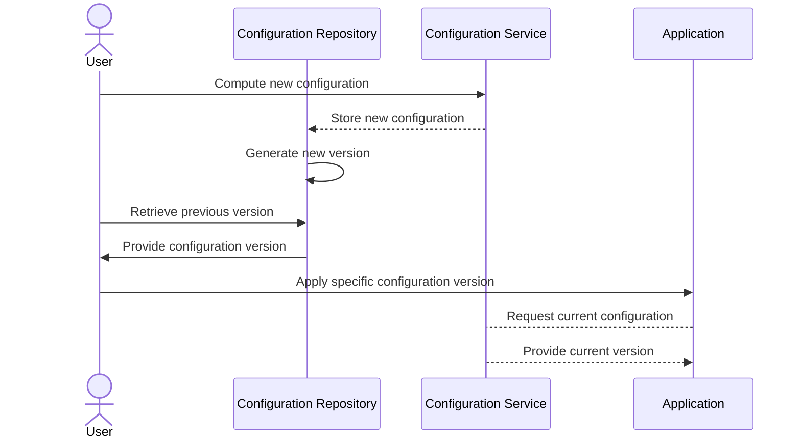

## Description

Versioned Configuration Management is a design pattern that involves tracking and managing different versions of configuration files or settings over time. It is essential in maintaining the stability and consistency of system configurations, allowing for easy rollback to previous configurations in case new configurations introduce errors or suboptimal performance. This pattern enhances the capability to audit changes, collaborate on configurations, and ensure continuity across deployments.

## Architectural Approach

1. **Version Control Systems**: Utilize systems such as Git, Subversion, or Mercurial for tracking configuration changes. Each configuration set is treated as a dataset versioned and stored similar to source code.

2. **Immutable Configuration Storage**: Use immutable storage where changes lead to a new version rather than altering existing ones. This could be implemented with append-only databases or object stores with versioning features like AWS S3, Azure Blob Storage, or Google Cloud Storage.

3. **Change Tracking and Auditing**: Implement change tracking mechanisms where each modification or update in configuration is logged with details like who made the change, timestamp, and nature of change.

4. **Automated Deployment and Rollback**: Leverage CI/CD pipelines with automated scripts to apply the latest configuration versions and provide facilities for quick rollbacks during failures.

## Example Code

An example using Git to manage configuration files:

```bash
git init configurations

git add config.json

git commit -m "Initial configuration file for service X"

git add config.json
git commit -m "Updated timeout values based on recent tests"

git log 
git checkout <previous-commit-hash> config.json
```

## Diagrams

### Versioned Configuration Workflow - Mermaid Sequence Diagram



## Related Patterns

- **Snapshot Pattern**: Permits capturing the state of a system or objects at a certain point, useful in backups and debugging.
  
- **Configuration Audit**: Complements versioning by providing detailed logs on access and changes.
  
- **Immutable Infrastructure**: Extends the principle of immutability from configurations to entire software environments, supporting seamless rollbacks and consistency.

## Additional Resources

- [Git Documentation](https://git-scm.com/doc)
- [AWS Versioning - S3](https://docs.aws.amazon.com/AmazonS3/latest/userguide/Versioning.html)
- [Continuous Delivery by Jez Humble and David Farley](https://www.amazon.com/dp/0321601912/)

## Summary

Versioned Configuration Management is a critical pattern for effective change control in dynamic environments. It enhances system resilience by providing straightforward pathways for reviewing configuration changes, supporting collaboration among teams, and ensuring quick resolution by reverting to known good states. Proper implementation involves leveraging modern version control systems, adopting immutable storage practices, and integrating with automated deployment tools.
