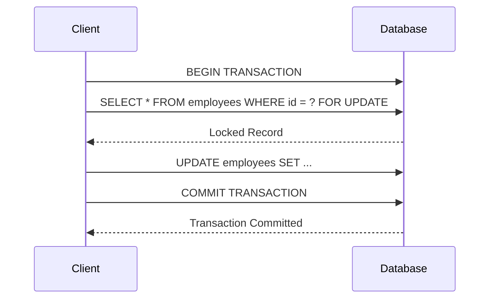

## Introduction to Pessimistic Locking

Pessimistic Locking is a concurrency control mechanism used in databases to manage simultaneous transactions on the same data. The pattern operates by locking the data record at the beginning of a transaction which prevents other transactions from making changes to the same record. This ensures data consistency and integrity but can lead to reduced system throughput if not managed correctly.

## Architectural Explanation

In systems where data consistency is paramount, especially where financial transactions or sensitive data operations are involved, pessimistic locking ensures that the operations on data remain consistent across scales. However, this approach assumes that conflict is common and hence locks data preemptively.

### Key Components:

- **Lock Manager**: Responsible for handling lock and release operations. Maintains a lock table to track locked records.
- **Transactions**: Operations that must be atomic and consistent, requiring explicit locks on data.
- **Lock Granularity**: Defines the level at which locks are applied – row-level, page-level, or table-level.

## Best Practices

1. **Optimize Locking Granularity**: Use the finest granularity of locks (e.g., row-level) to increase concurrency while maintaining data integrity.
2. **Timeouts and Deadlock Detection**: Implement timeouts to automatically release locks if transactions bottleneck. Use deadlock detection mechanisms to prevent system hangs.
3. **Optimistic Locking as Alternative**: For read-heavy operations, consider using Optimistic Locking to improve throughput under low-contention scenarios.
4. **Monitoring and Analysis**: Continuously monitor lock usage and contention to adapt and fine-tune the locking strategy as the application evolves.

## Example Code

Let's consider a Java example using a database connection and transaction:

```java
// Assume we are using a JDBC connection to the database
Connection connection = null;

try {
    // Start transaction
    connection.setAutoCommit(false);
    
    // Lock the record with a SELECT FOR UPDATE statement
    String query = "SELECT * FROM employees WHERE id = ? FOR UPDATE";
    PreparedStatement statement = connection.prepareStatement(query);
    statement.setInt(1, employeeId);
    
    ResultSet resultSet = statement.executeQuery();
    if (resultSet.next()) {
        // Process the employee data
        // ... perform update operations
        
        // Commit the transaction
        connection.commit();
    }
} catch (SQLException e) {
    // Handle any SQL exceptions and roll back if necessary
    try {
        if (connection != null) {
            connection.rollback();
        }
    } catch (SQLException rollbackEx) {
        // Handle rollback exception
    }
} finally {
    // Clean up resources
    if (connection != null) {
        try {
            connection.close();
        } catch (SQLException ex) {
            // Handle close exception
        }
    }
}
```

## Diagrams

Here's a sequence diagram portraying Pessimistic Locking.



## Related Patterns

- **Optimistic Locking**: Where transactions anticipate minimal conflicts and resolve concurrency issues during commit checks.
- **Read-Write Locks**: Facilitate concurrent read access while managing exclusive write locks, allowing better throughput for read-heavy operations.
- **Database Sharding**: Reduces contention and increases performance by distributing data across multiple instances or nodes.

## Additional Resources

- [Java Concurrency in Practice](https://jcip.net/), a comprehensive guide to building concurrent applications in Java.
- [Database Systems: The Complete Book](https://www.amazon.com/Database-Systems-Complete-Van-Stein/dp/0131873253), offers clear insights into fundamentals of databases including locking mechanisms.

## Summary

Pessimistic Locking provides a robust solution to handle conflicts in transactions by preemptively locking records, ideal for environments with high contention and critical data integrity requirements. While effective where consistency is a priority, careful management is required to avoid performance bottlenecks. Optimizing locking strategies and implementing alternative concurrency models can help in achieving the desired application performance.
