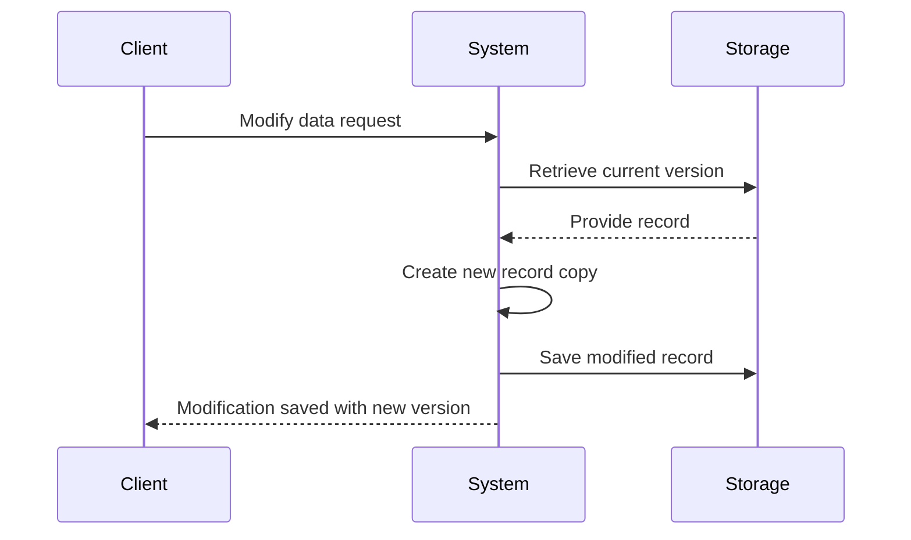
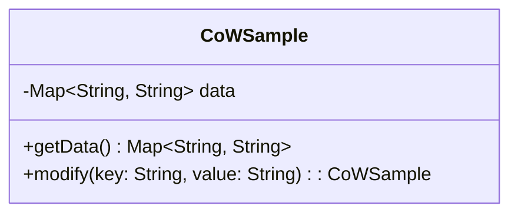

### Introduction to Copy-on-Write

The Copy-on-Write (CoW) design pattern is a programming and system design concept used to efficiently handle copies of data. When a record is modified, instead of altering the original, a new copy is created with the specific modifications, allowing the original data to remain unchanged. This results in multiple versions of the same data, supporting immutability, easy rollback, and auditability.

### Detailed Explanation

#### Key Concepts

1. **Immutability**: Each change results in a new version, making previous states immutable and easy to reference or rollback.

2. **Memory Efficiency**: Initial copy operations do not duplicate data entirely; only modified parts are copied when changes occur.

3. **Concurrency**: Multiple threads or processes can read data without interference because original copies remain unchanged until explicitly modified.

#### Architectural Approach

In practical terms, Copy-on-Write includes keeping track of versions with identifiers and status metadata within a system's database. This can often be seen in file systems, databases, and memory management, especially in operating systems like UNIX and storage systems like ZFS.

- **Memory Management**: Operating systems utilize CoW for processes, where parent and child processes initially share same pages in memory until one of them writes — necessitating a copy of the page modified.

- **Storage**: In file systems, instead of overwriting blocks, changes create new blocks, facilitating snapshots and deduplication.

- **Data Models**: With objects or records, a deep copy is not performed until a mutation operation necessitates it, preserving immutability.

### Example Code

Here is a simplified example of Copy-on-Write in Java:

```java
import java.util.HashMap;
import java.util.Map;

public class CoWExample {
    private Map<String, String> data;

    // Constructor
    public CoWExample() {
        this.data = new HashMap<>();
    }

    // Fetch current version of data
    public Map<String, String> getData() {
        return new HashMap<>(data);
    }

    // Modify data with copy-on-write approach
    public CoWExample modify(String key, String value) {
        CoWExample copy = new CoWExample();
        copy.data.putAll(this.data);
        copy.data.put(key, value);
        return copy;
    }
}
```

### Design Considerations

1. **Performance Trade-Offs**: While memory usage can be more efficient, the disk I/O operations may increase due to multiple data copies.

2. **Garbage Collection**: Needs to manage abandoned versions and ensure they do not consume unnecessary resources.

3. **Version Control**: Proper identifiers and metadata should be maintained to track and manage data integrity across versions.

### Diagrams

#### Sequence Diagram



#### Class Diagram



### Related Patterns

- **Event Sourcing**: Used to record changes as a sequence of events, which enables reconstructing states from these events, similar to CoW's rollback and history features.
  
- **Immutable Data Structures**: Structures that do not allow changes on existing instances, facilitating safer concurrent programs and designs.

- **Snapshot Pattern**: Creates point-in-time copies of a system's state that complement CoW by capturing consistent snapshots of a series of records.

### Additional Resources

- [Immutability in Programming](https://en.wikipedia.org/wiki/Immutable_object)
- [Copy-on-Write in Operating Systems](https://en.wikipedia.org/wiki/Copy-on-write)
- [File System Implementation of CoW](https://en.wikipedia.org/wiki/ZFS)  

### Final Summary

The Copy-on-Write pattern ensures data immutability and version integrity by copying data upon modifications rather than altering the original. This enhances safety in multi-threading, provides optimized memory management, better audit history, and facilitates efficient rollback mechanisms. Exploring its role in memory management, databases, and storage systems reveals its versatile application across various domains, making it essential in the repertoire of scalable and robust software architecture design patterns.
