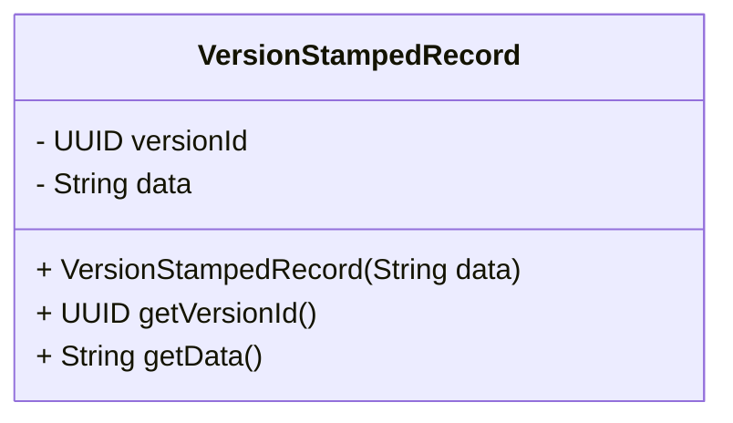

## Introduction

Version Stamping is a crucial design pattern in data modeling and software engineering for maintaining the integrity of evolving datasets and software releases. This pattern involves appending or tagging versions to your records, code bases, or configuration files, which helps uniquely identify specific states or changes over time. 

### Key Concepts

- **Unique Identifiers**: These are typically hashes, GUIDs (Globally Unique Identifiers), or semantic versioning tags that encode the version information.
- **Consistency and Integrity**: Ensures data integrity by allowing reference to its specific state, making it easier to manage data evolution.
- **Tracking Changes**: By maintaining a history of changes, version stamping aids in debugging, auditing, and rolling back to previous states if necessary.

### Applicability

Version stamping applies in scenarios such as:

- Version controlling of codebases (e.g., Git's commit hashes)
- Managing software releases with unique build numbers
- Database records where updates are frequent, and rollback capability is necessary

## Architectural Approaches

While implementing Version Stamping, consider the following techniques:

- **Semantic Versioning**: Especially useful for software releases, involving a naming convention like `MAJOR.MINOR.PATCH` (e.g., `v2.1.5`), where:
  - MAJOR version when you make incompatible API changes,
  - MINOR version when you add functionality in a backward-compatible manner, and
  - PATCH version when you make backward-compatible bug fixes.
  
- **Hashing**: Generates a fixed-length string (hash) that represents the content's state, often used for immutability verification (e.g., SHA-256).

- **GUID/UUID**: A 128-bit identifier used to ensure that identifiers are unique across space and time.

### Example Code

Here’s a simple Java example demonstrating the use of UUID for version stamping:

```java
import java.util.UUID;

public class VersionStampedRecord {
    private final UUID versionId;
    private final String data;

    public VersionStampedRecord(String data) {
        this.versionId = UUID.randomUUID();
        this.data = data;
    }

    public UUID getVersionId() {
        return versionId;
    }

    public String getData() {
        return data;
    }

    public static void main(String[] args) {
        VersionStampedRecord record = new VersionStampedRecord("Example data");
        System.out.println("Version ID: " + record.getVersionId());
        System.out.println("Data: " + record.getData());
    }
}
```

## Diagrams



## Related Patterns

- **Event Sourcing**: Maintains the entire sequence of state changes as a sequence of events.
- **Snapshot Pattern**: Complement to event sourcing, where periodic snapshots of the application state are saved, facilitating fast recovery.
- **Immutable Data Structures**: Ensures that records cannot be modified after creation to prevent inconsistent states.

## Best Practices

- Use immutable data structures to enhance data integrity when version stamping.
- Ensure compatibility with existing data models and systems when implementing semantic versioning.
- Consistently apply versioning across systems for uniformity in data management.

## Additional Resources

- [Semantic Versioning Specification](https://semver.org/)
- [UUID for Java 8](https://docs.oracle.com/javase/8/docs/api/java/util/UUID.html)
- [Hash Functions in Cryptography](https://en.wikipedia.org/wiki/Cryptographic_hash_function)

## Summary

Version Stamping is a powerful pattern for maintaining the integrity, history, and consistency of datasets and systems. By leveraging unique identifiers like hashes, GUIDs, or semantic versions, organizations can effectively manage their data lifecycle, enabling robust change management and auditability. Understanding and implementing the Version Stamping pattern is essential for any system where data integrity and version control are paramount.
