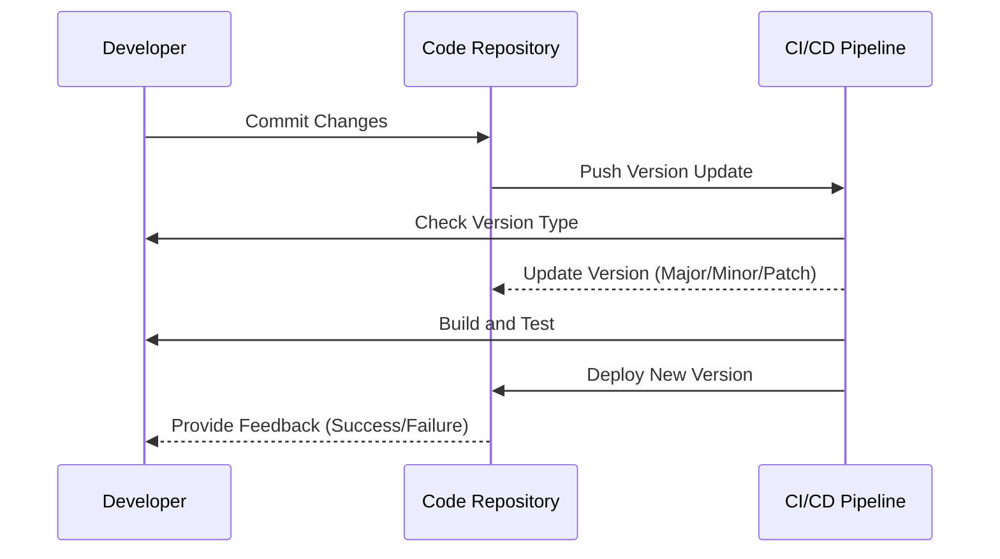

## Semantic Versioning

### Description

Semantic Versioning is a versioning system used in software development that provides a clear and structured way to communicate changes through version numbers. The format typically follows `Major.Minor.Patch`, each serving a particular purpose and conveying specific information regarding the nature of the changes:

- **Major**: Increments indicate incompatible API changes or significant functionality upgrades. For example, moving from version `1.x.x` to `2.0.0` suggests a breaking change or a major improvement.
  
- **Minor**: Increments denote backward-compatible feature additions. For example, changing from `2.1.x` to `2.2.0` usually involves new features without breaking existing implementations.
  
- **Patch**: Increments reflect backward-compatible bug fixes. A version change from `2.1.0` to `2.1.1` indicates small fixes or tweaks without altering the system’s compatibility.

The system is designed to make it easier for both maintainers and users to understand the nature of changes simply by looking at the version number.

### Architectural Approaches

1. **Strict Versioning Enforcement**: Enforce strict rules around version bumps to prevent accidental breaking changes from being included in minor or patch releases.

2. **Continuous Integration and Testing**: Integrate automated tests and validation pipelines to ensure that incorrect version changes are avoided and compatibility is always maintained.

3. **Documentation Updates**: Pair version changes with comprehensive documentation to inform users of what changes have occurred at each level.

### Best Practices

- **Automation**: Use build tools or scripts that automatically increment version numbers based on the type of changes introduced.
  
- **Change Logs**: Maintain detailed change logs that map version numbers to changes, enhancing transparency and aiding in troubleshooting.
  
- **Pre-release Versions**: Adopt suffixes such as `-alpha`, `-beta`, and `-rc` for bleeding-edge versions to indicate instability or potential changes.

### Example Code

Here’s an example of defining a version control system using Semantic Versioning in a Python script:

```python
class Version:
    def __init__(self, major: int, minor: int, patch: int):
        self.major = major
        self.minor = minor
        self.patch = patch

    def increment_major(self):
        self.major += 1
        self.minor = 0
        self.patch = 0

    def increment_minor(self):
        self.minor += 1
        self.patch = 0

    def increment_patch(self):
        self.patch += 1

    def __str__(self):
        return f"{self.major}.{self.minor}.{self.patch}"

version = Version(2, 1, 0)
version.increment_patch()  # Results in 2.1.1
version.increment_minor()  # Results in 2.2.0
version.increment_major()  # Results in 3.0.0
print(version)
```

### Diagrams

Below is a simple Mermaid sequence diagram representing the lifecycle of a semantic versioning strategy:



### Related Patterns

- **Backward Compatibility Patterns**: Ensures new versions remain compatible with older versions, easing transitions.
  
- **Release Management Patterns**: Manages the intricacies of deploying new software versions, often combined with semantic versioning.

### Additional Resources

- [Semantic Versioning Specification](https://semver.org/)
- [Version Management with Git](https://git-scm.com/book/en/v2/Git-Branching-Basic-Branching-and-Merging)
- ["The Art of Version Control" - O'Reilly Media](https://www.oreilly.com/)

### Summary

Semantic Versioning is a structured way to document and announce software changes, making it easier for developers and users to manage compatibility and anticipate updates. By following a consistent versioning scheme, teams can reduce the likelihood of integration issues, streamline communication, and provide a clearer roadmap for project evolution. Adopting semantic versioning as a discipline can lead to improved software reliability and user satisfaction.
