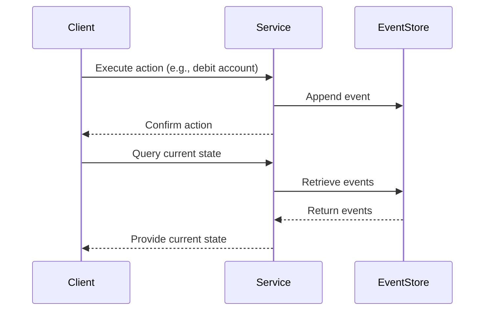

---

linkTitle: "Event Sourcing"
title: "Event Sourcing"
category: "Versioning Patterns"
series: "Data Modeling Design Patterns"
description: "Recording all state-changing events rather than the resulting state, allowing the system's state to be reconstructed by replaying events."
categories:
- Data Management
- Event Driven Architecture
- System Design
tags:
- Event Sourcing
- CQRS
- State Management
- Event-Driven Architecture
- Data Modeling
date: 2024-07-07
type: docs
canonical: "https://softwarepatternslexicon.com/103/4/8"
license: "© 2024 Tokenizer Inc. CC BY-NC-SA 4.0"
---

## Event Sourcing

### Introduction

Event Sourcing is a design pattern that records all changes to an application's state as a series of events. Instead of persisting only the current state, it logs each state-altering event. The current state can then be reconstructed by replaying events from the event store.

### Motivation

Traditional data storage techniques involve saving the latest state of an entity, which can lead to data loss in terms of historical changes. Event Sourcing addresses this by providing a complete history of events, allowing systems to maintain a detailed audit log and enabling powerful features like temporal queries or retroactive updates.

### Implementation

1. **Event Logging**: Each time a change occurs, an event describing the change is logged. Every event is immutable.

2. **Event Store**: A repository where events are stored. It may be designed for sequential access to quickly append and replay events.

3. **Reconstitution**: To determine the state of an entity, events related to the entity are fetched and replayed.

4. **Projection**: Derive a view or a read model by processing all relevant events for a particular query.

### Example Code

```java
// Event class interface
interface Event {
    String getType();
    long getTimestamp();
}

// Example of a specific event
public class AccountDebitedEvent implements Event {
    private final UUID accountId;
    private final BigDecimal amount;
    
    public AccountDebitedEvent(UUID accountId, BigDecimal amount) {
        this.accountId = accountId;
        this.amount = amount;
    }

    @Override
    public String getType() {
        return "AccountDebited";
    }

    @Override
    public long getTimestamp() {
        return System.currentTimeMillis();
    }

    // additional getters
}

// Event Store
public class EventStore {
    private List<Event> events = new ArrayList<>();

    public void store(Event event) {
        events.add(event);
    }

    public List<Event> getEventsForAccount(UUID accountId) {
        // Filtering based on accountId for reconstruction
        return events.stream()
                     .filter(event -> event instanceof AccountDebitedEvent && 
                                      ((AccountDebitedEvent)event).getAccountId().equals(accountId))
                     .collect(Collectors.toList());
    }
}

// Example of reconstructing state
public class AccountService {
    private EventStore eventStore;

    public Account reconstructAccount(UUID accountId) {
        List<Event> events = eventStore.getEventsForAccount(accountId);
        Account account = new Account(accountId);

        for (Event event : events) {
            if (event instanceof AccountDebitedEvent) {
                AccountDebitedEvent ade = (AccountDebitedEvent) event;
                account.debit(ade.getAmount());
            }
            // Handle other event types
        }
        return account;
    }
}
```

### Architectural Diagrams

#### Sequence Diagram



### Related Patterns

- **Command Query Responsibility Segregation (CQRS)**: A complementary pattern where the event store enables separate query models that can be independently optimized for read operations.
  
- **Event-Driven Architecture**: Event Sourcing naturally fits into this paradigm, enabling reactive processing based on distributed systems events architecture.

### Advantages

- Full audit history available with detailed logs of all state changes.
- Enables reconstructing past states, which aids debugging and compensating for bugs retroactively.

### Drawbacks

- Complexity involved in managing event stores and providing eventual consistency.
- Possible performance hits due to reapplying a large number of events for an entity in frequently changing domains.

### Additional Resources

- [Martin Fowler on Event Sourcing](https://martinfowler.com/eaaDev/EventSourcing.html)
- [Event Store – open-source event store implementation](https://eventstore.com/)

### Summary

Event Sourcing is a powerful pattern that ensures the longevity, accuracy, and traceability of the system's state through event tracking. While it introduces complexity, its benefits make it invaluable in domains needing robust audit capabilities and historical analytics. Its perfect pairing with CQRS and event-driven architecture patterns highlights its utility in modern distributed systems.
