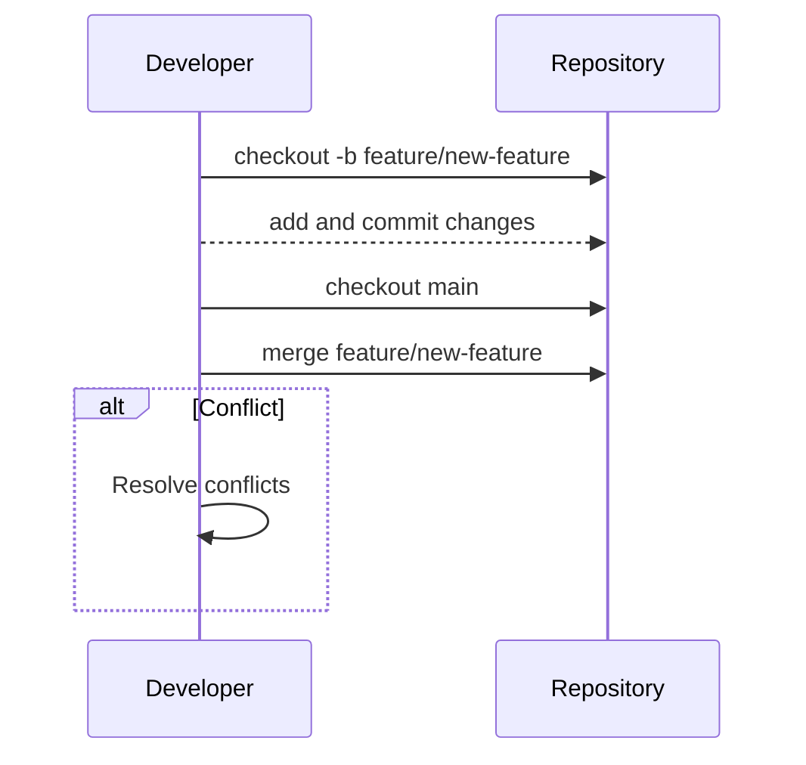

---

linkTitle: "Branching and Merging"
title: "Branching and Merging"
category: "Versioning Patterns"
series: "Data Modeling Design Patterns"
description: "Maintaining separate versions (branches) of data or code, which can later be merged, enabling parallel development or experimentation."
categories:
- versioning
- data modeling
- software engineering
tags:
- branching
- merging
- version control
- parallel development
- conflict resolution
date: 2024-07-07
type: docs

canonical: "https://softwarepatternslexicon.com/103/4/9"
license: "© 2024 Tokenizer Inc. CC BY-NC-SA 4.0"
---

## Introduction

In software development and data management, the Branching and Merging pattern is a powerful technique that allows for the maintenance of multiple versions or iterations of data or code. This pattern is crucial for enabling parallel development, experimentation, and effective collaborative workflows in both software engineering and large-scale data systems.

## Design Pattern Overview

The Branching and Merging pattern involves the creation of separate branches of data or code which can be individually modified and then merged back into a main line. This process can occur simultaneously among many development teams or data processing workflows, facilitating innovation and high iteration cycles without disrupting stable versions or deployments.

### Key Concepts

- **Branch**: Represents an independent line of development. Branches can stem from any point within the main line and allow changes to be made autonomously.
- **Merge**: The process of integrating changes from one branch into another, typically from a feature or experimental branch into a main or release branch.
- **Conflict**: A situation arising when changes in different branches affect the same parts of data or code, necessitating manual resolution.

## Architectural Approaches

### Parallel Development

This approach allows multiple development streams to co-exist. Different project teams might work on features, bug fixes, or experiments in isolation until components are ready to be consolidated. This is highly beneficial in projects with frequent release schedules or extensive testing phases.

### Version Control Systems

Systems such as Git, Mercurial, or Apache Subversion are typically utilized to facilitate branching and merging. These tools provide robust mechanisms for tracking changes, managing branches, and handling conflicts that arise during merges.

### Data Versioning Tactics

In data-centric applications or systems, versioning allows different strategies or machine learning models to be built and compared without affecting the integrity of existing data sets. Solutions for data versioning include Delta Lake in Apache Spark or time travel features in Snowflake.

## Example Code

Below is a simple example using Git commands for branching and merging in a version control system:

```bash
git checkout -b feature/new-feature

git add .
git commit -m "Implement new feature"

git checkout main

git merge feature/new-feature

```

## Diagrams

Here is a basic UML Sequence Diagram illustrating the branching and merging process using Mermaid syntax:



## Related Patterns

- **Feature Toggle**: A complementary pattern that allows features to be activated or deactivated in production without deploying new code.
- **Continuous Integration/Continuous Deployment (CI/CD)**: Practices that rely on branching and merging to automatically test, build, and deploy software.
- **Snapshot Isolation**: In databases, leveraging branching concepts to isolate transactions and ensure data consistency.

## Additional Resources

- [Pro Git Book](https://git-scm.com/book/en/v2): An in-depth resource on using Git effectively.
- [Version Control by Example](http://ericsink.com/vcbe/): A book offering practical examples and insights into various version control systems.
- [Atlassian Git Tutorial](https://www.atlassian.com/git): Offers tutorials and best practices about Git and branching strategies.

## Summary

The Branching and Merging design pattern is integral to modern software development and data management. It enables parallel work, experimentation, and collaboration while maintaining the integrity of the main codebase or dataset. By mastering this pattern and understanding related processes and tools, teams can greatly enhance their productivity and reduce integration issues in complex project environments.

---
