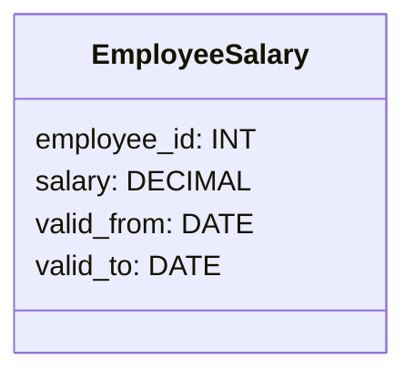

## Introduction

As-Of Queries are used in data retrieval to access historical data at a specific point in time. This enables users to obtain a snapshot of the data as it existed at a certain moment, using temporal conditions. The pattern is particularly valuable in scenarios where regulatory compliance, auditing, or rollback capabilities are required.

## Architectural Approach

### Temporal Data Modeling

The As-Of Query design pattern relies on temporal data modeling techniques, which involve adding time aspects to data, such as valid time, transaction time, or both (bitemporal). This can be achieved by adding timestamp columns to tables that record when a row is valid or when a change occurred.

### Implementation Strategy

1. **Table Design**: Extend tables to include temporal aspects:
   - `valid_from` and `valid_to` for valid-time periods.
   - `transaction_time` to record when each row was inserted or updated.

2. **Versioning**: Maintain multiple versions of the same record by inserting a new row with updated timestamps whenever data changes.

3. **Temporal Queries**: Implement queries that allow users to specify a point in time for retrieving the desired data snapshot.

### Best Practices

- Use index strategies on temporal columns to enhance query performance.
- Ensure correct handling of overlapping time periods in bitemporal tables to avoid data inconsistencies.
- Use SQL extensions (like PostgreSQL's range types) or database-specific features (like Oracle's Flashback or SQL Server's Temporal Tables) for efficient querying.

## Example Code

Below is an example of implementing As-Of Query using SQL:

```sql
CREATE TABLE employee_salary (
  employee_id INT,
  salary DECIMAL(10, 2),
  valid_from DATE,
  valid_to DATE,
  PRIMARY KEY (employee_id, valid_from)
);

-- Inserting new salary with time range
INSERT INTO employee_salary (employee_id, salary, valid_from, valid_to)
VALUES (1, 70000.00, '2023-01-01', '2023-06-30');

-- As-Of Query to find salary on January 1, 2023
SELECT salary FROM employee_salary
WHERE employee_id = 1 AND '2023-01-01' BETWEEN valid_from AND valid_to;
```

## Diagrams

### Mermaid Temporal Table Structure



## Related Patterns

- **Snapshot Isolation**: Ensures that data seen by a transaction is consistent for the duration of the transaction.
- **Versioning Pattern**: Aids in maintaining historical versions of records.
- **Event Sourcing**: Captures all changes as a sequence of events, making it easier to query history.

## Additional Resources

- [Temporal Database Design Techniques](https://www.databasejournal.com)
- [Handling Temporal Data in SQL](https://www.sqlpatterns.com/temporal)

## Summary

The As-Of Query design pattern provides a powerful mechanism to access data as it appeared at a specific time. By incorporating temporal aspects into your data model, you can enhance data analysis, auditing, and compliance capabilities. While implementation may involve additional complexity in data management, the benefits in terms of data accuracy and historical insight are significant.
